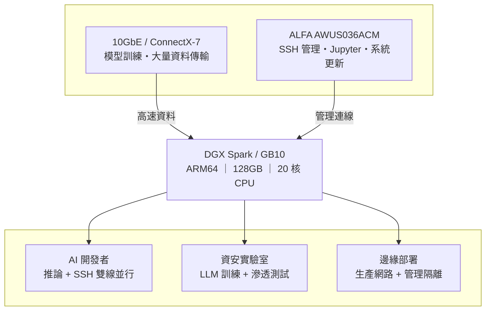

# DGX Spark Wi-Fi 連不上？只要十分鐘，這張ALFA USB 無線網路卡幫你終結噩夢

你期待已久的 **NVIDIA DGX Spark**（代號 Project DIGITS）終於到貨了。

開箱、接上電源、螢幕顯示 OOBE（第一次開機引導畫面）——一切都很順利。然後你選了 Wi-Fi 網路，輸入密碼，畫面轉了三十秒⋯⋯

**「無法連線到此網路。」**

再試一次。重開機。Reset。依然失敗。

你不是唯一遇到這個問題的人。在 [NVIDIA Developer Forums](https://forums.developer.nvidia.com) 上，**數十篇討論串**在抱怨同一件事：DGX Spark 的 Wi-Fi 故障。

這不是你的設定有問題。這是 DGX Spark 已知的設計缺陷。

---

## 問題根源：為什麼 DGX Spark 的 Wi-Fi 這麼難搞？

DGX Spark（以及所有基於 **NVIDIA GB10 Grace Blackwell Superchip** 的 AI Server）內建的是 **MediaTek MT7925 Wi-Fi 7 晶片**——規格上確實是頂級的硬體。

問題出在軟體層。

### 三大致命傷

**① OOBE 階段的 Wi-Fi supplicant 過度精簡**

DGX Spark 的第一次開機引導（OOBE）階段使用了一個精簡版的 `wpa_supplicant`。這個版本拿掉了許多企業級驗證功能，導致與特定品牌 AP（特別是 Ubiquiti UniFi）完全無法完成 association。

NVIDIA 官方在 **DGX Spark Release Notes（2026 年 4 月更新）** 中已明確記載此問題，但截至目前尚未完全修復。

**② WPA2-Enterprise 不相容**

如果你的辦公室或實驗室使用 WPA2-Enterprise（常見於企業環境），DGX Spark 的內建 Wi-Fi 幾乎確定無法連線。這不是設定檔能解決的問題——是驅動層與 supplicant 的雙重限制。

**③ 隨機出現的「No Wi-Fi Adapter Found」**

多名用戶在 NVIDIA 論壇回報（討論串 #356183），DGX Spark 會在正常使用中突然顯示「找不到無線網卡」，必須完整重開機才能恢復。更糟的是，**斷線後系統不會自動重連**——你必須手動執行 `nmcli` 指令。

| 問題 | 影響 |
|------|------|
| OOBE 無法連企業級 AP | UniFi / WPA2-Enterprise 全軍覆沒 |
| 隨機「No Wi-Fi Adapter Found」 | 需重開機，開發流程中斷 |
| 斷線不自動重連 | 遠端管理等於廢了 |
| Release Notes 承認問題 | 官方確認，非個案 |

> 💡 **好消息是：這些問題在軟體層短期內難以完全修復，但硬體層有一個簡單、穩定、完全相容的解法。**

---

## 不是只有 DGX Spark——所有 GB10 AI Edge Server 都共用同一顆 Wi-Fi 晶片

DGX Spark 的 Wi-Fi 問題之所以受到大量討論，純粹因為它是 NVIDIA 自家品牌、最早出貨。但實際上，**所有搭載 NVIDIA GB10 Grace Blackwell Superchip 的 AI Edge Server**，內部用的是同一顆 **MediaTek MT7925 Wi-Fi 7 晶片**——同樣的 driver stack、同樣的 `wpa_supplicant` 限制、同樣的相容性問題。

目前台灣市場上可以買到的 GB10 AI Edge Server 共有六款：

### GB10 AI Edge Server 全線規格比較

所有機型共享以下核心規格：

| 核心元件 | 規格 |
|----------|------|
| Superchip | **NVIDIA GB10 Grace Blackwell** |
| CPU | **20-core Arm**（10× Cortex-X925 + 10× Cortex-A725） |
| GPU | **NVIDIA Blackwell GPU**，5th Gen Tensor Cores／4th Gen RT Cores |
| AI 效能 | **1 PFLOP FP4**（1000 TOPS AI） |
| 系統記憶體 | **128 GB LPDDR5x** unified，256-bit，273 GB/s 頻寬 |
| 記憶體互連 | **NVLink-C2C**（5× PCIe 5.0 頻寬） |
| NIC | **NVIDIA ConnectX-7** SmartNIC（200G × 2 QSFP） |
| 乙太網路 | **1× 10GbE RJ-45** |
| Wi-Fi 晶片 | **MediaTek MT7925** Wi-Fi 7（2×2） |
| 顯示輸出 | **1× HDMI 2.1a** |
| 作業系統 | **NVIDIA DGX OS**（基於 Ubuntu Linux） |
| 電源 | **240W** USB-C 外接變壓器 |
| 雙機堆疊 | 支援（最高 405B 參數模型） |

以下為各品牌差異項目：

| 項目 | **ASUS ASCENT GX10** | **MSI EdgeXpert** | **NVIDIA DGX Spark** | **HP ZGX Nano G1n** | **ALTOS BrainSphere GB10 F1** | **GIGABYTE AI TOP ATOM** |
|------|----------------------|-------------------|----------------------|---------------------|------------------------------|--------------------------|
| 儲存選項 | 1TB / 2TB / 4TB NVMe | 1TB / 4TB NVMe | 1TB / 4TB NVMe | 1TB / 2TB / 4TB NVMe | 4TB NVMe | 1TB / 4TB NVMe（最高 Gen5） |
| Wi-Fi 模組 | AW-EM637（Wi-Fi 7） | Wi-Fi 7 | Wi-Fi 7 | MT7925（Wi-Fi 7） | Wi-Fi 7 | Wi-Fi 7 |
| 藍牙 | BT 5.4 | BT 5.3 | BT 5.4 | BT 5.4 | BT 5.4 LE | BT 5.4 |
| USB | 4× USB 3.2 Gen 2×2 Type-C | 4× USB 3.2 Type-C | 4× USB Type-C | 4× USB Type-C | 4× USB 3.2 Gen 2×2 Type-C | 4× USB 3.2 Gen 2×2 Type-C |
| 體積 | 150×150×51mm | 151×151×52mm | 150×150×50.5mm | 150×150×51mm | 150×150×50mm | 150×150×50.5mm |
| 重量 | 1.48 kg | 1.2 kg | 1.2 kg | 1.25 kg | < 1.5 kg | 1.2 kg |
| 獨家軟體 | — | — | — | HP ZGX Toolkit | Altos aiGeni 平台 | — |

> ⚠️ **關鍵結論**：無論你買哪一家的 GB10 AI Edge Server，內建 Wi-Fi 都是同一顆 MediaTek MT7925，也都可能遇到同樣的連線問題。底下的 ALFA USB 無線網卡解法，**六款全部適用**。

---

## 解法：一張 USB 無線網卡，十分鐘搞定

NVIDIA 官方僅測試 DGX OS（基於 Ubuntu 24.04），**所有 GB10 平台皆為 ARM64（aarch64）架構**，Kernel 版本 **6.17 以上**。

這意味著你需要的 USB 無線網卡必須滿足三個條件：

1. ✅ **Linux Kernel 內建驅動**——不需編譯、不需 DKMS
2. ✅ **ARM64 (aarch64) 完整支援**——能在 GB10 上即插即用
3. ✅ **成熟穩定**——經過社群廣泛驗證

在市面上數十款 USB 無線網卡中，只有極少數能同時滿足這三點。

### 🥇 唯一推薦：ALFA AWUS036ACM

| 項目 | 內容 |
|------|------|
| 晶片 | **MediaTek MT7612U** |
| 驅動 | **Linux Kernel 內建 mt76**（自 Kernel 4.19 起） |
| 頻段 | 雙頻 2.4GHz + 5GHz（AC1200） |
| 天線 | 2× RP-SMA 可拆卸 5dBi 天線（可更換更高增益） |
| 介面 | USB 3.0 Type-A |
| 監聽模式 | ✅ 完整支援 |
| AP 模式 | ✅ 支援 |
| TAA 認證 | ✅ 符合美國政府採購規範 |

#### 為什麼是它？六個「唯一」

**1. 唯一真正的免驅即插即用**

mt76 驅動自 Linux Kernel 4.19 起內建於核心主線。DGX Spark 的 Kernel 6.17 自然完整支援。插入 USB 後，系統**自動載入驅動**——你什麼都不需要安裝。

**2. 唯一 ARM64 完整驗證**

MT7612U 已在 Raspberry Pi OS（aarch64）、Ubuntu Server（ARM64）等多個 ARM 平台上經過多年驗證。GB10 的 ARM64 架構完全相容，不需任何 patch。

**3. 唯一零編譯、零設定**

對比 Realtek RTL8812AU 需要 DKMS 每次 Kernel 更新後重新編譯，ACM 完全不需要。你的 DGX OS 更新 Kernel 後——ACM 依然即插即用。

**4. 唯一完整支援監聽模式與封包注入**

如果你打算在 DGX Spark 上跑 Kali Linux VM 進行安全研究，ACM 是目前唯一支援監聽模式（Monitor Mode）、封包注入（Packet Injection）和虛擬介面（VIF）的免驅方案。

**5. 唯一可換天線的中高階方案**

2 支 RP-SMA 可拆卸天線。出廠附 5dBi，你可以視需求更換為 7dBi 或 9dBi 高增益天線——非常適合機房、工廠等 Wi-Fi 訊號較弱的邊緣部署場景。

**6. 唯一 TAA 認證**

如果你的單位有政府採購規範要求，ALFA AWUS036ACM 是少數具備 **TAA 認證**的外接 USB 無線網卡。

---

## 實戰：十分鐘從「無線網路」到「雙網併行」

以下是你在 DGX Spark 上使用 ALFA AWUS036ACM 的完整流程：

### 第一步：插入 USB 網卡

將 AWUS036ACM 插入 DGX Spark 的 USB 3.0 Type-A 連接埠。

打開終端機，執行：

```bash
dmesg | tail -20
```

你應該會看到類似這樣的輸出：

```
mt76_usb 3-1:1.0: MAC/BBP MT7612U (rev 2)
mt76_usb 3-1:1.0: firmware loaded: mt7612u.bin
ieee80211 phy1: rt2x00_set_rt: Info - RT chipset 7612, rev 0200 detected
ieee80211 phy1: rt2x00lib_probe_dev: Information - Successfully initialized device
```

**這就是「驅動已自動載入」的信號。** 整個過程你沒有安裝任何東西。

### 第二步：確認網卡被系統辨識

```bash
nmcli device status
```

你應該看到 `wlan1`（或 `wlx...`）出現在列表中，狀態為 `disconnected`。

### 第三步：連線到 Wi-Fi

```bash
# 掃描可用網路
nmcli device wifi list

# 連線到你的 SSID（以 "MyLabWiFi" 為例）
sudo nmcli device wifi connect "MyLabWiFi" password "your-password"

# 確認連線狀態
nmcli connection show --active
```

### 第四步：設定開機自動連線

如果上一步成功，`nmcli` 會自動建立連線設定檔。之後每次開機都會自動連線。

你可以用以下指令確認設定檔已儲存：

```bash
nmcli connection show
```

看到你的 SSID 出現在列表中——完成。從插入 USB 到 Wi-Fi 穩定連線，**總計不超過十分鐘**。

---

## 這才叫真正的 AI Server 網路架構

有了 AWUS036ACM 之後，你的 DGX Spark 網路配置可以升級為專業的**雙網路架構**：



**為什麼要分兩條路？**

AI 模型訓練時的網路流量非常可觀——下載預訓練權重、同步資料集、分散式訓練通訊。如果把這些流量跟 SSH 管理混在同一條線路上：

- SSH 操作會變得遲緩甚至 timeout
- 10GbE 的高頻寬被管理流量浪費
- 一旦主要連線中斷（例如模型下載卡住），你連遠端修復的機會都沒有

分開之後，**管理連線永遠穩定、不受模型工作負載影響**。

---

## 三種場景，一張網卡

### 場景 A：AI 開發者
```
10GbE → 模型推論、資料傳輸
ALFA ACM → SSH、Jupyter Notebook、系統更新
```

### 場景 B：資安研究實驗室
```
GB10 → 跑 LLM fine-tuning
Kali Linux VM → USB 直通 ALFA ACM → 無線網路滲透測試
```

### 場景 C：邊緣部署（工廠／倉庫）
```
10GbE → 接生產網路
ALFA ACM + 高增益天線 → 連至辦公室管理 WiFi
```

---

## 常見疑問

**Q：AWUS036ACM 的 MT7612U 跟 GB10 內建的 MT7925 不是同家晶片嗎？**

A：同為 MediaTek，但驅動架構完全不同。MT7925 使用 `mt7925e` 驅動，屬於較新的 PCIe 介面，驅動仍在打磨。MT7612U 使用 `mt76` USB 驅動，從 Kernel 4.19 發展至今已極度成熟。

**Q：這張網卡在 DGX OS 以外還能用嗎？**

A：當然。MT7612U 的驅動是 Linux Kernel 主線的一部分，Ubuntu、Debian、Raspberry Pi OS、Kali Linux、Fedora、Arch Linux——只要是 Kernel 4.19+，全部即插即用。

---

## 總結：不管你是哪一台 GB10，十分鐘讓它真正上線

無論你買的是 NVIDIA DGX Spark、ASUS ASCENT GX10、MSI EdgeXpert、HP ZGX Nano、ALTOS BrainSphere GB10 F1 還是 GIGABYTE AI TOP ATOM——這些 GB10 AI Edge Server 都是效能驚人的 AI 開發設備：128GB 統一記憶體、20 核 ARM CPU、ConnectX-7 200GbE 網路。但所有機型都共用同一顆 MediaTek MT7925 Wi-Fi 晶片，也都有可能被同一個連線問題卡住第一步。

ALFA AWUS036ACM 的解決方案簡單到近乎荒謬：**插入 USB，搞定。**

但正是這種「簡單」，才是工程師真正的生產力——你不該花時間 debug Wi-Fi 驅動，你應該把時間花在訓練模型。

與其他解決方案相比，ALFA AWUS036ACM 的優勢一目瞭然：

| 方案 | 時間 | 穩定度 | 維護成本 |
|------|------|--------|---------|
| 等 NVIDIA 修好 Wi-Fi 驅動 | 未知（數月？） | 不確定 | 低 |
| 買一台 Wi-Fi 橋接器 | 30 分鐘設定 | 中等 | 中 |
| **ALFA AWUS036ACM** | **< 10 分鐘** | **最高** | **零** |

十分鐘，一張 USB 網卡，讓你的 AI Server 真正上線。

---

> 📌 **ALFA AWUS036ACM 現貨供應中** → [Yupitek 產品頁](https://yupitek.com/en/products/alfa/awus036acm/)
>
> 榆閤科技 (Yupitek) 為 ALFA Network 台灣授權代理商
> 產品訂購或技術問題歡迎來信洽詢：sales@yupitek.com

---

*參考來源：NVIDIA DGX Spark Release Notes、NVIDIA Developer Forums、morrownr/USB-WiFi GitHub、ALFA Network Docs、Linux Kernel Wireless Documentation*
