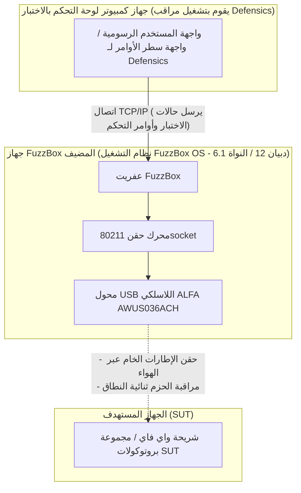

إن اختبار فحص ثغرات بروتوكول الشبكة اللاسلكية (WLAN protocol fuzzing) — والذي يشار إليه غالباً بالاختبار السلبي اللاسلكي (wireless negative testing) — هو أحد أهم الخطوات في التحقق من أمان ومتانة الأجهزة اللاسلكية المضمنة، والأجهزة المنزلية الذكية، ونقاط الوصول الخاصة بالمؤسسات. ومع ذلك، فإن محاولة إرسال إطارات إدارة أو تحكم أو بيانات 802.11 تالفة أو مشوهة (malformed) عبر الهواء تتطلب تحكماً منخفض المستوى في طبقة التحكم في الوصول إلى الوسائط (MAC) وهو ما لا تسمح به أنظمة التشغيل القياسية وبرامج تشغيل الواي فاي التجارية ببساطة.

لحل هذه المشكلة، تستخدم الفرق الأمنية **Black Duck FuzzBox** (المعروف سابقاً باسم Synopsys Defensics FuzzBox)، وهي بيئة تشغيل برمجية وعتادية متخصصة. لإجراء الاختبارات، يجب إقران نظام التشغيل FuzzBox OS بمحول لاسلكي USB متوافق وعالي الأداء وقادر على العمل في وضع المراقبة (Monitor Mode) المستقر وحقن الحزم الخام (raw packet injection) الموثوق. 

في دليل التوافق هذا، نقوم بتحليل كتالوج منتجات ALFA Network النشطة من Yupitek، ونوضح سبب فشل محولات Wi-Fi 6/6E الأحدث تحت نظام FuzzBox، ونقدم دليلاً مفصلاً خطوة بخطوة للإعداد للخيار القياسي في هذا المجال: **ALFA AWUS036ACH** (RTL8812AU).

---

## 1. متطلبات العميل

عند إجراء فحص ثغرات البروتوكول (protocol fuzzing)، تُنشئ حزمة الاختبار آلاف الإطارات اللاسلكية المخصصة والمشوهة (مثل إطارات Beacons أو Association Requests المعدلة، أو حزم مصافحة WPA) لمعرفة ما إذا كانت مجموعة بروتوكولات الجهاز المستهدف ستتعطل أو ستتصرف بشكل غير متوقع. 

تكون بطاقات الواي فاي الداخلية التقليدية (مثل سلسلة Intel AX200) أو أجهزة USB التجارية للمستهلكين مقيدة بالبرامج الثابتة (firmware) وبرامج تشغيل نظام التشغيل الخاصة بها. ولا يمكنها القيام بما يلي:
*   حقن إطارات 802.11 خام دون الارتباط بشبكة.
*   الانتقال بشكل موثوق إلى وضع المراقبة (Monitor Mode - RFMON) لالتقاط استجابات الهدف الدقيقة.
*   فرض سرعات إرسال دقيقة أو القفل على قنوات راديو محددة دون إسقاط الحزم.

لذلك، يتطلب النظام بيئة اختبار مخصصة — Black Duck FuzzBox — مقترنة بمحول لاسلكي USB خارجي عالي الطاقة يتيح الوصول المباشر إلى طبقة MAC.

---

## 2. تحليل الأجهزة والبرامج المستهدفة

يعد نظام التشغيل **FuzzBox OS** توزيعة لينكس تجارية ومخصصة تم تصميمها خصيصاً لتشغيل محركات حقن Defensics. إن فهم الحدود العتادية للنظام أمر ضروري لضمان نشر مستقر.

### 2.1 متطلبات العتاد
*   **النظام المضيف:** يعمل نظام التشغيل FuzzBox OS على أجهزة مخصصة بمعمارية x86 بـ 64 بت، ويتم نشره عادةً على أجهزة كمبيوتر مدمجة مثل Intel® NUC (الجيل الثامن إلى الثاني عشر) أو ASUS® NUC (الجيل الرابع عشر Pro).
*   **معمارية المعالج (CPU):** معالج ثنائي النواة بمعمارية x86_64 بتردد 2 جيجاهرتز أو أعلى.
*   **متحكم USB:** متحكم مضيف USB 3.0 / USB 3.2.
*   **قدرة طاقة منفذ USB:** هذه نقطة فشل شائعة. تسحب محولات ALFA اللاسلكية عالية الطاقة تياراً كبيراً (يصل إلى 900 مللي أمبير) أثناء الإرسال النشط. يجب توصيل المحول بمنفذ USB 3.0 عالي السرعة مباشرة على اللوحة الأم للجهاز المضيف. تجنب استخدام موزعات USB غير المزودة بالطاقة (unpowered USB hubs), حيث يمكن أن تتسبب في فصل المحول في منتصف الاختبار.

### 2.2 بيئة البرمجيات
يعمل نظام التشغيل FuzzBox OS كمنصة حاويات لينكس بدون واجهة رسومية (headless). وتشمل مواصفات البرامج ما يلي:

| المكون / الأداة المساعدة | المواصفات والإصدار |
|---------------------|--------------------------|
| **نظام التشغيل** | FuzzBox OS (مبني على توزيعة Debian 12 Bookworm، 64 بت) |
| **نواة لينكس (Kernel)** | إصدار النواة ذات الدعم طويل الأمد (LTS) **6.1.x** |
| **برامج التشغيل المحملة مسبقاً** | وحدات نواة لاسلكية محسنة، بما في ذلك برنامج تشغيل الحقن `rtl88xxau` |
| **دعم DKMS** | ممكّن للتجميع الديناميكي لوحدات برامج التشغيل المخصصة |
| **أدوات GCC & Make** | GCC 12.2.0 و GNU Make 4.3 (مثبتة مسبقاً لتجميع برامج التشغيل المخصصة) |
| **الأدوات المساعدة للشبكة** | `iw` و `iwpan` و `wireless-tools` و `airmon-ng` و `tcpdump` |

---

## 3. تحليل محول ALFA وموقع برنامج التشغيل على GitHub

يعد اختيار المحول المناسب من الموديلات النشطة الحالية أمراً بالغ الأهمية. دعونا نقارن مخزون منتجات ALFA Network النشط لدى Yupitek مع مصفوفة توافق نظام التشغيل FuzzBox OS.

### 3.1 تقييم صارم لموديلات ALFA الحالية
تقوم شركة ALFA Network بتصنيع محولات باستخدام شرائح مختلفة. تدعم شرائح معينة فقط محرك الحقن الخام لـ FuzzBox.

| موديل ALFA | الشريحة (Chipset) | إصدار USB | جيل Wi-Fi | حالة التوافق مع FuzzBox |
|------------|---------|-------------|-----------|------------------------------|
| **AWUS036ACH** | **Realtek RTL8812AU** | **USB 3.0** | **Wi-Fi 5** | **✅ متوافق 100% (الاختيار الأساسي)** |
| **AWUS036ACS** | **Realtek RTL8811AU** | **USB 2.0** | **Wi-Fi 5** | **✅ متوافق (احتياطي / مدمج)** |
| **AWUS036AXML** | MediaTek MT7921AUN | USB-C 3.2 | Wi-Fi 6E | ❌ غير مدعوم (لا يوجد برنامج تشغيل للحقن) |
| **AWUS036AXM** | MediaTek MT7921AUN | USB 3.2 | Wi-Fi 6E | ❌ غير مدعوم (لا يوجد برنامج تشغيل للحقن) |
| **AWUS036AX** | Realtek RTL8832BU | USB 3.2 | Wi-Fi 6 | ❌ غير مدعوم (لا يوجد برنامج تشغيل للحقن) |
| **AWUS036AXER** | Realtek RTL8832BU | USB 3.2 | Wi-Fi 6 | ❌ غير مدعوم (لا يوجد برنامج تشغيل للحقن) |
| **AWUS036ACM** | MediaTek MT7612U | USB 3.0 | Wi-Fi 5 | ❌ غير مدعوم (لا يوجد برنامج تشغيل للحقن) |
| **AWUS036EACS** | Realtek RTL8811CU | USB 2.0 | Wi-Fi 5 | ❌ غير مدعوم (برنامج التشغيل غير متوافق) |

### 3.2 الاختيار الأساسي: ALFA AWUS036ACH
يعتبر **ALFA AWUS036ACH** الخيار القياسي في الصناعة لاختبار البروتوكولات الاحترافي.
*   **الشريحة (Chipset):** Realtek RTL8812AU.
*   **معرفات USB VID/PID:** `0bda:8812` (يسجل معرف الشركة المصنعة لـ ALFA كـ `0df6:0088`).
*   **مواصفات الراديو:** ثنائي النطاق 2.4 جيجاهرتز و5 جيجاهرتز (802.11ac)، وتقنية 2×2 MIMO.
*   **الهوائيات:** هوائيات خارجية مزدوجة قابلة للفصل بقوة 5 ديسيبل (5 dBi) عالية الكسب ومتعددة الاتجاهات (موصلات RP-SMA).
*   **سبب التميز:** تتميز شريحة RTL8812AU ببرامج تشغيل قوية ومحسنة من قبل المجتمع تتيح لمحرك حقن FuzzBox تجاوز حزم شبكة نظام التشغيل القياسية، مما يسمح بنقل الإطارات الخام دون أي إسقاط للحزم.

### 3.3 الخيار الاحتياطي: ALFA AWUS036ACS
*   **الشريحة (Chipset):** Realtek RTL8811AU.
*   **معرفات USB VID/PID:** `0bda:0811` أو `0bda:8811`.
*   **مواصفات الراديو:** ثنائي النطاق، تدفق أحادي 1×1 (Single-Stream)، بسرعة تصل إلى 433 ميجابت في الثانية.
*   **سبب اختياره:** إنه مدمج واقتصادي، ويشترك في خصائص برنامج التشغيل المماثلة لشريحة RTL8812AU. ومع ذلك، نظراً لاحتوائه على هوائي واحد فقط، فإنه يفتقر إلى النطاق والتنوع المكاني المطلوبين لغرف الاختبار الكبيرة.

### 3.4 مواقع مصادر برامج التشغيل (GitHub)
يأتي نظام التشغيل FuzzBox OS محملاً مسبقاً ببرامج تشغيل حقن مستقرة. إذا كنت بحاجة إلى تجميع برامج التشغيل أو تشغيل التشخيصات على محطة عمل تحليل لينكس المحلية الخاصة بك، فإن المستودعات الأكثر استقراراً والمتوافقة مع النواة (Kernel) هي:
*   **برنامج تشغيل RTL8812AU (AWUS036ACH):** [مستودع GitHub morrownr/8812au-20210629](https://github.com/morrownr/8812au-20210629)
*   **برنامج تشغيل RTL8811AU (AWUS036ACS):** [مستودع GitHub morrownr/8821au](https://github.com/morrownr/8821au)

---

## 4. تحليل توافق برامج التشغيل

يقع جوهر إرسال الحزم في نظام FuzzBox في عفريت الحقن المملوك له (proprietary injector daemon) المسمى `80211socket`. 

### لماذا لا تعمل شرائح Wi-Fi 6/6E الأحدث
يفترض العديد من المختبرين أن شراء محول أحدث وأسرع (مثل محول Wi-Fi 6E AWUS036AXML الذي يستخدم شريحة MT7921AUN) سيؤدي إلى تحسين الأداء. ومع ذلك، تم تصميم FuzzBox لاختبار ثغرات البروتوكول، وليس لمعدل نقل الإنترنت. 

يتصل حاقن `80211socket` مباشرة ببرنامج تشغيل الشبكة اللاسلكية على مستوى الطبقة الفرعية لـ MAC. ولتحقيق ذلك، يجب أن يدعم برنامج التشغيل امتدادات حقن خام مخصصة. حالياً، تم تحسين محرك حقن FuzzBox OS لشجرة برامج تشغيل **Realtek `rtl88xxau`** الناضجة (تحديداً RTL8812AU/RTL8814AU). أما شرائح MediaTek (مثل MT7921AUN و MT7612U) وشرائح Realtek Wi-Fi 6 الأحدث (RTL8832BU) فلا تستخدم شجرة برنامج تشغيل الحقن هذه، وبالتالي يتجاهلها عفريت FuzzBox.

### الاستقرار تحت نواة (Kernel) 6.1.x
تم نقل برنامج تشغيل RTL8812AU وتصحيحه على نطاق واسع ليتوافق مع نواة Linux 6.1.x. وهو يدعم قفلاً مستقراً للقنوات، ويحمي من تجاوز سعة المخزن المؤقت (buffer overflows) تحت ضغط الحزم الهائل، ويمنع حالات ذعر النواة (kernel panics) أثناء حملات فحص إلغاء المصادقة (de-authentication fuzzing) عالية السرعة.

---

## 5. دليل الإعداد

اتبع هذه الخطوات لنشر وتكوين محول ALFA AWUS036ACH على نظام Black Duck FuzzBox الخاص بك.

### الخطوة 1: التوصيل الفعلي
قم بتوصيل محول ALFA AWUS036ACH مباشرة بمنفذ USB 3.0 (الملون باللون الأزرق أو الذي يحمل علامة `SS`) على جهاز FuzzBox NUC. تأكد من ربط الهوائيين بقوة 5 ديسيبل بشكل آمن.

### الخطوة 2: التحقق من اكتشاف العتاد
قم بالوصول إلى واجهة طرفية FuzzBox عبر SSH أو شاشة محلية، وقم بتشغيل الأمر التالي للتحقق مما إذا كانت واجهة USB تتعرف على المحول:
```bash
lsusb
```
يجب أن تظهر لك نتيجة تؤكد وجود شريحة RTL8812AU:
```text
Bus 002 Device 003: ID 0bda:8812 Realtek Semiconductor Corp. RTL8812AU 802.11a/b/g/n/ac WLAN Adapter
```

### الخطوة 3: تكوين عفريت الحقن (Injector Daemon)
يقوم نظام FuzzBox بتعيين محولاته المادية من خلال ملفات التكوين. افتح ملف إعدادات حاقن FuzzBox:
```bash
sudo nano /opt/defensics/fuzzbox/injectors/80211socket.conf
```
تأكد من تكوين معامل برنامج التشغيل لاستخدام وحدة حقن Realtek USB:
```text
driver="usb:rtl88xxau;"
```
احفظ الملف واخرج من المحرر.

### الخطوة 4: التحقق من وضع المراقبة والتشغيل
تحقق مما إذا كان عفريت FuzzBox ينجح في تحويل المحول إلى وضع المراقبة (monitor mode). قم بتعطيل أدوات إدارة الشبكة القياسية إذا كانت تتعارض مع الإعداد، ثم قم بتفعيل الواجهة:
```bash
sudo ip link set wlan0 down
sudo iw dev wlan0 set type monitor
sudo ip link set wlan0 up
```
تحقق من حالة الواجهة:
```bash
iwconfig wlan0
```
يجب أن تؤكد النتيجة أن الوضع هو `Mode:Monitor` وتعرض تردد التشغيل الحالي للمحول.

---

## 6. مخطط هيكلية التطبيق

يوضح المخطط التالي كيفية تفاعل محطة عمل FuzzBox ومحول ALFA AWUS036ACH والنظام قيد الاختبار (SUT) داخل شبكة تدقيق الأمان اللاسلكية:


### مخطط تدفق النظام


---

## 7. نتيجة التحقق

بمجرد التكوين، تحقق من أن نظام FuzzBox يتعرف على المحول اللاسلكي وأنه جاهز لتشغيل حالات الاختبار.

قم بتشغيل الأداة المساعدة للتشخيص الداخلي لمحول FuzzBox:
```bash
sudo ls -l /var/run/defensics/injectors/80211/adapters/
```
سيؤدي الاكتشاف الناجح إلى إخراج ارتباط رمزي (symbolic link) لواجهة الشبكة:
```text
lrwxrwxrwx 1 root root 23 Jun 04 13:30 phy0 -> /sys/class/net/wlan0
```

عند تشغيل حزمة اختبار Defensics WLAN (مثل حزمة اختبار عميل WPA3 أو نقطة الوصول) من جهاز كمبيوتر لوحة التحكم بالاختبار، سيعرض مخرج وحدة التحكم معدل الحقن ويؤكد أنه يتم حالياً حقن إطارات إدارة 802.11 تالفة بنشاط:
```text
[INFO] 13:31:02 Injector Daemon: Adapter phy0 loaded successfully.
[INFO] 13:31:04 Injecting test case #154 (Malformed Association Request) -> SUT
[INFO] 13:31:05 Capturing response: SUT responded with Status Code 0 (Success)
[INFO] 13:31:07 Injecting test case #155 (Malformed Association Request with invalid IE lengths)
```

---

## 8. التوصيات

### 8.1 مصفوفة التوصيات الخاصة بالعتاد
بالنسبة لمختبرات اختبار الأمان التي تنشر أنظمة Black Duck FuzzBox، نوصي بمجموعة الأجهزة التالية:

*   **المحول الأساسي للحقن:** **ALFA Network AWUS036ACH** (RTL8812AU). يتميز بهوائيات مزدوجة وقدرة إرسال عالية وعرض نطاق ترددي كامل عبر منفذ USB 3.0. هذا هو الخيار الأساسي للاختبارات الأساسية.
*   **المحول الاحتياطي / الخفيف:** **ALFA Network AWUS036ACS** (RTL8811AU). مثالي للإعدادات السريعة والمحمولة، ولكنه محدود باختبار تدفق 1×1.
*   **تحسين الإشارة (موصى به بشدة):** أضف الهوائيات اللوحية الاتجاهية ثنائية النطاق **ALFA APA-M25** أو **APA-M25-6E**. إن استبدال الهوائيات متعددة الاتجاهات المرفقة بهذه الألواح عالية الكسب يركز إشارة الراديو مباشرة على النظام قيد الاختبار (SUT)، مما يقلل من ضوضاء البيئة المحيطة ويحسن معدلات نجاح الحقن.

### 8.2 الاستفسارات والطلب
Yupitek هي موزع معتمد لمنتجات ALFA Network، وتقدم الدعم المحلي والتوريد بالجملة. لطلب عروض أسعار للمنتجات، أو تقديم طلبات بالجملة، أو استشارة فريق الدعم الفني لدينا:
*   قم بزيارة [صفحة اتصل بنا في Yupitek](/ar/contact/)
*   أو راسلنا مباشرة عبر البريد الإلكتروني على **sales@yupitek.com**

سيساعدك فريقنا الهندسي في الحصول على تكوينات الأجهزة اللاسلكية الدقيقة المطلوبة لدعم سير عمل فحص بروتوكول Black Duck FuzzBox.
