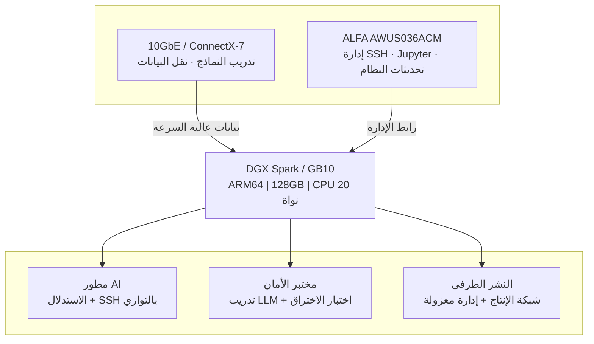

وصل أخيراً جهاز **NVIDIA DGX Spark** (الاسم الرمزي Project DIGITS) الذي طال انتظاره.

تقوم بفتح العلبة، وتوصيل الطاقة، وتظهر شاشة OOBE (الإعداد الأولي) — كل شيء يبدو سلساً. تختار شبكة Wi-Fi، وتدخل كلمة المرور، وتدور الشاشة لمدة ثلاثين ثانية...

**"لا يمكن الاتصال بهذه الشبكة."**

حاول مرة أخرى. أعد التشغيل. إعادة ضبط. لا يزال يفشل.

لست وحدك. على [منتديات مطوري NVIDIA](https://forums.developer.nvidia.com)، هناك **عشرات المواضيع** تشكو من نفس الشيء: Wi-Fi جهاز DGX Spark معطل.

هذا ليس خطأ في الإعدادات. هذا عيب تصميم معروف في DGX Spark.

---

## السبب الجذري: لماذا Wi-Fi جهاز DGX Spark غير موثوق؟

يستخدم DGX Spark — وجميع خوادم AI الأخرى المبنية على **NVIDIA GB10 Grace Blackwell Superchip** — شريحة **MediaTek MT7925 Wi-Fi 7**. على الورق، هي أجهزة من الطراز الأول.

المشكلة في طبقة البرمجيات.

### ثلاثة عيوب قاتلة

**① برنامج Wi-Fi supplicant في OOBE مبسط أكثر من اللازم**

يستخدم الإعداد الأولي لـ DGX Spark نسخة مبسطة من `wpa_supplicant` تزيل معظم ميزات المصادقة المؤسسية. هذا يجعل الارتباط مع نقاط وصول معينة — خاصة Ubiquiti UniFi — يفشل تماماً.

وثقت NVIDIA هذه المشكلة رسمياً في **ملاحظات إصدار DGX Spark (تحديث أبريل 2026)**، ولم يتم إصلاحها حتى الآن.

**② WPA2-Enterprise غير متوافق**

إذا كان مكتبك أو مختبرك يستخدم WPA2-Enterprise (شائع في البيئات المؤسسية)، فمن شبه المؤكد أن Wi-Fi المدمج في DGX Spark سيفشل. لا يمكن إصلاح هذا بملف إعدادات — إنه قيد مزدوج على مستوى التعريف و supplicant.

**③ أخطاء عشوائية "No Wi-Fi Adapter Found"**

أبلغ عدة مستخدمين في منتديات NVIDIA (الموضوع #356183) أن DGX Spark يعرض بشكل عشوائي "لم يتم العثور على محول Wi-Fi" أثناء الاستخدام العادي، مما يتطلب إعادة تشغيل كاملة. الأسوأ من ذلك، **النظام لا يعيد الاتصال تلقائياً بعد الانقطاع** — يجب عليك تشغيل أوامر `nmcli` يدوياً.

| المشكلة | التأثير |
|------|------|
| OOBE لا يمكنه الاتصال بنقاط الوصول المؤسسية | UniFi / WPA2-Enterprise — معطل بالكامل |
| "No Wi-Fi Adapter Found" عشوائي | يتطلب إعادة تشغيل، يقطع سير العمل |
| لا إعادة اتصال تلقائي | الإدارة عن بعد تصبح عديمة الفائدة |
| ملاحظات الإصدار تقر بالمشكلة | رسمي من NVIDIA، ليست حالة منعزلة |

> 💡 **الخبر السار: بينما لن يتم حل مشاكل البرمجيات هذه بالكامل في المدى القريب، هناك حل بسيط ومستقر ومتوافق تماماً على مستوى الأجهزة.**

---

## ليس فقط DGX Spark — جميع خوادم GB10 AI Edge تشترك في نفس شريحة Wi-Fi

يحظى DGX Spark بكل الاهتمام ببساطة لأنه العلامة التجارية الخاصة بـ NVIDIA وتم شحنه أولاً. لكن في الواقع، **كل خادم AI Edge يعمل بـ NVIDIA GB10 Grace Blackwell Superchip** يستخدم نفس شريحة **MediaTek MT7925 Wi-Fi 7** — نفس مجموعة التعريفات، نفس قيود `wpa_supplicant`، نفس مشاكل التوافق.

يتوفر حالياً ستة خوادم GB10 AI Edge في السوق:

### مقارنة كاملة لمواصفات خوادم GB10 AI Edge

تشترك جميع الطرازات في هذه المواصفات الأساسية:

| المكون | المواصفة |
|----------|------|
| Superchip | **NVIDIA GB10 Grace Blackwell** |
| CPU | **20-core Arm** (10× Cortex-X925 + 10× Cortex-A725) |
| GPU | **NVIDIA Blackwell GPU**، الجيل الخامس Tensor Cores / الجيل الرابع RT Cores |
| أداء AI | **1 PFLOP FP4** (1000 TOPS AI) |
| ذاكرة النظام | **128 جيجابايت LPDDR5x** موحدة، 256-bit، عرض نطاق 273 جيجابايت/ثانية |
| توصيل الذاكرة | **NVLink-C2C** (5× عرض نطاق PCIe 5.0) |
| NIC | **NVIDIA ConnectX-7** SmartNIC (200G × 2 QSFP) |
| إيثرنت | **1× 10GbE RJ-45** |
| شريحة Wi-Fi | **MediaTek MT7925** Wi-Fi 7 (2×2) |
| مخرج العرض | **1× HDMI 2.1a** |
| نظام التشغيل | **NVIDIA DGX OS** (مبني على Ubuntu Linux) |
| مزود الطاقة | **240W** محول خارجي USB-C |
| تكديس وحدتين | مدعوم (حتى 405 مليار معامل) |

الاختلافات بين العلامات التجارية:

| الميزة | **ASUS ASCENT GX10** | **MSI EdgeXpert** | **NVIDIA DGX Spark** | **HP ZGX Nano G1n** | **ALTOS BrainSphere GB10 F1** | **GIGABYTE AI TOP ATOM** |
|------|----------------------|-------------------|----------------------|---------------------|------------------------------|--------------------------|
| التخزين | 1TB / 2TB / 4TB NVMe | 1TB / 4TB NVMe | 1TB / 4TB NVMe | 1TB / 2TB / 4TB NVMe | 4TB NVMe | 1TB / 4TB NVMe (حد أقصى Gen5) |
| وحدة Wi-Fi | AW-EM637 (Wi-Fi 7) | Wi-Fi 7 | Wi-Fi 7 | MT7925 (Wi-Fi 7) | Wi-Fi 7 | Wi-Fi 7 |
| Bluetooth | BT 5.4 | BT 5.3 | BT 5.4 | BT 5.4 | BT 5.4 LE | BT 5.4 |
| USB | 4× USB 3.2 Gen 2×2 Type-C | 4× USB 3.2 Type-C | 4× USB Type-C | 4× USB Type-C | 4× USB 3.2 Gen 2×2 Type-C | 4× USB 3.2 Gen 2×2 Type-C |
| الأبعاد | 150×150×51mm | 151×151×52mm | 150×150×50.5mm | 150×150×51mm | 150×150×50mm | 150×150×50.5mm |
| الوزن | 1.48 كجم | 1.2 كجم | 1.2 كجم | 1.25 كجم | < 1.5 كجم | 1.2 كجم |
| البرمجيات المرفقة | — | — | — | HP ZGX Toolkit | منصة Altos aiGeni | — |

> ⚠️ **الخلاصة**: بغض النظر عن خادم GB10 AI Edge الذي اشتريته، فإن Wi-Fi المدمج هو نفس شريحة MediaTek MT7925، ويمكن أن تواجه جميعها نفس مشاكل الاتصال. حل محول USB من ALFA أدناه **يعمل على جميع الطرازات الستة**.

---

## الحل: محول Wi-Fi USB واحد، عشر دقائق

تختبر NVIDIA رسمياً فقط DGX OS (المبني على Ubuntu 24.04). **جميع منصات GB10 تستخدم معمارية ARM64 (aarch64)** مع Kernel **الإصدار 6.17 أو أحدث**.

هذا يعني أن محول Wi-Fi USB الخاص بك يجب أن يلبي ثلاثة متطلبات:

1. ✅ **تعريف Linux مدمج في النواة** — بدون ترجمة، بدون DKMS
2. ✅ **دعم كامل لـ ARM64 (aarch64)** — توصيل وتشغيل على GB10
3. ✅ **استقرار مثبت** — تم التحقق منه على نطاق واسع من قبل المجتمع

من بين عشرات محولات Wi-Fi USB في السوق، القليل جداً يفي بالثلاثة.

### 🥇 التوصية الوحيدة: ALFA AWUS036ACM

| العنصر | التفاصيل |
|------|------|
| مجموعة الشرائح | **MediaTek MT7612U** |
| التعريف | **mt76 مدمج في نواة Linux** (منذ Kernel 4.19) |
| النطاقات | مزدوج النطاق 2.4GHz + 5GHz (AC1200) |
| الهوائي | 2× RP-SMA قابلان للفصل 5dBi (قابلان للترقية) |
| الواجهة | USB 3.0 Type-A |
| وضع المراقبة | ✅ دعم كامل |
| وضع AP | ✅ مدعوم |
| الامتثال لـ TAA | ✅ يلبي معايير المشتريات الحكومية الأمريكية |

#### لماذا هذا؟ ستة أسباب

**1. الحل الوحيد plug-and-play بدون تعريفات حقاً**

كان تعريف mt76 جزءاً من نواة Linux الرئيسية منذ الإصدار 4.19. يدعمه Kernel 6.17 في DGX Spark بشكل أصلي. قم بتوصيله بمنفذ USB، وسيقوم النظام **بتحميل التعريف تلقائياً** — لا تقوم بتثبيت أي شيء.

**2. الخيار الوحيد المُتحقق منه على ARM64**

تم اختبار MT7612U على منصات ARM لسنوات — Raspberry Pi OS (aarch64)، Ubuntu Server (ARM64) والمزيد. معمارية ARM64 لـ GB10 متوافقة تماماً بدون الحاجة إلى أي تصحيحات.

**3. الحل الوحيد بدون ترجمة، بدون إعدادات**

على عكس Realtek RTL8812AU الذي يتطلب DKMS وإعادة ترجمة بعد كل تحديث للنواة، لا يحتاج ACM إلى أي من ذلك. قم بتحديث نواة DGX OS — يستمر ACM في العمل، فوراً.

**4. الحل الوحيد بدون تعريفات مع وضع مراقبة كامل + حقن الحزم**

إذا كنت تخطط لتشغيل أجهزة Kali Linux الافتراضية على DGX Spark لأبحاث الأمان، فإن ACM هو حالياً المحول الوحيد بدون تعريفات الذي يدعم وضع المراقبة وحقن الحزم والواجهات الافتراضية (VIF).

**5. الخيار الوحيد من الفئة المتوسطة/العليا بهوائيات قابلة للتبديل**

هوائيان RP-SMA قابلان للفصل. يأتي مع 5dBi، ويمكنك الترقية إلى هوائيات عالية الربح 7dBi أو 9dBi حسب الحاجة — مثالي للنشر في غرف الخوادم أو المصانع حيث إشارات Wi-Fi ضعيفة.

**6. الخيار الوحيد المتوافق مع TAA**

إذا كانت مؤسستك لديها متطلبات مشتريات حكومية، فإن ALFA AWUS036ACM هو أحد محولات Wi-Fi USB الخارجية القليلة الحاصلة على **امتثال TAA**.

---

## تطبيق عملي: من "لا توجد شبكة لاسلكية" إلى شبكة مزدوجة في 10 دقائق

إليك سير العمل الكامل لاستخدام ALFA AWUS036ACM على DGX Spark:

### الخطوة 1: توصيل محول USB

أدخل AWUS036ACM في أي منفذ USB 3.0 Type-A على DGX Spark.

افتح الطرفية ونفذ:

```bash
dmesg | tail -20
```

يجب أن ترى مخرجات مشابهة لـ:

```
mt76_usb 3-1:1.0: MAC/BBP MT7612U (rev 2)
mt76_usb 3-1:1.0: firmware loaded: mt7612u.bin
ieee80211 phy1: rt2x00_set_rt: Info - RT chipset 7612, rev 0200 detected
ieee80211 phy1: rt2x00lib_probe_dev: Information - Successfully initialized device
```

**هذه إشارة إلى أن التعريف تم تحميله تلقائياً.** لم تقم بتثبيت أي شيء.

### الخطوة 2: تأكيد التعرف على المحول

```bash
nmcli device status
```

يجب أن ترى `wlan1` (أو `wlx...`) مدرجاً بحالة `disconnected`.

### الخطوة 3: الاتصال بشبكة Wi-Fi

```bash
# مسح الشبكات المتاحة
nmcli device wifi list

# الاتصال بـ SSID الخاص بك (استبدل "MyLabWiFi")
sudo nmcli device wifi connect "MyLabWiFi" password "your-password"

# التحقق من حالة الاتصال
nmcli connection show --active
```

### الخطوة 4: تمكين الاتصال التلقائي عند التشغيل

إذا نجحت الخطوة السابقة، يحفظ `nmcli` ملف تعريف الاتصال تلقائياً. سيتصل تلقائياً عند كل تشغيل لاحق.

تحقق من حفظ ملف التعريف:

```bash
nmcli connection show
```

ترى SSID الخاص بك في القائمة — تم. من توصيل USB إلى اتصال Wi-Fi مستقر، **يستغرق الأمر أقل من عشر دقائق إجمالاً**.

---

## هذه هي بنية شبكة خادم AI الحقيقية

مع AWUS036ACM، يتحول إعداد شبكة DGX Spark إلى **بنية شبكة مزدوجة** احترافية:



**لماذا فصل حركة المرور؟**

يولد تدريب نماذج AI حركة مرور شبكة هائلة — تنزيل الأوزان المدربة مسبقاً، مزامنة مجموعات البيانات، اتصالات التدريب الموزع. إذا خلطت هذا مع إدارة SSH على نفس الخط:

- تصبح جلسات SSH بطيئة أو تنتهي مهلتها
- يُهدر عرض النطاق الترددي 10GbE على حركة الإدارة
- إذا انقطع الاتصال الرئيسي (مثل تعليق تنزيل نموذج)، لا يمكنك حتى الاتصال عن بعد لإصلاحه

مع الفصل، **يظل اتصال الإدارة مستقراً بغض النظر عن حمل عمل النموذج**.

---

## ثلاثة سيناريوهات، محول واحد

### السيناريو A: مطور AI
```
10GbE → استدلال النماذج، نقل البيانات
ALFA ACM → SSH، Jupyter Notebook، تحديثات النظام
```

### السيناريو B: مختبر أبحاث الأمان
```
GB10 → تشغيل ضبط دقيق لـ LLM
Kali Linux VM → تمرير USB ALFA ACM → اختبار اختراق لاسلكي
```

### السيناريو C: النشر الطرفي (مصنع / مستودع)
```
10GbE → شبكة الإنتاج
ALFA ACM + هوائيات عالية الربح → Wi-Fi إدارة المكتب
```

---

## أسئلة شائعة

**س: أليس MT7612U في AWUS036ACM و MT7925 المدمج في GB10 كلاهما من MediaTek؟**

ج: نفس الشركة المصنعة، بنية تعريف مختلفة تماماً. يستخدم MT7925 تعريف `mt7925e`، وهو تعريف واجهة PCIe أحدث لا يزال قيد التحسين. يستخدم MT7612U تعريف USB `mt76`، الذي نضج منذ Kernel 4.19 وهو مستقر للغاية.

**س: هل يعمل هذا المحول خارج DGX OS؟**

ج: بالتأكيد. تعريف MT7612U هو جزء من نواة Linux الرئيسية — Ubuntu، Debian، Raspberry Pi OS، Kali Linux، Fedora، Arch Linux — أي شيء بنواة 4.19 أو أحدث. توصيل وتشغيل على الجميع.

---

## ملخص: بغض النظر عن GB10 الذي لديك، اجعله متصلاً بالإنترنت في 10 دقائق

سواء اشتريت NVIDIA DGX Spark أو ASUS ASCENT GX10 أو MSI EdgeXpert أو HP ZGX Nano أو ALTOS BrainSphere GB10 F1 أو GIGABYTE AI TOP ATOM — هذه خوادم GB10 AI Edge هي آلات تطوير AI هائلة: ذاكرة موحدة 128 جيجابايت، CPU ARM بـ 20 نواة، شبكة ConnectX-7 200GbE. لكنها جميعاً تشترك في نفس شريحة Wi-Fi من MediaTek MT7925، ويمكن أن تتعثر جميعها في نفس الخطوة الأولى.

حل ALFA AWUS036ACM بسيط لدرجة السخف تقريباً: **وصّله، وانتهى.**

لكن هذه البساطة هي بالضبط ما تبدو عليه إنتاجية الهندسة الحقيقية — لا يجب أن تقوم بتصحيح أخطاء تعريفات Wi-Fi. يجب أن تقوم بتدريب النماذج.

مقارنة بالنهج الأخرى، الميزة واضحة:

| النهج | الوقت | الموثوقية | الصيانة |
|------|------|--------|---------|
| انتظار NVIDIA لإصلاح تعريف Wi-Fi | غير معروف (أشهر؟) | غير مؤكد | منخفضة |
| شراء جسر Wi-Fi | 30 دقيقة إعداد | متوسطة | متوسطة |
| **ALFA AWUS036ACM** | **< 10 دقائق** | **الأعلى** | **صفر** |

عشر دقائق، محول USB واحد، وخادم AI الخاص بك متصل بالإنترنت حقاً.

---

> 📌 **ALFA AWUS036ACM متوفر في المخزون** → [صفحة منتج Yupitek](/ar/products/alfa/awus036acm/)
>
> Yupitek Ltd هي موزع معتمد لـ ALFA Network في تايوان
> للطلبات أو الاستفسارات التقنية: sales@yupitek.com

---

*المصادر: ملاحظات إصدار NVIDIA DGX Spark، منتديات مطوري NVIDIA، morrownr/USB-WiFi GitHub، وثائق ALFA Network، وثائق Linux Kernel Wireless*
