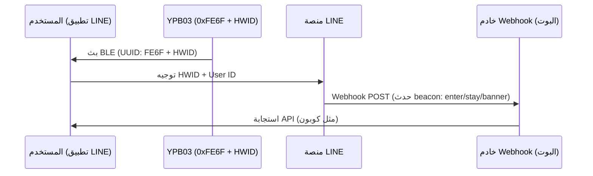

## نظرة عامة على المنتج

إنّ **YPB03** هو منارة صناعية طويلة المدى للبلتوث منخفض الطاقة (BLE 5.0) ومحسنة خصيصاً لتعمل كـ **LINE Beacon** تبث حزم **LINE Simple Beacon** القياسية. تعمل بـ **4 بطاريات AA** بسعة 5800 مللي أمبير، 

بفضل هوائي الكسب العالي، يصل مدى البث إلى **240 متراً**، وهو الخيار الأمثل للمساحات التجارية الكبيرة. لا يحتاج المستخدمون إلى تثبيت تطبيقات إضافية، بل يتلقون الإشعارات مباشرة في تطبيق **LINE**.

---

## الميزات الرئيسية

* **توافق رسمي مع LINE Beacon:** يبث بروتوكول LINE Simple Beacon المفتوح للربط مع API لـ LINE Bot.
* **صيانة منخفضة:** سعة 5800 مللي أمبير باستخدام 4 بطاريات AA شائعة يقلل الصيانة.
* **مدى 240 متراً:** إشارة BLE 5.0 قوية تغطي الصالات الكبيرة والمطارات.
* **تفاعل سلس:** يحتاج المستخدم فقط لتفعيل البلوتوث ومتابعة حسابك الرسمي.
* **هيكل IP65:** هيكل ABS متين ومقاوم للغبار ورذاذ الماء للاستخدام الصناعي.

---

## دليل تكامل LINE Beacon للمطورين

### كيف تعمل disparadores التقارب
عندما يدخل مستخدم لديه بلوتوث و LINE Beacon نطاق الإشارة:
1. يكتشف تطبيق LINE **UUID الخدمة `0xFE6F`** ويقرأ معرف الأجهزة (HWID).
2. ترسل منصة LINE حدث `beacon` إلى خادم Webhook الخاص بالبوت.
3. يستجيب البوت في الوقت الفعلي بكوبونات أو معلومات ملاحة.

### الخطوة 1: تسجيل معرف الأجهزة (HWID)
1. قم بتسجيل الدخول إلى **LINE Developers Console** أو **LINE Official Account Manager**.
2. انتقل إلى قسم Beacon وسجل الجهاز للحصول على **HWID المكون من 5 بايت (10 رموز ست عشرية)**.

### الخطوة 2: تهيئة YPB03 عبر BeaconSET+
1. قم بتنزيل **BeaconSET+** واتصل بالمنارة (يتطلب كلمة مرور).
2. اضبط إحدى قنوات البث كـ **Service Data** مع:
   - **Service UUID:** `FE6F`
   - **Data Value:** `FE6F` + `[HWID الخاص بك]` + `7F00` (مثال: `FE6F01234567897F00`).
3. احفظ واقطع الاتصال. ستبدأ المنارة ببث إشارة LINE Beacon.

### الخطوة 3: معالجة حدث الويب هوك
سيتلقى خادمك كائن JSON يحتوي تفاصيل `beacon`:
* **`hwid`**: معرف الأجهزة للمنارة.
* **`type`**: نوع الإجراء (`enter` عند الدخول، `stay` يرسل كل 10 ثوانٍ عند البقاء، `banner` عند النقر على الإعلان).

---

## طرق التثبيت

### الطريقة أ: شريط لاصق صناعي
* **الأسطح:** الزجاج، الأكريليك، الألومنيوم النظيف.
* **العملية:** نظف السطح. اضغط على الشريط (ثانيتين)، انتظر 30 دقيقة وثبت المنارة.

### الطريقة ب: التثبيت ببراغي ودعامة (موصى به)
* **الأسطح:** الخرسانة، الخشب، الطوب.
* **العملية:** ثبت الدعامة على الجدار باستخدام البراغي. أدخل YPB03 حتى يستقر في مكانه.

---

## إرشادات التهيئة

يتم تعديل المعلمات لاسلكياً عبر **BeaconSET+**:
1. قم بتنزيل **BeaconSET+** وفعل البلوتوث.
2. ابحث عن المنارة واتصل بكلمة المرور.
3. قم بتهيئة UUID و Major و Minor وقوة الإرسال والفاصل.

## Technical Specifications

| المعيار | المواصفات | ملاحظات |
| :--- | :--- | :--- |
| **Chip Model** | nRF52 series | Low latency and high efficiency |
| **Bluetooth Version** | BLE 5.0 | High range and throughput |
| **Waterproof Level** | IP65 | Dustproof and water-jet resistant |
| **Transmission Range** | Up to 240 meters | Maximum in open areas |
| **Protocol Support** | LINE Simple Beacon / iBeacon | Multi-slot broadcasting |
| **Service UUID** | 0xFE6F | Dedicated LINE Beacon UUID |
| **Service Data Format** | 0xFE6F + 5-Byte HWID + 0x7F00 | LINE Simple Beacon packet format |
| **Power Source** | 4 × AA batteries | 5800mAh capacity total (Included) |
| **Material** | ABS + Silicone | Rugged industrial casing |
| **Dimensions** | 72 × 72 × 23 mm | Wall-mountable square |
| **Net Weight** | 145 g | Including batteries |

---

## معرض صور المنتج


  


---


هل تحتاج إلى طلب عرض سعر للمنتج؟ يرجى [الاتصال بنا](/ar/contact/).

