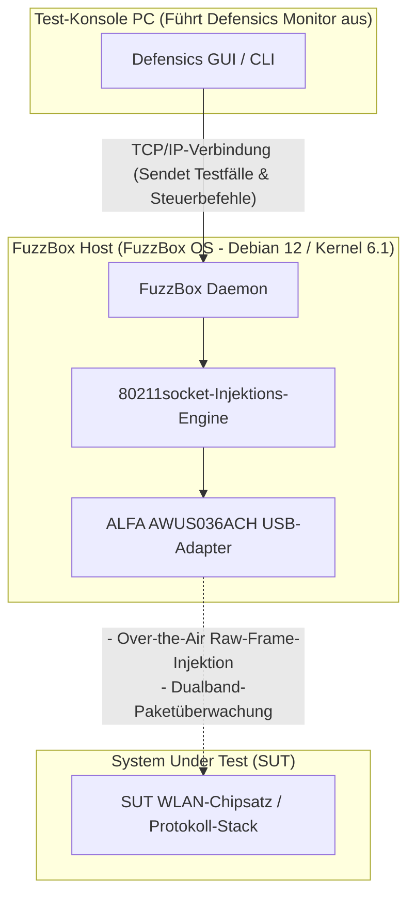

WLAN-Protokoll-Fuzzing – oft auch als negatives Drahtlostesten bezeichnet – ist einer der kritischsten Schritte bei der Validierung der Sicherheit und Robustheit von eingebetteten Drahtlosgeräten, Smart-Home-Geräten und Enterprise-Access-Points. Die Übertragung fehlerhafter 802.11-Management-, Kontroll- oder Datenframes über die Luft erfordert jedoch eine Low-Level-Steuerung der Media-Access-Control-Schicht (MAC), die Standard-Betriebssysteme und kommerzielle WLAN-Treiber schlichtweg nicht zulassen.

Um dieses Problem zu lösen, setzen Sicherheitsteams die **Black Duck FuzzBox** (ehemals Synopsys Defensics FuzzBox) ein, eine spezialisierte Software- und Hardware-Ausführungsumgebung. Zur Durchführung von Tests muss das FuzzBox OS mit einem kompatiblen, leistungsstarken USB-WLAN-Adapter gekoppelt werden, der einen stabilen Monitor-Modus und eine zuverlässige Raw-Packet-Injection unterstützt. 

In diesem Kompatibilitätsleitfaden analysieren wir das aktuelle Produktportfolio von ALFA Network bei Yupitek, erklären, warum neuere Wi-Fi 6/6E-Adapter unter FuzzBox fehlschlagen, und bieten eine Schritt-für-Schritt-Anleitung für die Branchenstandard-Wahl: den **ALFA AWUS036ACH** (RTL8812AU).

---

## 1. Kundenanforderungen

Beim Protokoll-Fuzzing erzeugt die Test-Suite Tausende von speziell angepassten, fehlerhaften WLAN-Frames (wie manipulierte Beacons, Association Requests oder WPA-Handshake-Pakete), um zu prüfen, ob der Protokoll-Stack des Zielgeräts abstürzt oder sich unerwartet verhält. 

Herkömmliche interne WLAN-Karten (wie die Intel AX200-Serie) oder USB-Dongles für Endverbraucher sind durch ihre Firmware und Betriebssystemtreiber eingeschränkt. Sie können Folgendes nicht:
*   Raw-802.11-Frames injizieren, ohne mit einem Netzwerk verbunden zu sein.
*   Zuverlässig in den Monitor-Modus (RFMON) wechseln, um die genauen Antworten des Ziels zu erfassen.
*   Präzise Übertragungsgeschwindigkeiten erzwingen oder sich ohne Paketverluste auf bestimmte Funkkanäle festlegen.

Daher erfordert das System eine dedizierte Testumgebung – Black Duck FuzzBox – in Kombination mit einem leistungsstarken, externen USB-WLAN-Adapter, der einen direkten Zugriff auf die MAC-Schicht ermöglicht.

---

## 2. Analyse der Ziel-Hardware & Software

Das **FuzzBox OS** ist eine kommerzielle, maßgeschneiderte Linux-Distribution, die speziell für den Betrieb von Defensics-Injektions-Engines entwickelt wurde. Das Verständnis der Hardware-Grenzen ist für eine stabile Bereitstellung unerlässlich.

### 2.1 Hardware-Anforderungen
*   **Host-System:** FuzzBox OS läuft auf dedizierter x86-64-Bit-Hardware, die typischerweise auf kompakten PCs wie dem Intel® NUC (8. bis 12. Gen.) oder ASUS® NUC (14. Gen. Pro) bereitgestellt wird.
*   **CPU-Architektur:** x86_64 Dual-Core-Prozessor mit einer Taktfrequenz von 2 GHz oder höher.
*   **USB-Controller:** USB 3.0 / USB 3.2 Host-Controller.
*   **USB-Stromversorgung:** Dies ist eine häufige Fehlerquelle. Leistungsstarke ALFA-WLAN-Adapter ziehen während der aktiven Übertragung erheblichen Strom (bis zu 900 mA). Sie müssen den Adapter direkt an einen High-Speed-USB-3.0-Anschluss auf dem Mainboard des Hosts anschließen. Vermeiden Sie die Verwendung von USB-Hubs ohne eigene Stromversorgung, da dies dazu führen kann, dass die Verbindung zum Adapter während des Tests unterbrochen wird.

### 2.2 Software-Umgebung
FuzzBox OS wird als Headless-Linux-Container-Plattform betrieben. Die Software-Spezifikationen umfassen:

| Komponente / Dienstprogramm | Spezifikationen & Version |
|-----------------------------|---------------------------|
| **Betriebssystem** | FuzzBox OS (basiert auf Debian 12 Bookworm, 64-Bit) |
| **Linux-Kernel** | Long-Term Support (LTS) Kernel-Version **6.1.x** |
| **Vorinstallierte Treiber** | Optimierte Wireless-Kernel-Module, einschließlich des Injektionstreibers `rtl88xxau` |
| **DKMS-Unterstützung** | Aktiviert für die dynamische Kompilierung benutzerdefinierter Treibermodule |
| **GCC & Make Toolchain** | GCC 12.2.0 und GNU Make 4.3 (vorinstalliert zum Kompilieren benutzerdefinierter Treiber) |
| **Netzwerk-Dienstprogramme** | `iw`, `iwpan`, `wireless-tools`, `airmon-ng` und `tcpdump` |

---

## 3. ALFA-Adapter-Analyse & GitHub-Treiber-Speicherort

Die Auswahl des richtigen Adapters aus den aktuellen, aktiven Modellen ist entscheidend. Vergleichen wir das aktive ALFA Network-Sortiment von Yupitek mit der Kompatibilitätsmatrix des FuzzBox OS.

### 3.1 Genaue Bewertung der aktuellen ALFA-Modelle
ALFA Network stellt Adapter mit verschiedenen Chipsätzen her. Nur bestimmte Chipsätze unterstützen die Raw-Injection-Engine der FuzzBox.

| ALFA-Modell | Chipsatz | USB-Version | WLAN-Gen | FuzzBox-Kompatibilitätsstatus |
|-------------|----------|-------------|----------|-------------------------------|
| **AWUS036ACH** | **Realtek RTL8812AU** | **USB 3.0** | **Wi-Fi 5** | **✅ 100 % kompatibel (Hauptempfehlung)** |
| **AWUS036ACS** | **Realtek RTL8811AU** | **USB 2.0** | **Wi-Fi 5** | **✅ Kompatibel (Backup / Kompakt)** |
| **AWUS036AXML** | MediaTek MT7921AUN | USB-C 3.2 | Wi-Fi 6E | ❌ Nicht unterstützt (Kein Injektionstreiber) |
| **AWUS036AXM** | MediaTek MT7921AUN | USB 3.2 | Wi-Fi 6E | ❌ Nicht unterstützt (Kein Injektionstreiber) |
| **AWUS036AX** | Realtek RTL8832BU | USB 3.2 | Wi-Fi 6 | ❌ Nicht unterstützt (Kein Injektionstreiber) |
| **AWUS036AXER** | Realtek RTL8832BU | USB 3.2 | Wi-Fi 6 | ❌ Nicht unterstützt (Kein Injektionstreiber) |
| **AWUS036ACM** | MediaTek MT7612U | USB 3.0 | Wi-Fi 5 | ❌ Nicht unterstützt (Kein Injektionstreiber) |
| **AWUS036EACS** | Realtek RTL8811CU | USB 2.0 | Wi-Fi 5 | ❌ Nicht unterstützt (Treiber inkompatibel) |

### 3.2 Die erste Wahl: ALFA AWUS036ACH
Der **ALFA AWUS036ACH** ist der Branchenstandard für professionelle Protokolltests.
*   **Chipsatz:** Realtek RTL8812AU.
*   **USB VID/PID:** `0bda:8812` (die ALFA-Herstellerkennung wird als `0df6:0088` registriert).
*   **Funkspezifikationen:** Dualband 2,4 GHz und 5 GHz (802.11ac), 2×2 MIMO.
*   **Antennen:** Zwei externe, abnehmbare omnidirektionale 5-dBi-High-Gain-Antennen (RP-SMA-Anschlüsse).
*   **Warum er überzeugt:** Der RTL8812AU-Chipsatz verfügt über robuste, von der Community optimierte Treiber, die es der FuzzBox-Injektions-Engine ermöglichen, die Standard-Netzwerkstacks des Betriebssystems zu umgehen. Dies erlaubt eine Raw-Frame-Übertragung ohne jeglichen Paketverlust.

### 3.3 Die Alternative: ALFA AWUS036ACS
*   **Chipsatz:** Realtek RTL8811AU.
*   **USB VID/PID:** `0bda:0811` oder `0bda:8811`.
*   **Funkspezifikationen:** Dualband, 1×1 Single-Stream, bis zu 433 MBit/s.
*   **Warum man ihn wählt:** Er ist kompakt und preisgünstig und teilt ähnliche Treibereigenschaften mit dem RTL8812AU. Da er jedoch nur über eine einzige Antenne verfügt, fehlen ihm die Reichweite und die räumliche Diversität, die für größere Testkammern erforderlich sind.

### 3.4 Treiber-Quellcode-Speicherorte (GitHub)
Das FuzzBox OS ist bereits mit stabilen Injektionstreibern vorinstalliert. Wenn Sie Treiber auf Ihrer lokalen Linux-Analysestation kompilieren oder Diagnosen durchführen müssen, sind die stabilsten und Kernel-kompatiblen Repositories:
*   **RTL8812AU-Treiber (AWUS036ACH):** [morrownr/8812au-20210629 GitHub-Repository](https://github.com/morrownr/8812au-20210629)
*   **RTL8811AU-Treiber (AWUS036ACS):** [morrownr/8821au GitHub-Repository](https://github.com/morrownr/8821au)

---

## 4. Analyse der Treiberkompatibilität

Das Herzstück der Paketübertragung von FuzzBox liegt in ihrem proprietären Injektor-Daemon `80211socket`.

### Warum neuere Wi-Fi 6/6E-Chipsätze nicht funktionieren
Viele Tester gehen davon aus, dass der Kauf eines neueren, schnelleren Adapters (wie des Wi-Fi 6E AWUS036AXML mit dem MT7921AUN-Chipsatz) die Leistung verbessern würde. FuzzBox is jedoch für die Sicherheitsprüfung von Protokollen konzipiert und nicht für den Internetdurchsatz.

Der Injektor `80211socket` kommuniziert direkt mit dem WLAN-Treiber auf Ebene der MAC-Teilschicht (MAC-Sublayer). Um dies zu ermöglichen, muss der Treiber spezielle Erweiterungen für die Raw-Injektion unterstützen. Derzeit ist die Injektions-Engine des FuzzBox OS für den ausgereiften **Realtek-`rtl88xxau`**-Treiberzweig (speziell RTL8812AU/RTL8814AU) optimiert. MediaTek-Chipsätze (MT7921AUN, MT7612U) und neuere Realtek Wi-Fi 6-Chipsätze (RTL8832BU) verwenden diesen Injektionstreiber nicht und werden daher vom FuzzBox-Daemon ignoriert.

### Stabilität unter Kernel 6.1.x
Der RTL8812AU-Treiber wurde für den Linux-Kernel 6.1.x rückportiert (backported) und umfassend gepatcht. Er unterstützt stabiles Channel-Locking (Kanalsperrung), schützt vor Pufferüberläufen (Buffer Overflows) bei massiver Paketbelastung und verhindert Kernel-Panics während intensiver Deauthentifizierungs-Fuzzing-Kampagnen.

---

## 5. Installations- und Einrichtungsanleitung

Befolgen Sie diese Schritte, um den ALFA AWUS036ACH-Adapter auf Ihrem Black Duck FuzzBox-System bereitzustellen und zu konfigurieren.

### Schritt 1: Physische Verbindung
Verbinden Sie den ALFA AWUS036ACH direkt mit einem USB-3.0-Anschluss (blau gefärbt oder mit `SS` gekennzeichnet) am FuzzBox-NUC. Stellen Sie sicher, dass die beiden 5-dBi-Antennen fest verschraubt sind.

### Schritt 2: Hardware-Erkennung überprüfen
Greifen Sie per SSH oder über einen lokalen Bildschirm auf die Terminal-Schnittstelle der FuzzBox zu und führen Sie den folgenden Befehl aus, um zu prüfen, ob die USB-Schnittstelle den Adapter erkennt:
```bash
lsusb
```
Sie sollten einen Eintrag sehen, der den RTL8812AU-Chipsatz bestätigt:
```text
Bus 002 Device 003: ID 0bda:8812 Realtek Semiconductor Corp. RTL8812AU 802.11a/b/g/n/ac WLAN Adapter
```

### Schritt 3: Injektor-Daemon konfigurieren
Die FuzzBox weist ihre physischen Adapter über Konfigurationsdateien zu. Öffnen Sie die Einstellungsdatei des FuzzBox-Injektors:
```bash
sudo nano /opt/defensics/fuzzbox/injectors/80211socket.conf
```
Stellen Sie sicher, dass der Treiber-Parameter für die Verwendung des Realtek-USB-Injektionsmoduls konfiguriert ist:
```text
driver="usb:rtl88xxau;"
```
Speichern Sie die Datei und beenden Sie den Editor.

### Schritt 4: Monitor-Modus und Betrieb validieren
Überprüfen Sie, ob der FuzzBox-Daemon den Adapter erfolgreich in den Monitor-Modus versetzt. Deaktivieren Sie standardmäßige Netzwerk-Management-Tools, falls diese Konflikte verursachen, und aktivieren Sie die Schnittstelle:
```bash
sudo ip link set wlan0 down
sudo iw dev wlan0 set type monitor
sudo ip link set wlan0 up
```
Überprüfen Sie den Status der Schnittstelle:
```bash
iwconfig wlan0
```
Die Ausgabe sollte `Mode:Monitor` bestätigen und die aktuelle Betriebsfrequenz des Adapters anzeigen.

---

## 6. Anwendungstopologie

Das folgende Diagramm veranschaulicht, wie die FuzzBox-Workstation, der ALFA AWUS036ACH-Adapter und das System Under Test (SUT) innerhalb des WLAN-Prüfnetzwerks interagieren:


### System-Ablaufdiagramm


---

## 7. Validierungsergebnis

Überprüfen Sie nach der Konfiguration, ob das FuzzBox-System den WLAN-Adapter erkennt und bereit ist, Testfälle auszuführen.

Führen Sie das interne Diagnose-Dienstprogramm für FuzzBox-Adapter aus:
```bash
sudo ls -l /var/run/defensics/injectors/80211/adapters/
```
Bei erfolgreicher Erkennung wird ein symbolischer Link zur Netzwerkschnittstelle ausgegeben:
```text
lrwxrwxrwx 1 root root 23 Jun 04 13:30 phy0 -> /sys/class/net/wlan0
```

Wenn Sie die Defensics WLAN-Test-Suite (wie die WPA3-Client- oder Access-Point-Test-Suite) vom Test-Konsolen-PC aus starten, zeigt die Konsolenausgabe die Injektionsrate an und bestätigt, dass fehlerhafte 802.11-Management-Frames aktiv injiziert werden:
```text
[INFO] 13:31:02 Injector Daemon: Adapter phy0 loaded successfully.
[INFO] 13:31:04 Injecting test case #154 (Malformed Association Request) -> SUT
[INFO] 13:31:05 Capturing response: SUT responded with Status Code 0 (Success)
[INFO] 13:31:07 Injecting test case #155 (Malformed Association Request with invalid IE lengths)
```

---

## 8. Empfehlungen

### 8.1 Hardware-Empfehlungsmatrix
Für Sicherheitsprüflabore, die Black Duck FuzzBox-Systeme einsetzen, empfehlen wir folgenden Hardware-Stack:

*   **Haupt-Injektions-Adapter:** **ALFA Network AWUS036ACH** (RTL8812AU). Bietet Doppelantennen, hohe Ausgangsleistung und die volle USB 3.0-Bandbreite. Dies ist das primäre Arbeitspferd für Basistests.
*   **Backup- / Leichtgewichts-Adapter:** **ALFA Network AWUS036ACS** (RTL8811AU). Perfekt für schnelle, portable Setups, jedoch beschränkt auf 1×1-Stream-Tests.
*   **Signaloptimierung (Dringend empfohlen):** Fügen Sie die gerichteten Dualband-Panel-Antennen **ALFA APA-M25** oder **APA-M25-6E** hinzu. Das Ersetzen der standardmäßigen omnidirektionalen Antennen durch diese High-Gain-Panel-Antennen fokussiert das Funksignal direkt auf das System Under Test (SUT), wodurch Umgebungsstörungen reduziert und die Erfolgsraten der Injektionen verbessert werden.

### 8.2 Anfragen und Bestellungen
Yupitek ist ein autorisierter Distributor von ALFA Network-Produkten, der lokalen Support und Großbestellungen anbietet. Um Produktangebote anzufordern, Großbestellungen aufzugeben oder unser technisches Support-Team zu konsultieren:
*   Besuchen Sie die [Yupitek Kontaktseite](/de/contact/)
*   Oder schreiben Sie uns direkt eine E-Mail an **sales@yupitek.com**

Unser Engineering-Team unterstützt Sie beim Erwerb der genauen WLAN-Hardwarekonfigurationen, die zur Unterstützung Ihrer Black Duck FuzzBox-Protokoll-Fuzzing-Workflows erforderlich sind.
