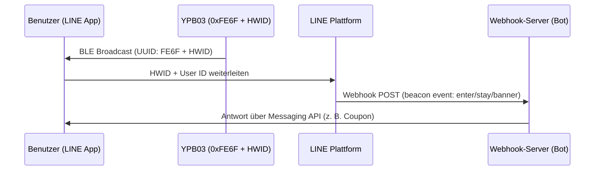

## Produktübersicht

Der **YPB03** is ein industrieller Bluetooth® Low Energy (BLE 5.0) Beacon, der als **LINE Beacon** optimiert ist und standardisierte **LINE Simple Beacon** Pakete sendet. Betrieben mit **4 × AA-Batterien** (5800mAh), erreicht er eine Lebensdauer von **bis zu 10 Jahren**.

Mit einer Sendeleistung von bis zu **240 Metern** eignet sich der YPB03 ideal für große Hallen, Museen und Einkaufszentren. Kunden benötigen keine separate App – sie empfangen Push-Benachrichtigungen direkt in ihrer **LINE** App.

---

## Hauptmerkmale

* **Offizielle LINE Beacon Kompatibilität:** Sendet das LINE Simple Beacon Protokoll für die direkte Verknüpfung mit der LINE Bot Messaging API.
* **10 Jahre Batterielaufzeit:** Große 5800mAh Kapazität mit vier Standard-AA-Batterien reduziert den Wartungsaufwand.
* **240m Reichweite:** Leistungsstarke BLE 5.0 Reichweite für Messehallen und Bahnhöfe.
* **Nahtlose Interaktion:** Benutzer müssen nur Bluetooth aktivieren und Ihren Kanal hinzufügen – kein App-Download nötig.
* **IP65-Gehäuse:** Robustes, strahlwassergeschütztes Gehäuse für den industriellen Einsatz.

---

## LINE Beacon Entwicklerhandbuch

### Funktionsweise der Näherungstrigger
Wenn ein Benutzer mit aktivem Bluetooth und LINE Beacon die Reichweite betritt:
1. Die LINE App erkennt die **Service UUID `0xFE6F`** und liest die Hardware-ID (HWID).
2. Die LINE Plattform sendet ein `beacon` Event an Ihren Bot Webhook-Server.
3. Ihr Server reagiert in Echtzeit mit Gutscheinen, Nachrichten oder Wegbeschreibungen.

### Schritt 1: Hardware-ID (HWID) registrieren
1. Gehen Sie in das **LINE Developers Portal** oder den **LINE Official Account Manager**.
2. Registrieren Sie das Gerät und notieren Sie sich die **5-Byte (10 Hex-Zeichen) HWID**.

### Schritt 2: YPB03 über BeaconSET+ konfigurieren
1. Laden Sie die **BeaconSET+** App herunter.
2. Verbinden Sie sich mit dem Beacon (Passwort erforderlich).
3. Setzen Sie einen Slot auf **Service Data** mit:
   - **Service UUID:** `FE6F`
   - **Data Value:** `FE6F` + `[Ihre 5-Byte HWID]` + `7F00` (z. B. `FE6F01234567897F00`).
4. Speichern und trennen. Der Beacon sendet nun LINE Beacon Signale.

### Schritt 3: Webhook Beacon Event verarbeiten
Ihr Server erhält ein JSON-Event mit `beacon` Details:
* **`hwid`**: Die 5-Byte Hardware-ID des Beacons.
* **`type`**: Aktionstyp (`enter` beim Betreten, `stay` für dauerhaften Aufenthalt alle 10 Sek., `banner` bei Klick auf das Banner).

---

## Installationsmethoden

### Methode A: Klebeband
* **Flächen:** Glas, Acryl, sauberes Aluminium.
* **Prozess:** Fläche reinigen. Klebeband anpressen (2 Sek.), 30 Min. warten, dann montieren.

### Methode B: Schrauben (Empfohlen)
* **Flächen:** Beton, Holz, Ziegel.
* **Prozess:** Halterung mit Schrauben und Dübeln anbringen. YPB03 einschieben, bis er einrastet.

---

## Konfigurationsanleitung

Die Parameter (UUID, Major, Minor, Sendeleistung, Intervall) werden über **BeaconSET+** drahtlos konfiguriert:
1. **BeaconSET+** App herunterladen.
2. Bluetooth und Standort aktivieren.
3. Beacon scannen, Passwort eingeben und Parameter anpassen.

## Technical Specifications

| Parameter | Spezifikationen | Anmerkungen |
| :--- | :--- | :--- |
| **Chip Model** | nRF52 series | Low latency and high efficiency |
| **Bluetooth Version** | BLE 5.0 | High range and throughput |
| **Waterproof Level** | IP65 | Dustproof and water-jet resistant |
| **Transmission Range** | Up to 240 meters | Maximum in open areas |
| **Protocol Support** | LINE Simple Beacon / iBeacon | Multi-slot broadcasting |
| **Service UUID** | 0xFE6F | Dedicated LINE Beacon UUID |
| **Service Data Format** | 0xFE6F + 5-Byte HWID + 0x7F00 | LINE Simple Beacon packet format |
| **Power Source** | 4 × AA batteries | 5800mAh capacity total (Included) |
| **Battery Lifetime** | Up to 10 years | Based on default broadcasting parameters |
| **Material** | ABS + Silicone | Rugged industrial casing |
| **Dimensions** | 72 × 72 × 23 mm | Wall-mountable square |
| **Net Weight** | 145 g | Including batteries |

---

## Produktgalerie


  


---


Benötigen Sie ein Produktangebot? Bitte [kontaktieren Sie uns](/de/contact/).

