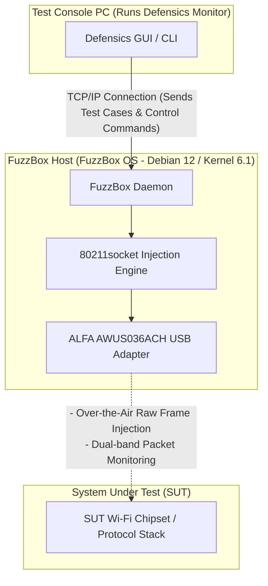

WLAN protocol fuzzing—often referred to as wireless negative testing—is one of the most critical steps in validating the security and robustness of embedded wireless devices, smart home appliances, and enterprise access points. However, attempting to transmit malformed 802.11 management, control, or data frames over-the-air requires low-level control of the media access control (MAC) layer that standard operating systems and commercial WiFi drivers simply do not allow.

To solve this, security teams use **Black Duck FuzzBox** (formerly Synopsys Defensics FuzzBox), a specialized software and hardware execution environment. To conduct tests, FuzzBox OS must be paired with a compatible, high-performance USB wireless adapter capable of stable monitor mode and reliable raw packet injection. 

In this compatibility guide, we analyze Yupitek's active ALFA Network product catalog, explain why newer Wi-Fi 6/6E adapters fail under FuzzBox, and provide a step-by-step setup guide for the industry-standard choice: the **ALFA AWUS036ACH** (RTL8812AU).

---

## 1. Customer Requirement

When performing protocol fuzzing, the test suite generates thousands of custom-crafted, malformed wireless frames (such as manipulated Beacons, Association Requests, or WPA handshake packets) to see if the target device's protocol stack crashes or behaves unexpectedly. 

Traditional internal WiFi cards (like the Intel AX200 series) or consumer-grade USB dongles are restricted by their firmware and OS drivers. They cannot:
*   Inject raw 802.11 frames without being associated with a network.
*   Reliably transition into Monitor Mode (RFMON) to capture the target's exact responses.
*   Enforce precise transmission speeds or lock onto specific radio channels without dropping packets.

Therefore, the system requires a dedicated testing environment—Black Duck FuzzBox—paired with a high-power, external USB wireless adapter that exposes direct MAC-layer access.

---

## 2. Target Hardware & Software Analysis

The **FuzzBox OS** is a commercial, custom-built Linux distribution engineered specifically to run Defensics injector engines. Understanding its hardware boundaries is essential for a stable deployment.

### 2.1 Hardware Requirements
*   **Host System:** FuzzBox OS runs on dedicated x86 64-bit hardware, typically deployed on compact PCs like the Intel® NUC (8th to 12th Gen) or ASUS® NUC (14th Gen Pro).
*   **CPU Architecture:** x86_64 dual-core processor clocked at 2 GHz or higher.
*   **USB Controller:** USB 3.0 / USB 3.2 Host Controller.
*   **USB Power Capability:** This is a common point of failure. High-power ALFA wireless adapters draw significant current (up to 900mA) during active transmission. You must connect the adapter to a high-speed USB 3.0 port directly on the host motherboard. Avoid using unpowered USB hubs, which can cause the adapter to disconnect mid-test.

### 2.2 Software Environment
FuzzBox OS operates as a headless Linux container platform. The software specs include:

| Component / Utility | Specifications & Version |
|---------------------|--------------------------|
| **Operating System** | FuzzBox OS (based on Debian 12 Bookworm, 64-bit) |
| **Linux Kernel** | Long-Term Support (LTS) Kernel version **6.1.x** |
| **Preloaded Drivers** | Optimized wireless kernel modules, including the `rtl88xxau` injection driver |
| **DKMS Support** | Enabled for dynamic compilation of custom driver modules |
| **GCC & Make Toolchain** | GCC 12.2.0 and GNU Make 4.3 (pre-installed for compiling custom drivers) |
| **Network Utilities** | `iw`, `iwpan`, `wireless-tools`, `airmon-ng`, and `tcpdump` |

---

## 3. ALFA Adapter Analysis & GitHub Driver Location

Selecting the right adapter from current, active models is crucial. Let's compare Yupitek's active ALFA Network inventory against the FuzzBox OS compatibility matrix.

### 3.1 Hard Evaluation of Current ALFA Models
ALFA Network manufactures adapters using different chipsets. Only specific chipsets support FuzzBox's raw injection engine.

| ALFA Model | Chipset | USB Version | Wi-Fi Gen | FuzzBox Compatibility Status |
|------------|---------|-------------|-----------|------------------------------|
| **AWUS036ACH** | **Realtek RTL8812AU** | **USB 3.0** | **Wi-Fi 5** | **✅ 100% Compatible (Primary Pick)** |
| **AWUS036ACS** | **Realtek RTL8811AU** | **USB 2.0** | **Wi-Fi 5** | **✅ Compatible (Backup / Compact)** |
| **AWUS036AXML** | MediaTek MT7921AUN | USB-C 3.2 | Wi-Fi 6E | ❌ Unsupported (No Injection Driver) |
| **AWUS036AXM** | MediaTek MT7921AUN | USB 3.2 | Wi-Fi 6E | ❌ Unsupported (No Injection Driver) |
| **AWUS036AX** | Realtek RTL8832BU | USB 3.2 | Wi-Fi 6 | ❌ Unsupported (No Injection Driver) |
| **AWUS036AXER** | Realtek RTL8832BU | USB 3.2 | Wi-Fi 6 | ❌ Unsupported (No Injection Driver) |
| **AWUS036ACM** | MediaTek MT7612U | USB 3.0 | Wi-Fi 5 | ❌ Unsupported (No Injection Driver) |
| **AWUS036EACS** | Realtek RTL8811CU | USB 2.0 | Wi-Fi 5 | ❌ Unsupported (Driver incompatible) |

### 3.2 The Primary Choice: ALFA AWUS036ACH
The **ALFA AWUS036ACH** is the industry-standard choice for professional protocol testing.
*   **Chipset:** Realtek RTL8812AU.
*   **USB VID/PID:** `0bda:8812` (ALFA vendor identification registers as `0df6:0088`).
*   **Radio Specifications:** Dual-band 2.4 GHz and 5 GHz (802.11ac), 2×2 MIMO.
*   **Antennas:** Dual external, detachable 5 dBi high-gain omni-directional antennas (RP-SMA connectors).
*   **Why it excels:** The RTL8812AU chipset features robust, community-refined drivers that allow the FuzzBox injection engine to bypass standard OS network stacks, enabling zero-packet-drop raw frame transmission.

### 3.3 The Backup Choice: ALFA AWUS036ACS
*   **Chipset:** Realtek RTL8811AU.
*   **USB VID/PID:** `0bda:0811` or `0bda:8811`.
*   **Radio Specifications:** Dual-band, 1×1 Single-Stream, up to 433 Mbps.
*   **Why to choose it:** It is compact and budget-friendly, sharing similar driver traits with the RTL8812AU. However, because it has only one antenna, it lacks the range and spatial diversity required for larger testing chambers.

### 3.4 Driver Source Locations (GitHub)
FuzzBox OS comes preloaded with stable injection drivers. If you need to compile or run diagnostics on your local Linux analysis workstation, the most stable, Kernel-compatible repositories are:
*   **RTL8812AU Driver (AWUS036ACH):** [morrownr/8812au-20210629 GitHub Repository](https://github.com/morrownr/8812au-20210629)
*   **RTL8811AU Driver (AWUS036ACS):** [morrownr/8821au GitHub Repository](https://github.com/morrownr/8821au)

---

## 4. Driver Compatibility Analysis

The core of FuzzBox's packet transmission lies in its proprietary `80211socket` injector daemon. 

### Why Newer Wi-Fi 6/6E Chipsets Do Not Work
Many testers assume that buying a newer, faster adapter (like the Wi-Fi 6E AWUS036AXML using the MT7921AUN chipset) will improve performance. However, FuzzBox is designed for protocol vulnerability testing, not internet throughput. 

The `80211socket` injector interfaces directly with the wireless driver at the MAC-sublayer level. To accomplish this, the driver must support specialized raw injection extensions. Currently, FuzzBox OS's injection engine is optimized for the mature **Realtek `rtl88xxau`** driver tree (specifically RTL8812AU/RTL8814AU). MediaTek chipsets (MT7921AUN, MT7612U) and newer Realtek Wi-Fi 6 chipsets (RTL8832BU) do not utilize this injection driver tree and are therefore ignored by the FuzzBox daemon.

### Stability Under Kernel 6.1.x
The RTL8812AU driver has been backported and extensively patched for the Linux 6.1.x kernel. It supports stable channel-locking, guards against buffer overflows under massive packet stress, and prevents kernel panics during high-speed de-authentication fuzzing campaigns.

---

## 5. Set up Guide

Follow these steps to deploy and configure the ALFA AWUS036ACH adapter on your Black Duck FuzzBox system.

### Step 1: Physical Connection
Connect the ALFA AWUS036ACH directly to a USB 3.0 port (colored blue or labeled with `SS`) on the FuzzBox NUC. Ensure the dual 5 dBi antennas are securely fastened.

### Step 2: Verify Hardware Detection
Access the FuzzBox terminal interface via SSH or a local display, and run the following command to check if the USB interface recognizes the adapter:
```bash
lsusb
```
You should see an entry confirming the RTL8812AU chipset:
```text
Bus 002 Device 003: ID 0bda:8812 Realtek Semiconductor Corp. RTL8812AU 802.11a/b/g/n/ac WLAN Adapter
```

### Step 3: Configure the Injector Daemon
FuzzBox maps its physical adapters through configuration files. Open the FuzzBox injector settings file:
```bash
sudo nano /opt/defensics/fuzzbox/injectors/80211socket.conf
```
Ensure that the driver parameter is configured to use the Realtek USB injection module:
```text
driver="usb:rtl88xxau;"
```
Save the file and exit the editor.

### Step 4: Validate Monitor Mode and Operation
Verify if the FuzzBox daemon successfully transitions the adapter into monitor mode. Disable standard network management tools if they conflict, and raise the interface:
```bash
sudo ip link set wlan0 down
sudo iw dev wlan0 set type monitor
sudo ip link set wlan0 up
```
Check the interface status:
```bash
iwconfig wlan0
```
The output should confirm `Mode:Monitor` and display the adapter's current operating frequency.

---

## 6. Application Topology

The following diagram illustrates how the FuzzBox workstation, the ALFA AWUS036ACH adapter, and the System Under Test (SUT) interact within the wireless auditing network:


### System Flow Diagram


---

## 7. Validation Result

Once configured, verify that the FuzzBox system recognizes the wireless adapter and is ready to run test cases.

Run the internal FuzzBox adapter diagnostic utility:
```bash
sudo ls -l /var/run/defensics/injectors/80211/adapters/
```
A successful detection will output a symbolic link to the network interface:
```text
lrwxrwxrwx 1 root root 23 Jun 04 13:30 phy0 -> /sys/class/net/wlan0
```

When you launch the Defensics WLAN test suite (such as the WPA3 Client or Access Point test suite) from the Test Console PC, the console output will display the injection rate and confirm that malformed 802.11 management frames are actively being injected:
```text
[INFO] 13:31:02 Injector Daemon: Adapter phy0 loaded successfully.
[INFO] 13:31:04 Injecting test case #154 (Malformed Association Request) -> SUT
[INFO] 13:31:05 Capturing response: SUT responded with Status Code 0 (Success)
[INFO] 13:31:07 Injecting test case #155 (Malformed Association Request with invalid IE lengths)
```

---

## 8. Recommendation

### 8.1 Hardware Recommendation Matrix
For security testing labs deploying Black Duck FuzzBox systems, we recommend the following hardware stack:

*   **Primary Injector Adapter:** **ALFA Network AWUS036ACH** (RTL8812AU). Features dual antennas, high output power, and full USB 3.0 bandwidth. This is the primary workhorse for baseline testing.
*   **Backup / Lightweight Adapter:** **ALFA Network AWUS036ACS** (RTL8811AU). Perfect for quick portable setups, but limited to 1×1 stream testing.
*   **Signal Optimization (Highly Recommended):** Add the **ALFA APA-M25** or **APA-M25-6E** dual-band directional panel antennas. Replacing the stock omni-directional antennas with these high-gain panels focuses the radio signal directly onto the System Under Test (SUT), reducing ambient environmental noise and improving injection success rates.

### 8.2 Inquiries and Ordering
Yupitek is an authorized distributor of ALFA Network products, providing local support and bulk supply. To request product quotes, place bulk orders, or consult with our technical support team:
*   Visit the [Yupitek Contact Us Page](/en/contact/)
*   Or email us directly at **sales@yupitek.com**

Our engineering team will assist you in acquiring the exact wireless hardware configurations needed to support your Black Duck FuzzBox protocol fuzzing workflows.
