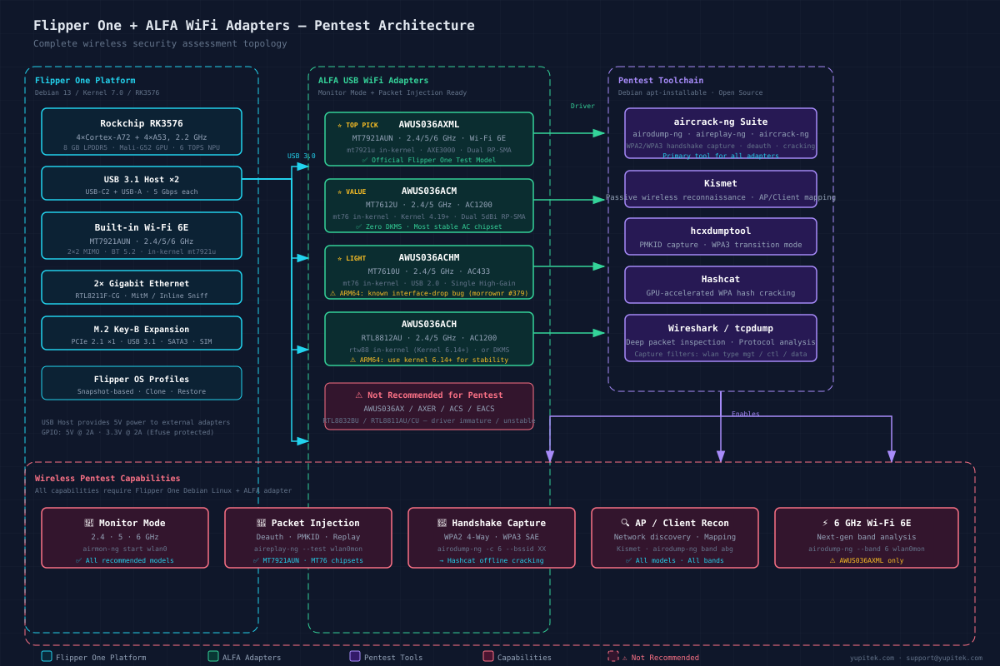

If you own a Flipper Zero — or are considering buying one — and you've heard about ALFA Network's legendary USB WiFi adapters for wireless security testing, you've probably wondered: **"Can I plug my ALFA adapter into my Flipper Zero and start capturing WPA2 handshakes?"**


**Legal Notice:** Monitor mode and packet injection must only be performed on networks you own or have explicit written authorization to test. Unauthorized interception of wireless communications is illegal in most jurisdictions. All techniques described in this guide are intended solely for **authorized penetration testing, security research on your own equipment, and educational purposes**.


## Introduction: The Question Every Pentester Asks


Flipper Zero STM32WB55 only supports USB device mode and cannot drive any ALFA adapter. Flipper One with RK3576 and full Debian Linux supports AWUS036AXML for tri-band monitoring and injection.



Flipper Zero cannot use any ALFA USB WiFi adapter due to hardware limitations. Flipper One fully supports models like the AWUS036AXML, capable of monitor mode and packet injection.


The short answer is no — but the full answer is much more interesting.

**Flipper Zero cannot connect to any ALFA USB WiFi adapter.** This is a hardware limitation, not a software one. The STM32WB55 microcontroller inside the Flipper Zero has a USB controller that operates in **device-only mode** — it physically cannot act as a USB host to drive external peripherals like WiFi adapters.

But Flipper Devices has announced an entirely new product: **Flipper One**. Built on a Rockchip RK3576 with 8 GB of RAM running full Debian Linux, Flipper One has two USB 3.1 host ports and can directly use ALFA adapters for complete wireless security testing — including 6 GHz Wi-Fi 6E analysis. In fact, Flipper One's founder Pavel Zhovner specifically named the **ALFA AWUS036AXML** as the official test adapter in the product announcement.

This article explains the full compatibility picture: what works, what doesn't, why, and how to set everything up.

---

## Flipper Zero: Why It Cannot Use ALFA Adapters

To understand the limitation, you need to understand what's inside a Flipper Zero.

### The Hardware

| Component | Specification |
|-----------|--------------|
| **MCU** | STMicroelectronics STM32WB55RG |
| **Architecture** | ARM Cortex-M4 (application core) @ 64 MHz + ARM Cortex-M0+ (wireless core) @ 32 MHz |
| **RAM** | 256 KB (shared between cores) |
| **Storage** | 1 MB Flash + MicroSD |
| **Operating System** | FreeRTOS (real-time operating system) |
| **USB** | USB Type-C, USB 2.0 Full Speed (12 Mbps) |
| **USB Mode** | **Device only** — no host or OTG capability |

### The USB Limitation

The STM32WB55's USB controller is a **USB Full-Speed Device Controller**. It can present the Flipper Zero to a computer as a USB device (for file transfer, firmware updates, and the CLI interface), but it cannot act as a USB host. There is no host controller hardware on the chip — no amount of firmware modification can add this capability.

To use an ALFA USB WiFi adapter, a device needs:
1. **USB Host controller hardware** — to enumerate and communicate with USB devices
2. **Linux kernel with WiFi driver support** — to load drivers like `mt7921u`, `mt76`, or `rtw88`
3. **Sufficient power delivery** — ALFA adapters typically draw 500 mA to 900 mA at 5V

Flipper Zero fails all three requirements:
- ❌ No USB Host controller (hardware)
- ❌ Runs FreeRTOS, not Linux — no kernel driver framework exists
- ⚠️ GPIO 5V output limited to 1.2A total across all pins, and only when manually enabled

> **Verdict:** It is **physically impossible** to connect any ALFA USB WiFi adapter to a Flipper Zero. This is not a limitation that can be worked around with software, firmware updates, or expansion boards — it is baked into the silicon.

---

## Flipper Zero + WiFi Dev Board: A Limited Alternative

Flipper Devices sells an official **WiFi Dev Board** based on the **ESP32-S2** microcontroller. This board plugs into the Flipper Zero's GPIO header and provides basic 2.4 GHz WiFi capabilities — but it does **not** change the USB host situation.

| Aspect | Capability |
|--------|-----------|
| **WiFi Chip** | ESP32-S2 (Xtensa LX7 single-core, 240 MHz) |
| **Frequency** | 2.4 GHz only, 802.11 b/g/n |
| **USB Host** | ❌ WiFi Dev Board does not expose USB Host — the ESP32-S2 connects to Flipper Zero via GPIO, not USB |
| **Firmware** | ESP32 Marauder (community-developed) |

With the **ESP32 Marauder firmware** installed, the WiFi Dev Board can perform:

- ✅ Deauthentication attacks (2.4 GHz only)
- ✅ PMKID capture (2.4 GHz only)
- ✅ Access point scanning and SSID broadcasting
- ✅ Basic packet sniffing (2.4 GHz only)

What it **cannot** do:

- ❌ Use external ALFA USB adapters (no USB host)
- ❌ Operate on 5 GHz or 6 GHz bands
- ❌ Achieve the range or injection reliability of a dedicated ALFA adapter
- ❌ Run Linux-based tools like aircrack-ng, Kismet, or Wireshark

> **If you only have a Flipper Zero and need basic 2.4 GHz testing**, the WiFi Dev Board with ESP32 Marauder is a functional — but severely limited — workaround. For anything beyond that, you need different hardware.

---

## Flipper One: The Platform ALFA Was Waiting For

On **May 21, 2026**, Flipper Devices founder Pavel Zhovner published a blog post titled *"Flipper One — We Need Your Help"* announcing a completely new product. Flipper One is not an upgrade to Flipper Zero — it is an entirely different class of device designed for a different layer of the protocol stack.

> *"Flipper Zero is Layer 0 — offline point-to-point access control: NFC, RFID, Sub-GHz, infrared. Flipper One is Layer 1 — IP connectivity: Wi-Fi, Ethernet, 5G, satellite. They do not replace each other."*
> — Pavel Zhovner, flipper.net


**Availability Notice:** Flipper One is currently in **developer preview**. General availability, pricing, and regional distribution will be announced via crowdfunding. Follow [flipper.net](https://flipper.net) and the [Flipper One Developer Portal](https://docs.flipper.net/one) for updates.


### Hardware Specifications

| Component | Specification |
|-----------|--------------|
| **CPU** | Rockchip RK3576: 4× Cortex-A72 + 4× Cortex-A53, up to 2.2 GHz |
| **GPU** | ARM Mali-G52 MC3 (OpenGL ES 3.2, Vulkan 1.2) |
| **NPU** | 6 TOPS @ INT8 (can run local LLMs) |
| **Co-processor** | Raspberry Pi RP2350B (dual M33 + dual RISC-V) for display/buttons/power |
| **RAM** | 8 GB LPDDR5 |
| **Storage** | 64 GB UFS 2.2 + MicroSD |
| **Operating System** | Debian 13 (Trixie) — Flipper Devices states it will target mainline Linux Kernel 7.0 with no out-of-tree patch dependencies |
| **USB Host** | USB-C2 + USB-A, both USB 3.1 (5 Gbps), both host-capable |
| **Built-in WiFi** | Wi-Fi 6E via MT7921AUN (2.4/5/6 GHz, 2×2 MIMO) |
| **Ethernet** | 2× RJ45 Gigabit (supports inline/MitM sniffing) |
| **M.2 Expansion** | Key-B: PCIe 2.1 ×1 / USB 3.1 / SATA3 / SIM card |

### Why Flipper One Works With ALFA Adapters

Unlike Flipper Zero, Flipper One meets all three requirements:

1. ✅ **USB 3.1 Host controller**: Two host-capable USB ports that can enumerate and power external devices
2. ✅ **Full Debian Linux**: Standard Linux kernel with in-kernel driver support for `mt7921u`, `mt76`, and `rtw88`
3. ✅ **Sufficient power**: USB ports can deliver standard bus power; GPIO provides 5V @ 2A and 3.3V @ 2A with eFuse protection

The USB 3.1 bandwidth (5 Gbps) is more than sufficient — even the fastest ALFA adapter (AWUS036AXML at AXE3000) is limited by USB 3.0's practical throughput of ~1.2 Gbps.

### Software Environment

Flipper One runs a standard Debian environment, meaning you can install wireless security tools directly via `apt`:

```bash
sudo apt update
sudo apt install aircrack-ng kismet wireshark hcxdumptool hashcat
```

Flipper One also introduces **Flipper OS Profiles** — a snapshot-based system that lets you create clean, isolated environments. You can maintain a dedicated "Pentest" profile with all your wireless tools, and switch back to a clean profile for everyday use without cross-contamination.

---

## Recommended ALFA Adapters for Flipper One

Not all ALFA adapters work equally well for wireless security testing. The key factors are **chipset**, **driver maturity**, and **in-kernel support** (meaning no DKMS compilation required).

### ⭐⭐⭐⭐⭐ Top Pick: AWUS036AXML (Wi-Fi 6E)

| Spec | Detail |
|------|--------|
| **Chipset** | MediaTek MT7921AUN |
| **Bands** | 2.4 / 5 / 6 GHz (Wi-Fi 6E) |
| **Max Speed** | AXE3000 (theoretical), ~1.2 Gbps practical |
| **Driver** | `mt7921u` — in-kernel since Linux 5.18 |
| **DKMS Required** | ❌ No |
| **Antenna** | Dual RP-SMA (replaceable) + Bluetooth 5.2 |

> **Why it's the best:** This is the adapter Flipper One's creator specifically tested with. The `mt7921u` driver is in the mainline kernel with zero vendor patches required. It supports all three WiFi bands (2.4/5/6 GHz), making it future-proof for Wi-Fi 6E security assessments. Monitor mode and packet injection are stable and well-tested.

### ⭐⭐⭐⭐⭐ Best Value: AWUS036ACM (Wi-Fi 5 AC1200)

| Spec | Detail |
|------|--------|
| **Chipset** | MediaTek MT7612U |
| **Bands** | 2.4 / 5 GHz (Wi-Fi 5) |
| **Max Speed** | AC1200 (300 + 867 Mbps) |
| **Driver** | `mt76` — in-kernel since Linux 4.19 |
| **DKMS Required** | ❌ No |
| **Antenna** | Dual 5 dBi RP-SMA (replaceable) |

> **Why it's the best value:** The MT7612U chipset is battle-tested in the pentesting community. The `mt76` driver has been in the kernel for years and is exceptionally stable. Monitor mode and injection work flawlessly on kernel 6.5 and above. At a lower price point than the AXML, it offers the best price-to-capability ratio for 2.4/5 GHz testing.

### ⭐⭐⭐⭐ Lightweight Pick: AWUS036ACHM (Wi-Fi 5 AC433)

| Spec | Detail |
|------|--------|
| **Chipset** | MediaTek MT7610U |
| **Bands** | 2.4 / 5 GHz (Wi-Fi 5) |
| **Max Speed** | AC433 (theoretical) |
| **Driver** | `mt76` — in-kernel since Linux 4.19 |
| **DKMS Required** | ❌ No |
| **Antenna** | Single high-gain RP-SMA (replaceable) |

> **Why it's the lightweight choice:** The most portable option — USB 2.0, single antenna, lowest power draw. Uses the same `mt76` driver family as the ACM. Ideal for field work where size and power efficiency matter more than raw throughput. **Note:** On ARM64 platforms (including RK3576), running `airodump-ng` and `aireplay-ng` simultaneously can trigger a known interface-drop bug (morrownr issue #379). Use with awareness.

### ⭐⭐⭐ Alternative: AWUS036ACH (Wi-Fi 5 AC1200, RTL8812AU)

| Spec | Detail |
|------|--------|
| **Chipset** | Realtek RTL8812AU |
| **Bands** | 2.4 / 5 GHz (Wi-Fi 5) |
| **Max Speed** | AC1200 (300 + 867 Mbps) |
| **Driver** | `rtw88` — in-kernel on Flipper One's planned kernel; older systems may need DKMS |
| **DKMS Required** | ❌ Not required on Flipper One / ⚠️ Older kernels may need [aircrack-ng/rtl8812au](https://github.com/aircrack-ng/rtl8812au) DKMS |
| **Antenna** | Dual 6 dBi RP-SMA (high TX power) |

> **Why it's an alternative:** The RTL8812AU chipset has a long history in pentesting. It is expected to be supported on Flipper One's planned kernel without additional DKMS modules. For older systems, the aircrack-ng DKMS driver remains available. The high-gain 6 dBi antennas provide excellent range, though the MediaTek-based adapters are generally preferred for their more mature in-kernel driver support.

### ⚠️ Not Recommended for Pentesting

The following ALFA models use Realtek chipsets with immature or unstable Linux drivers for monitor mode and packet injection. **Avoid these for Flipper One wireless security work:**

| Model | Chipset | Issue |
|-------|---------|-------|
| AWUS036AX | RTL8832BU | Wi-Fi 6 chip, driver support still developing in 2026 |
| AWUS036AXER | RTL8832BU | Same chipset issues as AWUS036AX |
| AWUS036ACS | RTL8811AU | Monitor mode limited, injection unstable |
| AWUS036EACS | RTL8811CU | Monitor mode limited, injection unstable |

---

## Setup Guide: Flipper One + ALFA AWUS036AXML

This guide assumes you have a Flipper One running Debian Linux with the adapter physically connected to a USB host port.

### Step 1: Verify the Adapter Is Recognized

```bash
# Check USB device enumeration
lsusb
# Expected output (example):
# Bus 001 Device 003: ID 0e8d:7961 MediaTek Inc. Wireless_Device

# List wireless interfaces
iw dev
# Expected: wlan0 (or wlan1 if built-in WiFi occupies wlan0)

# Alternative check
ip link show
```

### Step 2: Confirm the Driver Is Loaded

```bash
# For AWUS036AXML / AWUS036AXM (MT7921AUN):
lsmod | grep mt7921u

# For AWUS036ACM / AWUS036ACHM (MT7612U / MT7610U):
lsmod | grep mt76

# For AWUS036ACH (RTL8812AU):
lsmod | grep rtw88

# Check kernel version (should be 6.12+ for best MT7921AUN support):
uname -r
```

If the driver module is listed, it's loaded and ready. No further installation is needed — these are all in-kernel drivers.

### Step 3: Enable Monitor Mode

```bash
# Kill interfering processes (NetworkManager, wpa_supplicant, etc.)
# Note: This will also disconnect Flipper One's built-in WiFi — use a dedicated
# Flipper OS Profile for pentesting to avoid disrupting your normal network connection.
sudo airmon-ng check kill

# Start monitor mode on the adapter
sudo airmon-ng start wlan0
# Interface renamed to wlan0mon

# Verify monitor mode is active
iw dev wlan0mon info
# Should show: type monitor
```

Manual method (if you prefer not to use airmon-ng):

```bash
sudo ip link set wlan0 down
sudo iw wlan0 set monitor none
sudo ip link set wlan0 up
```

### Step 4: Test Packet Injection

```bash
# Test injection capability
sudo aireplay-ng --test wlan0mon
# Look for: "Injection is working!"

# Perform a basic scan
sudo airodump-ng wlan0mon

# Scan all supported bands (AWUS036AXML only)
sudo airodump-ng --band abg wlan0mon     # 2.4 GHz + 5 GHz
sudo airodump-ng --band 6 wlan0mon       # 6 GHz (aircrack-ng 1.7+)

# Target a specific channel
sudo airodump-ng -c 6 --bssid AA:BB:CC:DD:EE:FF wlan0mon
```

### Step 5: Capture a WPA2 Handshake

```bash
# Terminal 1: Start capture on target channel
sudo airodump-ng -c 6 --bssid AA:BB:CC:DD:EE:FF -w capture wlan0mon

# Terminal 2: Send deauth to force reconnection
sudo aireplay-ng -0 5 -a AA:BB:CC:DD:EE:FF wlan0mon

# Check for handshake capture in Terminal 1:
# "WPA handshake: AA:BB:CC:DD:EE:FF" appears when captured
```

### Step 6: Return to Normal Operation

```bash
# Stop monitor mode and restore managed mode
sudo airmon-ng stop wlan0mon

# Restart network services
sudo systemctl restart NetworkManager
```

### Architecture Overview

The diagram below shows the complete wireless pentest architecture with Flipper One and ALFA adapters:



*Topology: Flipper One platform → ALFA USB adapters → pentest toolchain → wireless capabilities*

---

## Flipper Zero vs. Flipper One: Side-by-Side Comparison

| Feature | Flipper Zero | Flipper One |
|---------|:-----------:|:----------:|
| **Operating System** | FreeRTOS | Debian 13 (Trixie) |
| **CPU** | STM32WB55 (Cortex-M4, 64 MHz) | RK3576 (8-core ARM, 2.2 GHz) |
| **RAM** | 256 KB | 8 GB LPDDR5 |
| **Storage** | 1 MB Flash + MicroSD | 64 GB UFS 2.2 + MicroSD |
| **GPU / NPU** | ❌ | Mali-G52 GPU + 6 TOPS NPU |
| **USB Host** | ❌ Device only | ✅ USB-C2 + USB-A (USB 3.1) |
| **ALFA Adapter Support** | ❌ | ✅ |
| **Built-in WiFi** | ❌ (BLE only) | ✅ Wi-Fi 6E (MT7921AUN) |
| **5 GHz / 6 GHz WiFi** | ❌ | ✅ |
| **Gigabit Ethernet** | ❌ | ✅ 2× RJ45 |
| **Monitor Mode** | ❌ (native) | ✅ |
| **Packet Injection** | ❌ (native) | ✅ |
| **M.2 Expansion** | ❌ | ✅ Key-B (PCIe / USB 3.1 / SATA) |
| **Price** | ~$169 USD (in production) | Developer preview (crowdfunding TBA) |

---



## Conclusion: The Right Tool for the Right Job

If you're trying to use ALFA WiFi adapters for wireless security testing, **Flipper Zero is the wrong platform** — through no fault of its own. It was designed for a different purpose: offline access control testing (NFC, RFID, Sub-GHz, infrared). It excels at those tasks, but USB host capability was never part of its design.

For the specific use case of **Monitor Mode and Packet Injection with ALFA adapters**, you have two paths:

| Path | Platform | ALFA Adapter | Capability |
|------|----------|-------------|------------|
| **Best** | Flipper One | AWUS036AXML (MT7921AUN) | Full 2.4/5/6 GHz, in-kernel driver, official support |
| **Value** | Flipper One | AWUS036ACM (MT7612U) | Full 2.4/5 GHz, in-kernel driver, proven stable |
| **Workaround** | Flipper Zero + WiFi Dev Board | None (ESP32-S2 built-in) | 2.4 GHz only, limited range, basic capabilities |

**Flipper One represents a generational leap** — it brings the full power of a Debian Linux environment with USB 3.1 host capability to a portable, purpose-built hardware platform. When paired with an ALFA AWUS036AXML (the adapter Flipper One's creator specifically tested), you get a complete wireless security assessment toolkit in your pocket.

---

### Where to Buy

All recommended ALFA adapters are available from Yupitek — an authorized ALFA Network distributor. Browse the complete selection or compare models:

- [ALFA USB WiFi Adapters — Full Catalog](https://yupitek.com/en/products/alfa/) — All models with specs and pricing
- [ALFA Product Comparison](/en/alfa_compare/) — Side-by-side chipset, band, and driver comparison

### Further Reading

- [Flipper One Official Blog Post](https://blog.flipper.net/flipper-one-we-need-your-help/) — Pavel Zhovner, May 2026
- [Flipper One Developer Portal](https://docs.flipper.net/one) — Technical specifications and documentation
- [What is Packet Injection?](/en/blog/packet-injection-guide/) — Our guide to packet injection fundamentals
- [AWUS036AXML WiFi 6E Review](/en/blog/awus036axml-wifi-6e-review/) — In-depth review of our flagship adapter
- [ALFA Product Comparison](/en/alfa_compare/) — Side-by-side specs for all ALFA models

---

*For pre-sales questions about Flipper One and ALFA adapter compatibility, contact Yupitek support at support@yupitek.com or call +886-2-87325338.*

## References

1. [Flipper One Official Blog, Pavel Zhovner Product Announcement](https://blog.flipper.net/flipper-one-we-need-your-help/)
2. [Flipper One Developer Portal, Technical Specs and Documentation](https://docs.flipper.net/one)
3. [Flipper Zero Official Website](https://flipperzero.one/)
4. [aircrack-ng, Wireless Security Toolkit Official Website](https://www.aircrack-ng.org/)
5. [ALFA Network Official Website](https://www.alfa.com.tw/)
