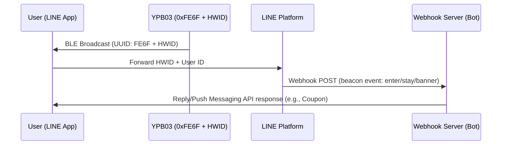

## Product Overview

The **YPB03** is an industrial-grade, long-range Bluetooth® Low Energy (BLE 5.0) beacon specifically optimized to function as a **LINE Beacon** broadcasting standard **LINE Simple Beacon** packets. Powered by **4 × AA batteries** providing a massive 5800mAh capacity, it boasts an exceptional battery lifetime of **up to 10 years** under default broadcasting parameters.

With a high-gain antenna delivering a transmission range of up to **240 meters**, the YPB03 is the ideal choice for large-scale commercial proximity marketing, smart retail navigation, and indoor location services. It eliminates the need for users to install custom mobile apps—interaction is triggered directly within the ubiquitous **LINE** messaging application, offering a frictionless user experience.

---

## Technical Specifications

| Parameter | Specifications | Remarks |
| :--- | :--- | :--- |
| **Chip Model** | nRF52 series | Low latency and high efficiency |
| **Bluetooth Version** | BLE 5.0 | High range and throughput |
| **Waterproof Level** | IP65 | Dustproof and water-jet resistant |
| **Transmission Range** | Up to 240 meters | Maximum in open areas |
| **Protocol Support** | LINE Simple Beacon / iBeacon | Multi-slot broadcasting |
| **Service UUID** | 0xFE6F | Dedicated LINE Beacon UUID |
| **Service Data Format** | 0xFE6F + 5-Byte HWID + 0x7F00 | LINE Simple Beacon packet format |
| **Power Source** | 4 × AA batteries | 5800mAh capacity total (Included) |
| **Battery Lifetime** | Up to 10 years | Based on default broadcasting parameters |
| **Material** | ABS + Silicone | Rugged industrial casing |
| **Dimensions** | 72 × 72 × 23 mm | Wall-mountable square |
| **Net Weight** | 145 g | Including batteries |

---

## Key Features

* **Official LINE Beacon Compatibility:** Broadcasts the open LINE Simple Beacon protocol, seamlessly linking physical locations to your LINE Bot Messaging API.
* **10-Year Service Life:** Massive 5800mAh capacity using four standard replaceable AA batteries reduces hardware maintenance overhead to near-zero.
* **Extended Coverage (240m):** Strong BLE 5.0 signal penetration covers wide halls, airports, exhibition centers, and multi-story retail stores.
* **Frictionless Engagement:** Users only need Bluetooth enabled and your LINE Official Account added; no third-party app download is required to receive notifications.
* **Rugged Enclosure:** IP65-rated dustproof and water-jet resistant casing designed for challenging warehouse and indoor industrial environments.

---

## LINE Beacon Developer Integration Guide

### How Proximity Triggers Work
When a user with Bluetooth and "LINE Beacon" settings enabled in their LINE app enters the YPB03's broadcasting range:
1. The LINE app detects the **Service UUID `0xFE6F`** and reads the Hardware ID (HWID) from the advertising payload.
2. The LINE platform intercepts this signal and triggers a `beacon` event via a POST request to your LINE Bot webhook server.
3. Your bot handler responds to the event (e.g. sending a flex message, rich menu, or promotional coupon) in real time.



### Step 1: Register your Hardware ID (HWID)
1. Log in to the **LINE Developers Console** or **LINE Official Account Manager**.
2. Navigate to the **Beacon** section and register a new beacon device to generate a unique **5-byte (10 hex characters) Hardware ID (HWID)**.

### Step 2: Configure YPB03 via BeaconSET+
The parameters of YPB03 are configured wirelessly over-the-air:
1. Download **BeaconSET+** from Google Play or the Apple App Store.
2. Open the app, scan for the YPB03's MAC address, and connect (inputting the default management password).
3. Select an active advertising slot and set the type to **Service Data** with:
   - **Service UUID:** `FE6F`
   - **Data Value:** `FE6F` + `[Your 5-byte HWID]` + `7F00` (e.g., if your HWID is `0123456789`, configure the data payload as `FE6F01234567897F00`).
4. Save and disconnect. The YPB03 will begin broadcasting the LINE Simple Beacon frame.

### Step 3: Handle the Webhook Beacon Event
In your webhook server, parse the incoming JSON payload. The event object will look like this:

```json
{
  "destination": "xxxxxxxxxx",
  "events": [
    {
      "type": "beacon",
      "replyToken": "nHuyWiB7yP5Zw52FIkcQobQuGDXCTA",
      "source": {
        "userId": "U1234567890abcdef...",
        "type": "user"
      },
      "timestamp": 1462629479859,
      "mode": "active",
      "webhookEventId": "01FZ7MRDRSG04EE8X1A84W1NG8",
      "deliveryContext": {
        "isRedelivery": false
      },
      "beacon": {
        "hwid": "0123456789",
        "type": "enter"
      }
    }
  ]
}
```

#### Event Properties:
* **`hwid`**: The registered 5-byte Hardware ID of the YPB03 beacon.
* **`type`**: The trigger action:
  - `enter`: The user entered the beacon's signal range.
  - `stay`: The user is remaining in range (sent every 10 seconds).
  - `banner`: The user tapped the proximity banner inside the LINE chat screen.

---

## Installation Methods

### Method A: Industrial Adhesive Tape
* **Best Surface:** Smooth surfaces like glass, acrylic, clean aluminum, or polished tile.
* **Process:** Clean the surface. Apply the double-sided tape, apply pressure for 2 seconds, and let it rest for 30 minutes before mounting the beacon.

### Method B: Screw Bracket Mount (Recommended)
* **Best Surface:** Concrete, drywall, wood, or brick.
* **Process:**
  1. Secure the bracket onto the wall using the expansion plugs and screws.
  2. Slide the YPB03 into the bracket slots until it locks.

---

## Product Gallery


  


---


Need a product quotation? Please [contact us](/en/contact/)

