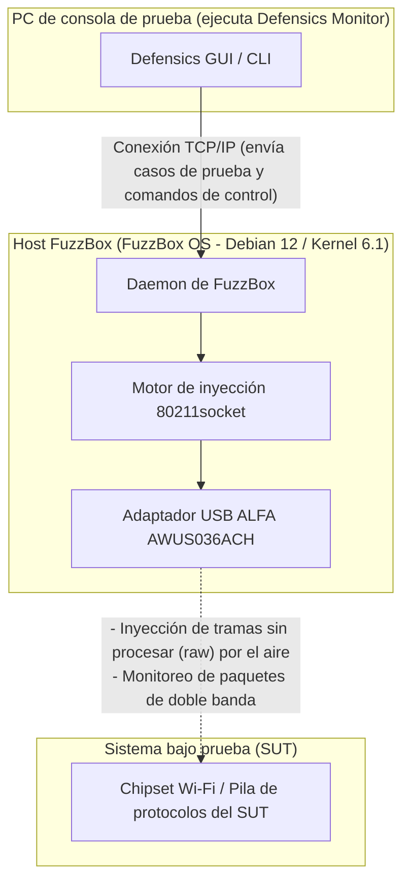

El fuzzing de protocolos WLAN (a menudo denominado pruebas negativas inalámbricas) es uno de los pasos más críticos para validar la seguridad y robustez de los dispositivos inalámbricos integrados, los electrodomésticos inteligentes y los puntos de acceso empresariales. Sin embargo, intentar transmitir tramas de datos, control o gestión 802.11 malformadas a través del aire requiere un control de bajo nivel de la capa de control de acceso al medio (MAC) que los sistemas operativos estándar y los controladores de WiFi comerciales simplemente no permiten.

Para solucionar esto, los equipos de seguridad utilizan **Black Duck FuzzBox** (anteriormente Synopsys Defensics FuzzBox), un entorno de ejecución de software y hardware especializado. Para realizar las pruebas, FuzzBox OS debe emparejarse con un adaptador inalámbrico USB compatible y de alto rendimiento que sea capaz de ofrecer un modo monitor estable y una inyección de paquetes sin procesar (raw) confiable. 

En esta guía de compatibilidad, analizamos el catálogo activo de productos de ALFA Network en Yupitek, explicamos por qué los adaptadores Wi-Fi 6/6E más nuevos fallan con FuzzBox y proporcionamos una guía de configuración paso a paso para la opción estándar de la industria: el **ALFA AWUS036ACH** (RTL8812AU).

---

## 1. Requisitos del cliente

Al realizar fuzzing de protocolos, la suite de pruebas genera miles de tramas inalámbricas malformadas y personalizadas (como Beacons manipulados, solicitudes de asociación o paquetes de handshake WPA) para ver si la pila de protocolos del dispositivo de destino se bloquea o se comporta de forma inesperada. 

Las tarjetas WiFi internas tradicionales (como la serie Intel AX200) o los dongles USB de consumo están limitados por su firmware y los controladores del sistema operativo. No pueden:
*   Inyectar tramas 802.11 sin procesar (raw) sin estar asociados a una red.
*   Hacer la transición de forma confiable al modo monitor (RFMON) para capturar las respuestas exactas del objetivo.
*   Forzar velocidades de transmisión precisas o fijarse en canales de radio específicos sin perder paquetes.

Por lo tanto, el sistema requiere un entorno de prueba dedicado (Black Duck FuzzBox) emparejado con un adaptador inalámbrico USB externo de alta potencia que exponga el acceso directo a la capa MAC.

---

## 2. Análisis de hardware y software de destino

El **FuzzBox OS** es una distribución de Linux comercial y personalizada, diseñada específicamente para ejecutar los motores de inyección Defensics. Comprender sus límites de hardware es esencial para una implementación estable.

### 2.1 Requisitos de hardware
*   **Sistema host:** FuzzBox OS se ejecuta en hardware dedicado x86 de 64 bits, normalmente implementado en ordenadores compactos como Intel® NUC (de 8.ª a 12.ª generación) o ASUS® NUC (14.ª generación Pro).
*   **Arquitectura de CPU:** Procesador de doble núcleo x86_64 con una velocidad de reloj de 2 GHz o superior.
*   **Controlador USB:** Controlador host USB 3.0 / USB 3.2.
*   **Capacidad de alimentación USB:** Este es un punto de fallo común. Los adaptadores inalámbricos ALFA de alta potencia consumen una corriente significativa (hasta 900 mA) durante la transmisión activa. Debe conectar el adaptador directamente a un puerto USB 3.0 de alta velocidad en la placa base del host. Evite el uso de concentradores (hubs) USB sin alimentación, que pueden provocar que el adaptador se desconecte a mitad de la prueba.

### 2.2 Entorno de software
FuzzBox OS funciona como una plataforma de contenedores Linux sin interfaz gráfica (headless). Las especificaciones de software incluyen:

| Componente / Utilidad | Especificaciones y versión |
|---------------------|--------------------------|
| **Sistema operativo** | FuzzBox OS (basado en Debian 12 Bookworm, 64 bits) |
| **Kernel de Linux** | Versión de kernel de soporte a largo plazo (LTS) **6.1.x** |
| **Controladores precargados** | Módulos de kernel inalámbricos optimizados, incluido el controlador de inyección `rtl88xxau` |
| **Soporte DKMS** | Habilitado para la compilación dinámica de módulos de controlador personalizados |
| **Herramientas GCC y Make** | GCC 12.2.0 y GNU Make 4.3 (preinstalados para compilar controladores personalizados) |
| **Utilidades de red** | `iw`, `iwpan`, `wireless-tools`, `airmon-ng` y `tcpdump` |

---

## 3. Análisis del adaptador ALFA y ubicación del controlador en GitHub

Seleccionar el adaptador adecuado entre los modelos activos actuales es fundamental. Comparemos el inventario activo de ALFA Network de Yupitek con la matriz de compatibilidad de FuzzBox OS.

### 3.1 Evaluación rigurosa de los modelos ALFA actuales
ALFA Network fabrica adaptadores con diferentes chipsets. Solo chipsets específicos son compatibles con el motor de inyección sin procesar (raw) de FuzzBox.

| Modelo ALFA | Chipset | Versión USB | Gen Wi-Fi | Estado de compatibilidad con FuzzBox |
|------------|---------|-------------|-----------|--------------------------------------|
| **AWUS036ACH** | **Realtek RTL8812AU** | **USB 3.0** | **Wi-Fi 5** | **✅ 100% compatible (elección principal)** |
| **AWUS036ACS** | **Realtek RTL8811AU** | **USB 2.0** | **Wi-Fi 5** | **✅ Compatible (respaldo / compacto)** |
| **AWUS036AXML** | MediaTek MT7921AUN | USB-C 3.2 | Wi-Fi 6E | ❌ No compatible (sin controlador de inyección) |
| **AWUS036AXM** | MediaTek MT7921AUN | USB 3.2 | Wi-Fi 6E | ❌ No compatible (sin controlador de inyección) |
| **AWUS036AX** | Realtek RTL8832BU | USB 3.2 | Wi-Fi 6 | ❌ No compatible (sin controlador de inyección) |
| **AWUS036AXER** | Realtek RTL8832BU | USB 3.2 | Wi-Fi 6 | ❌ No compatible (sin controlador de inyección) |
| **AWUS036ACM** | MediaTek MT7612U | USB 3.0 | Wi-Fi 5 | ❌ No compatible (sin controlador de inyección) |
| **AWUS036EACS** | Realtek RTL8811CU | USB 2.0 | Wi-Fi 5 | ❌ No compatible (controlador incompatible) |

### 3.2 La elección principal: ALFA AWUS036ACH
El **ALFA AWUS036ACH** es la elección estándar de la industria para las pruebas profesionales de protocolos.
*   **Chipset:** Realtek RTL8812AU.
*   **USB VID/PID:** `0bda:8812` (el registro de identificación del fabricante de ALFA es `0df6:0088`).
*   **Especificaciones de radio:** Doble banda de 2.4 GHz y 5 GHz (802.11ac), MIMO 2×2.
*   **Antenas:** Dos antenas omnidireccionales externas desmontables de alta ganancia de 5 dBi (conectores RP-SMA).
*   **Por qué destaca:** El chipset RTL8812AU cuenta con controladores robustos y perfeccionados por la comunidad que permiten al motor de inyección de FuzzBox eludir las pilas de red estándar del sistema operativo, lo que permite una transmisión de tramas sin procesar (raw) sin pérdida de paquetes.

### 3.3 La elección de respaldo: ALFA AWUS036ACS
*   **Chipset:** Realtek RTL8811AU.
*   **USB VID/PID:** `0bda:0811` o `0bda:8811`.
*   **Especificaciones de radio:** Doble banda, flujo único (Single-Stream) 1×1, hasta 433 Mbps.
*   **Por qué elegirlo:** Es compacto y económico, y comparte características de controlador similares con el RTL8812AU. Sin embargo, al tener una sola antena, carece del alcance y la diversidad espacial necesarios para cámaras de prueba más grandes.

### 3.4 Ubicaciones de origen de los controladores (GitHub)
FuzzBox OS viene precargado con controladores de inyección estables. Si necesita compilar o realizar diagnósticos en su estación de trabajo de análisis Linux local, los repositorios más estables y compatibles con el kernel son:
*   **Controlador RTL8812AU (AWUS036ACH):** [Repositorio de GitHub morrownr/8812au-20210629](https://github.com/morrownr/8812au-20210629)
*   **Controlador RTL8811AU (AWUS036ACS):** [Repositorio de GitHub morrownr/8821au](https://github.com/morrownr/8821au)

---

## 4. Análisis de compatibilidad de controladores

El núcleo de la transmisión de paquetes de FuzzBox reside en su daemon inyector propietario `80211socket`. 

### Por qué no funcionan los chipsets Wi-Fi 6/6E más nuevos
Muchos probadores asumen que comprar un adaptador más nuevo y rápido (como el Wi-Fi 6E AWUS036AXML que utiliza el chipset MT7921AUN) mejorará el rendimiento. Sin embargo, FuzzBox está diseñado para pruebas de vulnerabilidad de protocolos, no para el rendimiento de Internet. 

El inyector `80211socket` se conecta directamente con el controlador inalámbrico a nivel de la subcapa MAC. Para lograr esto, el controlador debe admitir extensiones especializadas de inyección sin procesar (raw). Actualmente, el motor de inyección de FuzzBox OS está optimizado para el árbol de controladores maduro **Realtek `rtl88xxau`** (específicamente RTL8812AU/RTL8814AU). Los chipsets de MediaTek (MT7921AUN, MT7612U) y los chipsets Realtek Wi-Fi 6 más nuevos (RTL8832BU) no utilizan este árbol de controladores de inyección y, por lo tanto, el daemon de FuzzBox los ignora.

### Estabilidad bajo el Kernel 6.1.x
El controlador RTL8812AU ha sido adaptado (backported) y parcheado extensamente para el kernel de Linux 6.1.x. Admite un bloqueo de canal estable, protege contra desbordamientos de búfer bajo una gran carga de paquetes y evita pánicos del kernel (kernel panics) durante campañas de fuzzing de desautenticación a alta velocidad.

---

## 5. Guía de configuración

Siga estos pasos para implementar y configure el adaptador ALFA AWUS036ACH en su sistema Black Duck FuzzBox.

### Paso 1: Conexión física
Conecte el ALFA AWUS036ACH directamente a un puerto USB 3.0 (de color azul o etiquetado como `SS`) en el NUC FuzzBox. Asegúrese de que las dos antenas de 5 dBi estén bien sujetas.

### Paso 2: Verificar la detección de hardware
Acceda a la interfaz de terminal de FuzzBox a través de SSH o una pantalla local, y ejecute el siguiente comando para comprobar si la interfaz USB reconoce el adaptador:
```bash
lsusb
```
Debería ver una entrada que confirme el chipset RTL8812AU:
```text
Bus 002 Device 003: ID 0bda:8812 Realtek Semiconductor Corp. RTL8812AU 802.11a/b/g/n/ac WLAN Adapter
```

### Paso 3: Configurar el daemon inyector
FuzzBox mapea sus adaptadores físicos a través de archivos de configuración. Abra el archivo de configuración del inyector de FuzzBox:
```bash
sudo nano /opt/defensics/fuzzbox/injectors/80211socket.conf
```
Asegúrese de que el parámetro del controlador esté configurado para utilizar el módulo de inyección USB de Realtek:
```text
driver="usb:rtl88xxau;"
```
Guarde el archivo y salga del editor.

### Paso 4: Validar el modo monitor y el funcionamiento
Verifique si el daemon de FuzzBox cambia correctamente el adaptador al modo monitor. Desactive las herramientas de gestión de red estándar si entran en conflicto y levante la interfaz:
```bash
sudo ip link set wlan0 down
sudo iw dev wlan0 set type monitor
sudo ip link set wlan0 up
```
Compruebe el estado de la interfaz:
```bash
iwconfig wlan0
```
La salida debería confirmar `Mode:Monitor` y mostrar la frecuencia de funcionamiento actual del adaptador.

---

## 6. Topología de la aplicación

El siguiente diagrama ilustra cómo interactúan la estación de trabajo FuzzBox, el adaptador ALFA AWUS036ACH y el sistema bajo prueba (SUT, por sus siglas en inglés) dentro de la red de auditoría inalámbrica:


### Diagrama de flujo del sistema


---

## 7. Resultado de la validación

Una vez configurado, verifique que el sistema FuzzBox reconozca el adaptador inalámbrico y esté listo para ejecutar los casos de prueba.

Ejecute la utilidad de diagnóstico del adaptador interno de FuzzBox:
```bash
sudo ls -l /var/run/defensics/injectors/80211/adapters/
```
Una detección exitosa mostrará un enlace simbólico a la interfaz de red:
```text
lrwxrwxrwx 1 root root 23 Jun 04 13:30 phy0 -> /sys/class/net/wlan0
```

Cuando inicie la suite de pruebas WLAN de Defensics (como la suite de pruebas de cliente WPA3 o de punto de acceso) desde la PC de consola de prueba, la salida de la consola mostrará la tasa de inyección y confirmará que se están inyectando activamente tramas de gestión 802.11 malformadas:
```text
[INFO] 13:31:02 Injector Daemon: Adapter phy0 loaded successfully.
[INFO] 13:31:04 Injecting test case #154 (Malformed Association Request) -> SUT
[INFO] 13:31:05 Capturing response: SUT responded with Status Code 0 (Success)
[INFO] 13:31:07 Injecting test case #155 (Malformed Association Request with invalid IE lengths)
```

---

## 8. Recomendación

### 8.1 Matriz de recomendación de hardware
Para los laboratorios de pruebas de seguridad que implementan sistemas Black Duck FuzzBox, recomendamos el siguiente conjunto de hardware (hardware stack):

*   **Adaptador inyector principal:** **ALFA Network AWUS036ACH** (RTL8812AU). Cuenta con dos antenas, alta potencia de salida y ancho de banda completo USB 3.0. Este es el caballo de batalla principal para las pruebas de línea base.
*   **Adaptador de respaldo / ligero:** **ALFA Network AWUS036ACS** (RTL8811AU). Perfecto para configuraciones portátiles rápidas, pero limitado a pruebas de flujo 1×1.
*   **Optimización de señal (altamente recomendada):** Añada las antenas de panel direccional de doble banda **ALFA APA-M25** o **APA-M25-6E**. Reemplazar las antenas omnidireccionales estándar con estos paneles de alta ganancia enfoca la señal de radio directamente en el sistema bajo prueba (SUT), reduciendo el ruido ambiental y mejorando las tasas de éxito de la inyección.

### 8.2 Consultas y pedidos
Yupitek es distribuidor autorizado de los productos de ALFA Network, ofreciendo soporte local y suministro al por mayor. Para solicitar cotizaciones de productos, realizar pedidos al por mayor o consultar con nuestro equipo de soporte técnico:
*   Visite la [Página de contacto de Yupitek](/es/contact/)
*   O envíenos un correo electrónico directamente a **sales@yupitek.com**

Nuestro equipo de ingeniería le ayudará a adquirir las configuraciones exactas de hardware inalámbrico necesarias para respaldar sus flujos de trabajo de fuzzing de protocolos con Black Duck FuzzBox.
