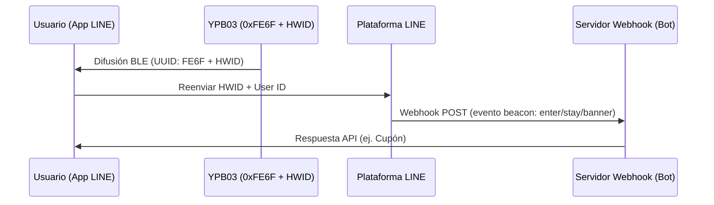

## Descripción del producto

El **YPB03** es una baliza industrial optimizada como **LINE Beacon** que transmite paquetes estándar **LINE Simple Beacon**. Funciona con **4 pilas AA** (5800mAh), alcanzando una vida útil de **hasta 10 años**.

Con un alcance de hasta **240 metros**, es ideal para áreas comerciales y museos. Los usuarios no necesitan instalar apps adicionales, reciben notificaciones directas en la app **LINE**.

---

## Características clave

* **Compatibilidad oficial con LINE Beacon:** Transmite el protocolo abierto LINE Simple Beacon para integrar con la API de LINE Bot.
* **10 años de autonomía:** Utiliza 4 pilas AA comunes que minimizan el costo de mantenimiento.
* **Alcance de 240m:** Señal potente BLE 5.0 ideal para grandes superficies.
* **Interacción sin fricción:** El cliente solo necesita activar Bluetooth y seguir su canal.
* **Carcasa IP65:** Resistente a salpicaduras y polvo para entornos industriales.

---

## Guía de integración de LINE Beacon para desarrolladores

### Cómo funcionan los disparadores de proximidad
Cuando un usuario con Bluetooth y LINE Beacon activo entra al rango:
1. La app de LINE detecta el **UUID de servicio `0xFE6F`** y lee la ID de hardware (HWID).
2. La plataforma de LINE envía un evento `beacon` a su servidor Webhook.
3. Su bot responde en tiempo real con cupones o información de navegación.

### Paso 1: Registrar el ID de hardware (HWID)
1. Inicie sesión en **LINE Developers Console** o en el **LINE Official Account Manager**.
2. Vaya a la sección Beacon y obtenga el **HWID de 5 bytes (10 caracteres hexadecimales)**.

### Paso 2: Configurar YPB03 mediante BeaconSET+
1. Abra la app **BeaconSET+** y conéctese a la baliza (requiere contraseña).
2. Configure una ranura de transmisión como **Service Data** con:
   - **Service UUID:** `FE6F`
   - **Data Value:** `FE6F` + `[Su HWID de 5 bytes]` + `7F00` (ej. `FE6F01234567897F00`).
3. Guarde y desconecte. La baliza comenzará a emitir la señal LINE Beacon.

### Paso 3: Manejar el evento del webhook
Su servidor recibirá un objeto JSON con detalles de `beacon`:
* **`hwid`**: ID de hardware del beacon.
* **`type`**: Tipo de acción (`enter` al entrar, `stay` enviado cada 10 segundos al permanecer, `banner` cuando se pulsa el banner en la app).

---

## Métodos de instalación

### Método A: Cinta adhesiva industrial
* **Superficies:** Vidrio, acrílico, aluminio limpio.
* **Proceso:** Limpiar superficie. Presionar la cinta (2 seg), esperar 30 min y montar.

### Método B: Soporte con tornillos (Recomendado)
* **Superficies:** Hormigón, madera, ladrillo.
* **Proceso:** Fijar el soporte a la pared con tacos y tornillos. Deslizar el YPB03 hasta que encaje.

---

## Guía de configuración

Los parámetros se editan vía inalámbrica con **BeaconSET+**:
1. Descargue **BeaconSET+** y active Bluetooth.
2. Busque la baliza y conéctese con su clave.
3. Configure UUID, Major, Minor, potencia e intervalo.

## Technical Specifications

| :--- | :--- | :--- |
| **Chip Model** | nRF52 series | Low latency and high efficiency |
| **Bluetooth Version** | BLE 5.0 | High range and throughput |
| **Waterproof Level** | IP65 | Dustproof and water-jet resistant |
| **Transmission Range** | Up to 240 meters | Maximum in open areas |
| **Protocol Support** | LINE Simple Beacon / iBeacon | Multi-slot broadcasting |
| **Service UUID** | 0xFE6F | Dedicated LINE Beacon UUID |
| **Service Data Format** | 0xFE6F + 5-Byte HWID + 0x7F00 | LINE Simple Beacon packet format |
| **Power Source** | 4 × AA batteries | 5800mAh capacity total (Included) |
| **Battery Lifetime** | Up to 10 years | Based on default broadcasting parameters |
| **Material** | ABS + Silicone | Rugged industrial casing |
| **Dimensions** | 72 × 72 × 23 mm | Wall-mountable square |
| **Net Weight** | 145 g | Including batteries |

---

## Galería del producto


  


---


¿Necesita una cotización del producto? Por favor, [contáctenos](/es/contact/).

