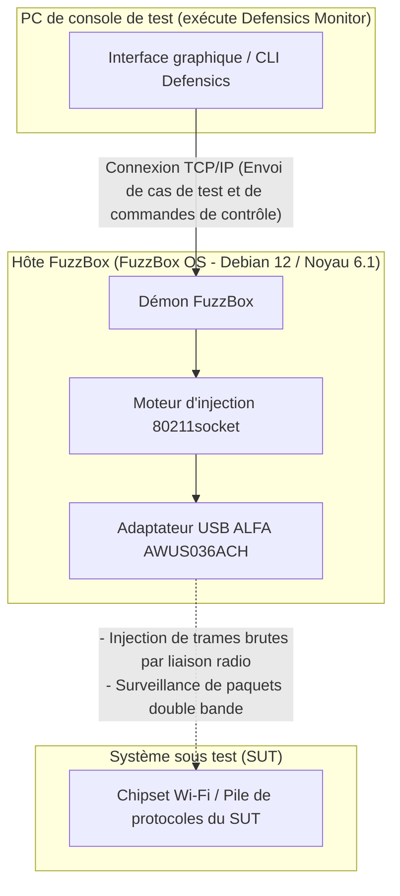

Le fuzzing de protocoles WLAN — souvent appelé test négatif sans fil — est l'une des étapes les plus critiques pour valider la sécurité et la robustesse des appareils sans fil embarqués, des appareils électroménagers intelligents et des points d'accès d'entreprise. Cependant, tenter de transmettre des trames de gestion, de contrôle ou de données 802.11 malformées par liaison radio nécessite un contrôle de bas niveau de la couche de contrôle d'accès au support (MAC) que les systèmes d'exploitation standard et les pilotes Wi-Fi commerciaux ne permettent tout simplement pas.

Pour résoudre ce problème, les équipes de sécurité utilisent **Black Duck FuzzBox** (anciennement Synopsys Defensics FuzzBox), un environnement d'exécution logiciel et matériel spécialisé. Pour effectuer les tests, le système d'exploitation FuzzBox OS doit être associé à un adaptateur sans fil USB compatible et performant, capable de prendre en charge un mode moniteur stable et une injection fiable de paquets bruts. 

Dans ce guide de compatibilité, nous analysons le catalogue de produits ALFA Network actifs de Yupitek, expliquons pourquoi les adaptateurs Wi-Fi 6/6E plus récents échouent sous FuzzBox, et fournissons un guide d'installation étape par étape pour le choix standard de l'industrie : l'**ALFA AWUS036ACH** (RTL8812AU).

---

## 1. Besoins des clients

Lors de l'exécution d'un fuzzing de protocole, la suite de tests génère des milliers de trames sans fil malformées et personnalisées (telles que des balises Beacon, des requêtes d'association ou des paquets de handshake WPA manipulés) pour vérifier si la pile de protocoles de l'appareil cible plante ou se comporte de manière inattendue.

Les cartes Wi-Fi internes traditionnelles (comme la série Intel AX200) ou les clés USB grand public sont limitées par leur micrologiciel (firmware) et leurs pilotes système. Elles ne peuvent pas :
*   Injecter des trames 802.11 brutes sans être associées à un réseau.
*   Passer de manière fiable en mode moniteur (RFMON) pour capturer les réponses exactes de la cible.
*   Imposer des vitesses de transmission précises ou se caler sur des canaux radio spécifiques sans perdre de paquets.

Par conséquent, le système nécessite un environnement de test dédié — Black Duck FuzzBox — associé à un adaptateur sans fil USB externe haute puissance qui offre un accès direct à la couche MAC.

---

## 2. Analyse matérielle et logicielle de la cible

**FuzzBox OS** est une distribution Linux commerciale personnalisée, conçue spécifiquement pour exécuter les moteurs d'injection Defensics. Comprendre ses limites matérielles est essentiel pour un déploiement stable.

### 2.1 Configuration matérielle requise
*   **Système hôte :** FuzzBox OS s'exécute sur du matériel x86 64 bits dédié, généralement déployé sur des PC compacts comme les Intel® NUC (de la 8e à la 12e génération) ou ASUS® NUC (14e génération Pro).
*   **Architecture processeur (CPU) :** Processeur double cœur x86_64 cadencé à 2 GHz ou plus.
*   **Contrôleur USB :** Contrôleur hôte USB 3.0 / USB 3.2.
*   **Alimentation USB :** C'est un point de défaillance courant. Les adaptateurs sans fil ALFA haute puissance consomment un courant important (jusqu'à 900 mA) en phase de transmission active. Vous devez connecter l'adaptateur directement à un port USB 3.0 haut débit situé sur la carte mère de l'hôte. Évitez d'utiliser des hubs USB non alimentés, qui peuvent provoquer la déconnexion de l'adaptateur en plein test.

### 2.2 Environnement logiciel
FuzzBox OS fonctionne comme une plateforme de conteneurs Linux sans interface graphique (headless). Les spécifications logicielles comprennent :

| Composant / Utilitaire | Spécifications et versions |
|---------------------|--------------------------|
| **Système d'exploitation** | FuzzBox OS (basé sur Debian 12 Bookworm, 64 bits) |
| **Noyau (Kernel) Linux** | Version du noyau avec support à long terme (LTS) **6.1.x** |
| **Pilotes préchargés** | Modules de noyau sans fil optimisés, y compris le pilote d'injection `rtl88xxau` |
| **Support DKMS** | Activé pour la compilation dynamique de modules de pilotes personnalisés |
| **Chaîne d'outils GCC et Make** | GCC 12.2.0 et GNU Make 4.3 (préinstallés pour la compilation de pilotes personnalisés) |
| **Utilitaires réseau** | `iw`, `iwpan`, `wireless-tools`, `airmon-ng` et `tcpdump` |

---

## 3. Analyse des adaptateurs ALFA et emplacements des pilotes sur GitHub

Il est crucial de choisir le bon adaptateur parmi les modèles actifs actuels. Comparons l'inventaire des produits ALFA Network actifs de Yupitek avec la matrice de compatibilité de FuzzBox OS.

### 3.1 Évaluation rigoureuse des modèles ALFA actuels
ALFA Network fabrique des adaptateurs utilisant différents chipsets. Seuls certains chipsets prennent en charge le moteur d'injection brute de FuzzBox.

| Modèle ALFA | Chipset | Version USB | Gén. Wi-Fi | Statut de compatibilité avec FuzzBox |
|------------|---------|-------------|-----------|--------------------------------------|
| **AWUS036ACH** | **Realtek RTL8812AU** | **USB 3.0** | **Wi-Fi 5** | **✅ 100 % compatible (Premier choix)** |
| **AWUS036ACS** | **Realtek RTL8811AU** | **USB 2.0** | **Wi-Fi 5** | **✅ Compatible (Secours / Compact)** |
| **AWUS036AXML** | MediaTek MT7921AUN | USB-C 3.2 | Wi-Fi 6E | ❌ Non supporté (Pas de pilote d'injection) |
| **AWUS036AXM** | MediaTek MT7921AUN | USB 3.2 | Wi-Fi 6E | ❌ Non supporté (Pas de pilote d'injection) |
| **AWUS036AX** | Realtek RTL8832BU | USB 3.2 | Wi-Fi 6 | ❌ Non supporté (Pas de pilote d'injection) |
| **AWUS036AXER** | Realtek RTL8832BU | USB 3.2 | Wi-Fi 6 | ❌ Non supporté (Pas de pilote d'injection) |
| **AWUS036ACM** | MediaTek MT7612U | USB 3.0 | Wi-Fi 5 | ❌ Non supporté (Pas de pilote d'injection) |
| **AWUS036EACS** | Realtek RTL8811CU | USB 2.0 | Wi-Fi 5 | ❌ Non supporté (Pilote incompatible) |

### 3.2 Le choix principal : ALFA AWUS036ACH
L'**ALFA AWUS036ACH** est le choix standard de l'industrie pour les tests de protocoles professionnels.
*   **Chipset :** Realtek RTL8812AU.
*   **USB VID/PID :** `0bda:8812` (le registre d'identification du vendeur ALFA indique `0df6:0088`).
*   **Spécifications radio :** Double bande 2,4 GHz et 5 GHz (802.11ac), MIMO 2×2.
*   **Antennes :** Deux antennes omnidirectionnelles amovibles externes à gain élevé de 5 dBi (connecteurs RP-SMA).
*   **Pourquoi il excelle :** Le chipset RTL8812AU bénéficie de pilotes robustes améliorés par la communauté, qui permettent au moteur d'injection de FuzzBox de contourner les piles réseau standard du système d'exploitation, permettant une transmission de trames brutes sans aucune perte de paquets.

### 3.3 Le choix de secours : ALFA AWUS036ACS
*   **Chipset :** Realtek RTL8811AU.
*   **USB VID/PID :** `0bda:0811` ou `0bda:8811`.
*   **Spécifications radio :** Double bande, flux unique (Single-Stream) 1×1, jusqu'à 433 Mbps.
*   **Pourquoi le choisir :** Il est compact et économique, partageant des caractéristiques de pilote similaires à celles du RTL8812AU. Cependant, comme il ne possède qu'une seule antenne, il n'a pas la portée et la diversité spatiale requises pour les chambres de test plus grandes.

### 3.4 Emplacements des sources des pilotes (GitHub)
FuzzBox OS est livré avec des pilotes d'injection stables préinstallés. Si vous devez compiler ou exécuter des diagnostics sur votre station de travail d'analyse Linux locale, les dépôts les plus stables et compatibles avec le noyau sont :
*   **Pilote RTL8812AU (AWUS036ACH) :** [Dépôt GitHub morrownr/8812au-20210629](https://github.com/morrownr/8812au-20210629)
*   **Pilote RTL8811AU (AWUS036ACS) :** [Dépôt GitHub morrownr/8821au](https://github.com/morrownr/8821au)

---

## 4. Analyse de la compatibilité des pilotes

Le cœur de la transmission de paquets de FuzzBox repose sur son démon d'injection propriétaire `80211socket`.

### Pourquoi les nouveaux chipsets Wi-Fi 6/6E ne fonctionnent pas
De nombreux testeurs pensent que l'achat d'un adaptateur plus récent et plus rapide (comme le modèle Wi-Fi 6E AWUS036AXML utilisant le chipset MT7921AUN) améliorera les performances. Cependant, FuzzBox est conçu pour tester les vulnérabilités des protocoles, et non pour le débit Internet.

L'injecteur `80211socket` s'interface directement avec le pilote sans fil au niveau de la sous-couche MAC. Pour ce faire, le pilote doit prendre en charge des extensions d'injection brute spécialisées. Actuellement, le moteur d'injection de FuzzBox OS est optimisé pour l'arbre de pilotes mature **Realtek `rtl88xxau`** (en particulier RTL8812AU/RTL8814AU). Les chipsets MediaTek (MT7921AUN, MT7612U) et les nouveaux chipsets Realtek Wi-Fi 6 (RTL8832BU) n'utilisent pas cet arbre de pilotes d'injection et sont donc ignorés par le démon FuzzBox.

### Stabilité sous le noyau 6.1.x
Le pilote RTL8812AU a été rétroporté (backported) et largement corrigé pour le noyau Linux 6.1.x. Il prend en charge un verrouillage de canal stable, protège contre les dépassements de tampon (buffer overflows) sous une contrainte de paquets massive, et évite les paniques du noyau (kernel panics) lors des campagnes de fuzzing de désauthentification à grande vitesse.

---

## 5. Guide d'installation

Suivez ces étapes pour déployer et configurer l'adaptateur ALFA AWUS036ACH sur votre système Black Duck FuzzBox.

### Étape 1 : Connexion physique
Connectez l'ALFA AWUS036ACH directement à un port USB 3.0 (de couleur bleue ou étiqueté `SS`) sur le NUC FuzzBox. Assurez-vous que les deux antennes de 5 dBi sont solidement fixées.

### Étape 2 : Vérifier la détection du matériel
Accédez à l'interface du terminal FuzzBox via SSH ou un écran local, et exécutez la commande suivante pour vérifier si l'interface USB reconnaît l'adaptateur :
```bash
lsusb
```
Vous devriez voir une entrée confirmant le chipset RTL8812AU :
```text
Bus 002 Device 003: ID 0bda:8812 Realtek Semiconductor Corp. RTL8812AU 802.11a/b/g/n/ac WLAN Adapter
```

### Étape 3 : Configurer le démon de l'injecteur
FuzzBox associe ses adaptateurs physiques via des fichiers de configuration. Ouvrez le fichier de paramètres de l'injecteur FuzzBox :
```bash
sudo nano /opt/defensics/fuzzbox/injectors/80211socket.conf
```
Assurez-vous que le paramètre du pilote est configuré pour utiliser le module d'injection USB Realtek :
```text
driver="usb:rtl88xxau;"
```
Sauvegardez le fichier et quittez l'éditeur.

### Étape 4 : Valider le mode moniteur et le fonctionnement
Vérifiez si le démon FuzzBox parvient à faire passer l'adaptateur en mode moniteur. Désactivez les outils de gestion réseau standard s'ils entrent en conflit, puis activez l'interface :
```bash
sudo ip link set wlan0 down
sudo iw dev wlan0 set type monitor
sudo ip link set wlan0 up
```
Vérifiez l'état de l'interface :
```bash
iwconfig wlan0
```
La sortie devrait confirmer `Mode:Monitor` et afficher la fréquence de fonctionnement actuelle de l'adaptateur.

---

## 6. Topologie de l'application

Le schéma suivant illustre comment la station de travail FuzzBox, l'adaptateur ALFA AWUS036ACH et le système sous test (SUT) interagissent au sein du réseau d'audit sans fil :


### Schéma de flux du système


---

## 7. Résultats de la validation

Une fois configuré, vérifiez que le système FuzzBox reconnaît l'adaptateur sans fil et est prêt à exécuter des cas de test.

Exécutez l'utilitaire de diagnostic d'adaptateur interne de FuzzBox :
```bash
sudo ls -l /var/run/defensics/injectors/80211/adapters/
```
Une détection réussie affichera un lien symbolique vers l'interface réseau :
```text
lrwxrwxrwx 1 root root 23 Jun 04 13:30 phy0 -> /sys/class/net/wlan0
```

Lorsque vous lancez la suite de tests WLAN Defensics (telle que la suite de tests client ou point d'accès WPA3) depuis le PC de console de test, la sortie de la console affichera le taux d'injection et confirmera que des trames de gestion 802.11 malformées sont activement injectées :
```text
[INFO] 13:31:02 Injector Daemon: Adapter phy0 loaded successfully.
[INFO] 13:31:04 Injecting test case #154 (Malformed Association Request) -> SUT
[INFO] 13:31:05 Capturing response: SUT responded with Status Code 0 (Success)
[INFO] 13:31:07 Injecting test case #155 (Malformed Association Request with invalid IE lengths)
```

---

## 8. Recommandations

### 8.1 Matrice de recommandations matérielles
Pour les laboratoires de tests de sécurité qui déploient des systèmes Black Duck FuzzBox, nous recommandons la configuration matérielle suivante :

*   **Adaptateur d'injecteur principal :** **ALFA Network AWUS036ACH** (RTL8812AU). Équipé de deux antennes, d'une puissance de sortie élevée et de toute la bande passante USB 3.0. C'est l'outil principal pour les tests de référence.
*   **Adaptateur de secours / léger :** **ALFA Network AWUS036ACS** (RTL8811AU). Parfait pour les installations portables rapides, mais limité aux tests de flux 1×1.
*   **Optimisation du signal (fortement recommandée) :** Ajoutez les antennes panneaux directionnelles double bande **ALFA APA-M25** ou **APA-M25-6E**. Remplacer les antennes omnidirectionnelles d'origine par ces panneaux à gain élevé concentre le signal radio directement sur le système sous test (SUT), réduisant le bruit ambiant et améliorant les taux de réussite de l'injection.

### 8.2 Demandes de renseignements et commandes
Yupitek est un distributeur agréé des produits ALFA Network, offrant un support local et un approvisionnement en volume. Pour demander des devis de produits, passer des commandes groupées ou consulter notre équipe de support technique :
*   Visitez la [page Contactez-nous de Yupitek](https://www.yupitek.com)
*   Ou envoyez-nous un e-mail directement à **sales@yupitek.com**

Notre équipe d'ingénieurs vous aidera à acquérir les configurations matérielles sans fil exactes nécessaires pour prendre en charge vos flux de travail de fuzzing de protocoles Black Duck FuzzBox.
