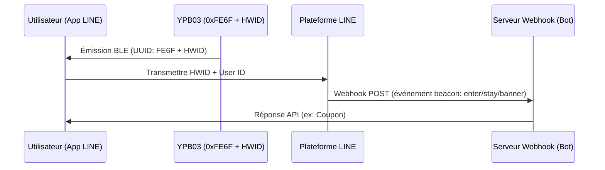

## Présentation du produit

Le **YPB03** est une balise industrielle optimisée en tant que **LINE Beacon** qui diffuse des paquets standards **LINE Simple Beacon**. Elle fonctionne avec **4 piles AA** (5800mAh), lui offrant une autonomie allant **jusqu'à 10 ans**.

Avec une portée allant jusqu'à **240 mètres**, elle est idéale pour les galeries marchandes et les musées. Les utilisateurs reçoivent des notifications directement dans leur application **LINE** sans installer d'autres applications.

---

## Caractéristiques principales

* **Compatibilité officielle LINE Beacon:** Diffuse le protocole ouvert LINE Simple Beacon pour s'associer avec l'API LINE Bot.
* **10 ans d'autonomie:** Fonctionne avec 4 piles AA standards pour réduire la maintenance.
* **Portée de 240m:** Signal BLE 5.0 puissant idéal pour les grands espaces.
* **Engagement sans friction:** L'utilisateur doit simplement activer son Bluetooth et suivre votre compte.
* **Boîtier IP65:** Conçu pour résister aux projections d'eau en milieu industriel.

---

## Guide d'intégration LINE Beacon pour les développeurs

### Fonctionnement des déclencheurs de proximité
Lorsqu'un utilisateur avec Bluetooth et LINE Beacon activés entre dans la zone:
1. L'application LINE détecte l'**UUID de service `0xFE6F`** et lit l'identifiant matériel (HWID).
2. La plateforme LINE transmet un événement `beacon` à votre serveur Webhook.
3. Votre bot répond en temps réel avec des messages, des coupons ou des plans.

### Étape 1: Enregistrer l'identifiant matériel (HWID)
1. Connectez-vous sur le **LINE Developers Console** ou le **LINE Official Account Manager**.
2. Allez dans la section Beacon et générez l'**HWID de 5 octets (10 caractères hexadécimaux)**.

### Étape 2: Configurer le YPB03 avec BeaconSET+
1. Lancez l'application **BeaconSET+** et connectez-vous à la balise (mot de passe requis).
2. Configurez un slot en type **Service Data** avec:
   - **Service UUID:** `FE6F`
   - **Data Value:** `FE6F` + `[Votre HWID de 5 octets]` + `7F00` (ex: `FE6F01234567897F00`).
3. Sauvegardez et déconnectez. La balise commence à diffuser le signal LINE Beacon.

### Étape 3: Gérer l'événement du webhook
Votre serveur recevra un objet JSON contenant les détails du `beacon`:
* **`hwid`**: Identifiant matériel de la balise.
* **`type`**: Type d'action (`enter` à l'entrée, `stay` envoyé toutes les 10 secondes si l'utilisateur reste, `banner` en cas de clic sur la bannière).

---

## Méthodes d'installation

### Méthode A: Ruban adhésif industriel
* **Surfaces:** Verre, acrylique, aluminium propre.
* **Process:** Nettoyer la surface. Presser le ruban (2 sec), attendre 30 min et monter la balise.

### Méthode B: Support à vis (Recommandé)
* **Surfaces:** Béton, bois, brique.
* **Process:** Fixer le support avec des vis et des chevilles. Glisser le YPB03 jusqu'au clic.

---

## Guide de configuration

Les paramètres se configurent sans fil à l'aide de **BeaconSET+**:
1. Téléchargez **BeaconSET+** et activez le Bluetooth.
2. Recherchez la balise et connectez-vous.
3. Modifiez l'UUID, le Major, le Minor, la puissance et l'intervalle.

## Technical Specifications

| Paramètre | Spécifications | Remarques |
| :--- | :--- | :--- |
| **Chip Model** | nRF52 series | Low latency and high efficiency |
| **Bluetooth Version** | BLE 5.0 | High range and throughput |
| **Waterproof Level** | IP65 | Dustproof and water-jet resistant |
| **Transmission Range** | Up to 240 meters | Maximum in open areas |
| **Protocol Support** | LINE Simple Beacon / iBeacon | Multi-slot broadcasting |
| **Service UUID** | 0xFE6F | Dedicated LINE Beacon UUID |
| **Service Data Format** | 0xFE6F + 5-Byte HWID + 0x7F00 | LINE Simple Beacon packet format |
| **Power Source** | 4 × AA batteries | 5800mAh capacity total (Included) |
| **Battery Lifetime** | Up to 10 years | Based on default broadcasting parameters |
| **Material** | ABS + Silicone | Rugged industrial casing |
| **Dimensions** | 72 × 72 × 23 mm | Wall-mountable square |
| **Net Weight** | 145 g | Including batteries |

---

## Galerie du produit


  


---


Besoin d'un devis sur mesure ou d'une solution d'intégration ? Veuillez contacter notre équipe commerciale directement à : **sales@yupitek.com**

