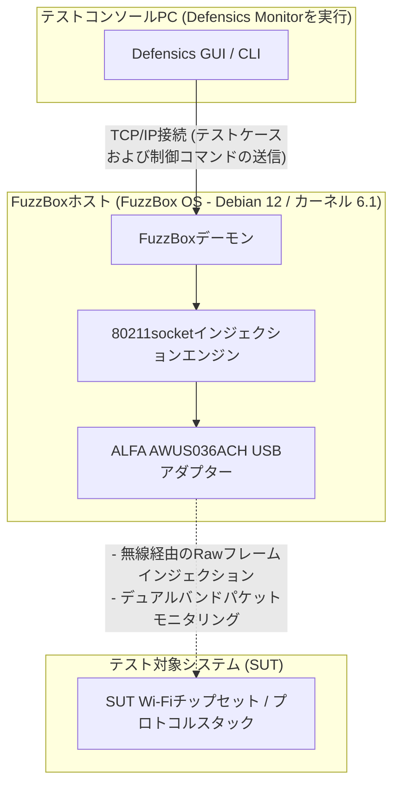

---

title: "Black Duck FuzzBox WLANアダプター互換性ガイド：最適なALFAワイヤレスカードの選定"
description: "Black Duck FuzzBox OSに最適なALFA Network製USB WiFiアダプターを選定するための包括的なハードウェア評価および互換性ガイド。ワイヤレスプロトコルのファジング向けにALFA AWUS036ACH (RTL8812AU)を設定・導入する方法について解説します。"
date: 2026-06-04
draft: false
showBreadcrumbs: true
showTableOfContents: true
tags: ["Black-Duck-FuzzBox", "FuzzBox", "ALFA-Network", "AWUS036ACH", "monitor-mode", "packet-injection", "protocol-fuzzing"]
featureimage: "/images/blog/black-duck-fuzzbox-alfa-awus036ach-compatibility-guide.webp"
author: "benny-lai"
lastmod: 2026-07-02
faq:
  - question: "Black Duck FuzzBoxはどのような用途のツールですか？"
    answer: "Black Duck FuzzBoxは専用の無線プロトコルファジングテスト環境で、異常な802.11フレームを注入して組み込み無線デバイスと基地局のプロトコルスタックの堅牢性を検証します。"
  - question: "Wi-Fi 6/6EアダプターがFuzzBoxで動作しないのはなぜですか？"
    answer: "FuzzBoxのインジェクションエンジンはRealtek rtl88xxauドライバー向けに最適化されており、MediaTekやより新しいRealtek Wi-Fi 6チップセットはこのブランチを使用しないためウィザードに無視されます。"
  - question: "ALFA AWUS036ACHがFuzzBox首选アダプターなのはなぜですか？"
    answer: "AWUS036ACHはRTL8812AUチップセットを採用し、コミュニティ最適化のインジェクションドライバーを持ち、OSネットワークスタックをバイパスしてゼロロスの生フレーム送信を実現できます。"
  - question: "FuzzBox OSはどのLinuxバージョンがベースですか？"
    answer: "FuzzBox OSはDebian 12 Bookwormをベースとし、LTSカーネル6.1.xを実行し、rtl88xxauインジェクションドライバーとairmon-ngなどのネットワークツールをプリロードしています。"
  - question: "AWUS036ACHがモニターモードに切り替わったかどう確認しますか？"
    answer: "iwconfig wlan0コマンドを実行し、出力にMode:Monitorが表示され現在の動作周波数が示されていれば、FuzzBoxウィザードが正常にインターフェースモードを切り替えたことを確認できます。"
---

WLANプロトコルのファジング（多くの場合、ワイヤレスネガティブテストと呼ばれます）は、組み込みワイヤレスデバイス、スマート家電、エンタープライズ向けアクセスポイントのセキュリティと堅牢性を検証するための最も重要なステップの1つです。しかし、不正な形式の802.11管理、制御、またはデータフレームを無線（Over-the-Air）で送信するには、メディアアクセス制御（MAC）レイヤーの低レベルな制御が必要であり、標準的なオペレーティングシステムや商用のWiFiドライバーではこれを許可していません。



ALFA AWUS036ACHはBlack Duck FuzzBoxプロトコルファジングテストの唯一首选で、RTL8812AUドライバーが生パケットインジェクションとモニターモードをサポートし、Wi-Fi 6/6Eアダプターはドライバー非互換で動作しません。

これを解決するために、セキュリティチームは、専用のソフトウェアおよびハードウェア実行環境である**Black Duck FuzzBox**（旧Synopsys Defensics FuzzBox）を使用します。テストを実行するには、FuzzBox OSに、安定したモニターモードと信頼性の高いrawパケットインジェクション（パケット注入）が可能な、互換性のある高性能USBワイヤレスアダプターを組み合わせる必要があります。

本互換性ガイドでは、Yupitekが取り扱うALFA Networkの現行製品ラインナップを分析し、新しいWi-Fi 6/6EアダプターがFuzzBoxで動作しない理由を説明するとともに、業界標準の選択肢である**ALFA AWUS036ACH** (RTL8812AU)のステップバイステップのセットアップ手順を提供します。

---

## 1. 顧客要件 (Customer Requirement)

プロトコルファジングを実行する際、テストスイートは、カスタム作成された数千もの不正な形式のワイヤレスフレーム（改ざんされたBeacon、Association Request、またはWPAハンドシェイクパケットなど）を生成し、対象デバイスのプロトコルスタックがクラッシュするか、あるいは予期しない動作を示すかを検証します。

従来の組み込みWiFiカード（Intel AX200シリーズなど）やコンシューマー向けのUSBドングルは、ファームウェアおよびOSドライバーによる制限があります。そのため、以下の動作を実行できません：
*   ネットワークに接続（アソシエーション）することなく、生の802.11フレームを注入（インジェクション）する。
*   対象デバイスの正確な応答をキャプチャするために、モニターモード（RFMON）へ確実に行き来する。
*   パケットをドロップすることなく、正確な送信速度を強制したり、特定の無線チャネルにロックしたりする。

したがって、システムには、直接的なMACレイヤーへのアクセスを提供するハイパワーな外部USBワイヤレスアダプターと組み合わせた、専用のテスト環境（Black Duck FuzzBox）が必要となります。

---

## 2. 対象ハードウェアおよびソフトウェアの分析 (Target Hardware & Software Analysis)

**FuzzBox OS**は、Defensicsインジェクターエンジンを実行するために特別に設計された、商用のカスタムLinuxディストリビューションです。安定した導入には、そのハードウェアの制限を理解することが不可欠です。

### 2.1 ハードウェア要件
*   **ホストシステム:** FuzzBox OSは専用のx86 64ビットハードウェアで動作し、通常はIntel® NUC（第8世代〜第12世代）やASUS® NUC（第14世代Pro）などのコンパクトPCにデプロイされます。
*   **CPUアーキテクチャ:** 2 GHz以上の動作クロックを持つx86_64デュアルコアプロセッサ。
*   **USBコントローラー:** USB 3.0 / USB 3.2 ホストコントローラー。
*   **USB給電能力:** これは非常によくある失敗原因の1つです。高出力のALFAワイヤレスアダプターは、アクティブな送信中に大きな電流（最大900mA）を消費します。アダプターは、ホストのマザーボードにある高速USB 3.0ポートに直接接続する必要があります。電源供給のないセルフパワーでない（バスパワーの）USBハブの使用は避けてください。テスト中にアダプターが切断される原因になります。

### 2.2 ソフトウェア環境
FuzzBox OSは、ヘッドレスのLinuxコンテナプラットフォームとして動作します。ソフトウェアの仕様は以下の通りです：

| コンポーネント / ユーティリティ | 仕様およびバージョン |
|---------------------|--------------------------|
| **オペレーティングシステム** | FuzzBox OS (Debian 12 Bookworm, 64-bit ベース) |
| **Linuxカーネル** | 長期サポート (LTS) カーネル バージョン **6.1.x** |
| **プリロードされたドライバー** | `rtl88xxau` インジェクションドライバーを含む、最適化されたワイヤレスカーネルモジュール |
| **DKMSサポート** | カスタムドライバーモジュールの動的コンパイル用に有効化 |
| **GCCおよびMakeツールチェーン** | GCC 12.2.0 および GNU Make 4.3 (カスタムドライバーのコンパイル用にプリインストール) |
| **ネットワークユーティリティ** | `iw`、`iwpan`、`wireless-tools`、`airmon-ng`、および `tcpdump` |

---

## 3. ALFAアダプターの分析およびGitHubドライバーの場所 (ALFA Adapter Analysis & GitHub Driver Location)

現行のアクティブなモデルから適切なアダプターを選択することが極めて重要です。Yupitekが取り扱うALFA Network製品の在庫をFuzzBox OS互換性マトリクスと比較してみましょう。

### 3.1 現行のALFAモデルの厳格な評価
ALFA Networkは、異なるチップセットを使用したアダプターを製造しています。FuzzBoxのrawインジェクションエンジンをサポートしているのは、特定のチップセットのみです。

| ALFAモデル | チップセット | USBバージョン | Wi-Fi世代 | FuzzBox互換性ステータス |
|------------|---------|-------------|-----------|------------------------------|
| **AWUS036ACH** | **Realtek RTL8812AU** | **USB 3.0** | **Wi-Fi 5** | **✅ 100% 互換 (最優先の選択肢)** |
| **AWUS036ACS** | **Realtek RTL8811AU** | **USB 2.0** | **Wi-Fi 5** | **✅ 互換 (バックアップ / コンパクト)** |
| **AWUS036AXML** | MediaTek MT7921AUN | USB-C 3.2 | Wi-Fi 6E | ❌ 非対応 (インジェクションドライバーなし) |
| **AWUS036AXM** | MediaTek MT7921AUN | USB 3.2 | Wi-Fi 6E | ❌ 非対応 (インジェクションドライバーなし) |
| **AWUS036AX** | Realtek RTL8832BU | USB 3.2 | Wi-Fi 6 | ❌ 非対応 (インジェクションドライバーなし) |
| **AWUS036AXER** | Realtek RTL8832BU | USB 3.2 | Wi-Fi 6 | ❌ 非対応 (インジェクションドライバーなし) |
| **AWUS036ACM** | MediaTek MT7612U | USB 3.0 | Wi-Fi 5 | ❌ 非対応 (インジェクションドライバーなし) |
| **AWUS036EACS** | Realtek RTL8811CU | USB 2.0 | Wi-Fi 5 | ❌ 非対応 (ドライバー非互換) |

### 3.2 最優先の選択肢：ALFA AWUS036ACH
**ALFA AWUS036ACH**は、プロフェッショナルなプロトコルテストにおける業界標準の選択肢です。
*   **チップセット:** Realtek RTL8812AU。
*   **USB VID/PID:** `0bda:8812` (ALFAのベンダーID登録は `0df6:0088`)。
*   **無線仕様:** デュアルバンド 2.4 GHz および 5 GHz (802.11ac)、2×2 MIMO。
*   **アンテナ:** 外部着脱式 5 dBi 高利得無指向性アンテナ × 2 (RP-SMAコネクター)。
*   **優れている理由:** RTL8812AUチップセットは、コミュニティによって洗練された強力なドライバーを備えており、FuzzBoxインジェクションエンジンが標準のOSネットワークスタックをバイパスして、パケットドロップなしで生のフレーム送信を行うことができます。

### 3.3 バックアップの選択肢：ALFA AWUS036ACS
*   **チップセット:** Realtek RTL8811AU。
*   **USB VID/PID:** `0bda:0811` または `0bda:8811`。
*   **無線仕様:** デュアルバンド、1×1シングルストリーム、最大433 Mbps。
*   **選ぶ理由:** コンパクトで予算に優しく、RTL8812AUと共通のドライバー特性を持っています。ただし、アンテナが1本しかないため、大規模なテストチャンバーで必要となる通信範囲や空間ダイバーシティが不足しています。

### 3.4 ドライバーのソース（GitHub）
FuzzBox OSには、あらかじめ安定したインジェクションドライバーがプリロードされています。ローカルのLinux解析用ワークステーションでコンパイルや診断を実行する必要がある場合、カーネルと互換性のある最も安定したリポジトリは以下の通りです：
*   **RTL8812AU ドライバー (AWUS036ACH 用):** [morrownr/8812au-20210629 GitHub リポジトリ](https://github.com/morrownr/8812au-20210629)
*   **RTL8811AU ドライバー (AWUS036ACS 用):** [morrownr/8821au GitHub リポジトリ](https://github.com/morrownr/8821au)

---

## 4. ドライバー互換性の分析 (Driver Compatibility Analysis)

FuzzBoxのパケット送信の核心は、独自の `80211socket` インジェクターデーモンにあります。

### 新しいWi-Fi 6/6Eチップセットが動作しない理由
多くのテスターは、より新しく高速なアダプター（MT7921AUNチップセットを搭載したWi-Fi 6E対応のAWUS036AXMLなど）を購入すればパフォーマンスが向上すると考えがちです。しかし、FuzzBoxはインターネットのスループット向上ではなく、プロトコルの脆弱性テストを目的として設計されています。

`80211socket` インジェクターは、MAC副層（サブレイヤー）レベルでワイヤレスドライバーと直接対話します。これを実現するには、ドライバーが特殊なrawインジェクション拡張機能をサポートしている必要があります。現在、FuzzBox OSのインジェクションエンジンは、十分に成熟した**Realtek `rtl88xxau`** ドライバーツリー（特にRTL8812AUおよびRTL8814AU）に最適化されています。MediaTek製チップセット（MT7921AUN、MT7612U）や、より新しいRealtek製Wi-Fi 6チップセット（RTL8832BU）は、このインジェクションドライバーツリーを使用しないため、FuzzBoxデーモンによって無視されます。

### カーネル 6.1.x における安定性
RTL8812AUドライバーは、Linux 6.1.xカーネル向けにバックポートされ、広範囲にわたるパッチが適用されています。これにより、安定したチャネルロックをサポートし、大量のパケット負荷がかかる状況下でのバッファオーバーフローを防ぎ、高速な認証解除（De-authentication）ファジング実施中のカーネルパニックを回避します。

---

## 5. セットアップガイド (Set up Guide)

以下の手順に従って、Black Duck FuzzBoxシステムにALFA AWUS036ACHアダプターをデプロイし、設定します。

### ステップ 1: 物理接続
ALFA AWUS036ACHを、FuzzBox NUCのUSB 3.0ポート（青色、または`SS`のラベル表記があるポート）に直接接続します。2本の5 dBiアンテナがしっかりと固定されていることを確認してください。

### ステップ 2: ハードウェア認識の確認
SSH経由またはローカルディスプレイからFuzzBoxのターミナルインターフェースにアクセスし、次のコマンドを実行してUSBインターフェースがアダプターを認識しているか確認します：
```bash
lsusb
```
RTL8812AUチップセットを示す以下のようなエントリが表示されるはずです：
```text
Bus 002 Device 003: ID 0bda:8812 Realtek Semiconductor Corp. RTL8812AU 802.11a/b/g/n/ac WLAN Adapter
```

### ステップ 3: インジェクターデーモンの設定
FuzzBoxは設定ファイルを介して物理アダプターをマッピングします。FuzzBoxインジェクターの設定ファイルを開きます：
```bash
sudo nano /opt/defensics/fuzzbox/injectors/80211socket.conf
```
ドライバーのパラメータがRealtek USBインジェクションモジュールを使用するように構成されていることを確認します：
```text
driver="usb:rtl88xxau;"
```
ファイルを保存してエディタを終了します。

### ステップ 4: モニターモードと動作の検証
FuzzBoxデーモンがアダプターをモニターモードに正常に移行できるか検証します。標準のネットワーク管理ツールが競合する場合は無効にし、インターフェースを起動します：
```bash
sudo ip link set wlan0 down
sudo iw dev wlan0 set type monitor
sudo ip link set wlan0 up
```
インターフェースのステータスを確認します：
```bash
iwconfig wlan0
```
出力結果で `Mode:Monitor` が確認され、アダプターの現在の動作周波数が表示されるはずです。

---

## 6. アプリケーショントポロジー (Application Topology)

以下の図は、ワイヤレス監査ネットワーク内において、FuzzBoxワークステーション、ALFA AWUS036ACHアダプター、およびテスト対象システム（SUT）がどのように相互作用するかを示しています：


### システムフロー図


---

## 7. 検証結果 (Validation Result)

設定が完了したら、FuzzBoxシステムがワイヤレスアダプターを認識し、テストケースを実行する準備ができていることを確認します。

FuzzBoxの内部アダプター診断ユーティリティを実行します：
```bash
sudo ls -l /var/run/defensics/injectors/80211/adapters/
```
正常に検出されると、ネットワークインターフェースへのシンボリックリンクが出力されます：
```text
lrwxrwxrwx 1 root root 23 Jun 04 13:30 phy0 -> /sys/class/net/wlan0
```

テストコンソールPCからDefensics WLANテストスイート（WPA3クライアントまたはアクセスポイントテストスイートなど）を起動すると、コンソール出力にインジェクションレートが表示され、不正な形式の802.11管理フレームがアクティブに注入されていることが確認できます：
```text
[INFO] 13:31:02 Injector Daemon: Adapter phy0 loaded successfully.
[INFO] 13:31:04 Injecting test case #154 (Malformed Association Request) -> SUT
[INFO] 13:31:05 Capturing response: SUT responded with Status Code 0 (Success)
[INFO] 13:31:07 Injecting test case #155 (Malformed Association Request with invalid IE lengths)
```

---


---



## 8. 推奨事項 (Recommendation)

### 8.1 ハードウェア推奨マトリクス
Black Duck FuzzBoxシステムを導入するセキュリティテストラボ向けに、以下のハードウェアスタックを推奨します：

*   **メインのインジェクターアダプター:** **ALFA Network AWUS036ACH** (RTL8812AU)。デュアルアンテナ、高出力パワー、およびフルUSB 3.0帯域幅を備えています。これは基本テスト用の主要なワークホース（主力機）です。
*   **バックアップ / 軽量アダプター:** **ALFA Network AWUS036ACS** (RTL8811AU)。迅速なポータブルセットアップに最適ですが、1×1ストリームテストに限定されます。
*   **信号の最適化 (強く推奨):** **ALFA APA-M25** または **APA-M25-6E** デュアルバンド指向性パネルアンテナを追加します。標準の無指向性アンテナをこれらの高利得パネルに置き換えることで、無線信号をテスト対象システム（SUT）に直接集中させ、周囲の環境ノイズを低減してインジェクション成功率を向上させることができます。

### 8.2 お問い合わせとご注文
YupitekはALFA Network製品の正規ディストリビューターであり、現地でのサポートやバルク（一括）供給を提供しています。製品の見積もり依頼、一括注文、または技術サポートチームへのご相談は、以下よりお願いいたします：
*   [Yupitek お問い合わせページ](/ja/contact/)にアクセス
*   または、**sales@yupitek.com** まで直接メールでお問い合わせください

当社のエンジニアリングチームは、お客様のBlack Duck FuzzBoxプロトコルファジングワークフローをサポートするために必要な、正確なワイヤレスハードウェア構成の選定を支援いたします。

---

## 参考文献

1. [Synopsys Defensics — FuzzBox公式製品ページ](https://www.synopsys.com/software-integrity/security-testing/fuzzing/defensics.html)
2. [morrownr/8812au-20210629 — RTL8812AU LinuxドライバーGitHubリポジトリ](https://github.com/morrownr/8812au-20210629)
3. [aircrack-ng — 無線セキュリティツールスイート公式ウェブサイト](https://www.aircrack-ng.org/)
4. [ALFA Network公式ウェブサイト](https://www.alfa.com.tw/)
5. [Linux Wireless — mac80211サブシステムドキュメント](https://wireless.wiki.kernel.org/en/developers/documentation/mac80211)
