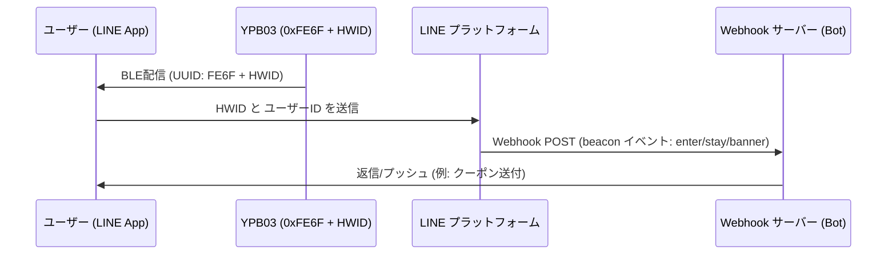

## 製品概要

**YPB03** は、**LINE Beacon** プロトコル用に最適化され、標準的な **LINE Simple Beacon** パケットの配信に対応した、産業用超長寿命型 Bluetooth® Low Energy (BLE 5.0) ビーコンです。**単3乾電池×4本**（計 5800mAh）で駆動し、デフォルトの設定で **最大10年間** という圧倒的なバッテリー寿命を実現しています。

高利得アンテナの採用により、最大 **240メートル** の超広範囲通信に対応。大規模な商業店舗でのプロモーション、スマート小売店のナビゲーション、広大な屋内施設の案内などに最適です。ユーザーは専用アプリを別途インストールする必要がなく、使い慣れた **LINE** アプリを通じて直接位置連動型の通知やメッセージを受け取ることができます。

---

## 主な特徴

* **公式 LINE Beacon 完全互換:** オープンな LINE Simple Beacon プロトコルを配信し、物理的な位置情報と LINE ボット (Messaging API) を簡単に統合します。
* **10年間のメンテナンスフリー:** 入手性の高い単3乾電池4本で駆動。5800mAh の大容量により、頻繁な電池交換コストを削減します。
* **240m の広域カバー:** 強力な BLE 5.0 信号で、空港、イベント会場、ショッピングモールなどの大規模施設をカバーします。
* **手軽なエンゲージメント:** ユーザーは Bluetooth をオンにし、公式アカウントを友だち追加するだけで受信可能。アプリダウンロードの障壁がありません。
* **タフな産業用設計:** IP65 等級の防水防塵 ABS 筐体を採用し、工場や倉庫、湿気の多い屋内環境でも安定して動作します。

---

## LINE Beacon 開発者向け統合ガイド

### 近接トリガーの仕組み
Bluetooth と LINE Beacon 設定を有効にしているユーザーが YPB03 の電波圏内に入ると：
1. LINE アプリが **Service UUID `0xFE6F`** を検知し、電波に含まれるハードウェア ID (HWID) を読み取ります。
2. LINE プラットフォームがこの情報を仲介し、該当する LINE ボットの Webhook サーバーへ `beacon` イベントを POST 送信します。
3. ボットサーバーがこのイベントを受け取り、クーポン、ウェルカムメッセージ、あるいは屋内ナビなどのアクションをリアルタイムに返信します。

### ステップ 1：ハードウェア ID (HWID) の登録
1. **LINE Developers Console** または **LINE 公式アカウント管理画面** にログインします。
2. **Beacon** 連携メニューから新規デバイスを登録し、固有の **5バイト (16進数10文字) のハードウェア ID (HWID)** を発行・取得します。

### ステップ 2：BeaconSET+ を使用した YPB03 の設定
YPB03 の設定はワイヤレスで変更可能です：
1. スマートフォンで **BeaconSET+** アプリを開きます。
2. 該当する YPB03 の MAC アドレスを選択して接続します（管理パスワードが必要）。
3. 使用するスロットの設定を **Service Data** に変更し、以下を設定します：
   - **Service UUID:** `FE6F`
   - **Data Value:** `FE6F` + `[取得した 5バイトの HWID]` + `7F00` (例: HWID が `0123456789` の場合、`FE6F01234567897F00` と入力します)。
4. 保存して接続を切断すると、デバイスは LINE Beacon パケットの配信を開始します。

### ステップ 3：Webhook での Beacon イベント処理
ユーザーの検知時にサーバーが受け取る JSON オブジェクトには、以下のような `beacon` 情報が含まれます：
* **`hwid`**: 登録されたビーコンのハードウェアID。
* **`type`**: 検知タイプ：
  - `enter`: ユーザーがビーコンの電波圏内に入ったとき。
  - `stay`: ユーザーが電波圏内に滞在し続けているとき（10秒ごとに送信）。
  - `banner`: ユーザーが LINE のトーク画面上部に表示されたビーコン通知をタップしたとき。

---

## 設置方法

### 方法 A：両面テープによる貼り付け
* **適した場所:** ガラス、アクリル、清潔なアルミ板、磨かれたタイルなどの滑らかな表面。
* **手順:** 設置場所を綺麗に拭きます。付属の強力両面テープを貼り付け、2秒間押し当てた後、30分間置いてからビーコン本体を固定します。

### 方法 B：ネジ式ブラケットによる壁掛け（推奨）
* **適した場所:** コンクリート、石膏ボード、木材、レンガ壁など。
* **手順:**
  1. 壁面にプラグとネジを用いて取付用ブラケットを固定します。
  2. YPB03 をブラケットの溝に沿ってスライドさせ、カチッと音がするまで差し込みます。

---

## 設定ガイド

YPB03 のパラメータ（UUID、Major、Minor、送信出力、およびアドバタイジング間隔）は、**BeaconSET+** アプリを使用してワイヤレスで設定します：
1. Google Play または Apple App Store から **BeaconSET+** をダウンロードします。
2. スマートフォンの Bluetooth と位置情報を有効にします。
3. アプリから接続し、デフォルトのパスワードを入力してパラメータを編集します。

## 技術仕様

| :--- | :--- | :--- |
| **Chip Model** | nRF52 series | Low latency and high efficiency |
| **Bluetooth Version** | BLE 5.0 | High range and throughput |
| **Waterproof Level** | IP65 | Dustproof and water-jet resistant |
| **Transmission Range** | Up to 240 meters | Maximum in open areas |
| **Protocol Support** | LINE Simple Beacon / iBeacon | Multi-slot broadcasting |
| **Service UUID** | 0xFE6F | Dedicated LINE Beacon UUID |
| **Service Data Format** | 0xFE6F + 5-Byte HWID + 0x7F00 | LINE Simple Beacon packet format |
| **Power Source** | 4 × AA batteries | 5800mAh capacity total (Included) |
| **Battery Lifetime** | Up to 10 years | Based on default broadcasting parameters |
| **Material** | ABS + Silicone | Rugged industrial casing |
| **Dimensions** | 72 × 72 × 23 mm | Wall-mountable square |
| **Net Weight** | 145 g | Including batteries |

---

## 製品ギャラリー


  


---


製品のお見積もりをご希望ですか？[お問い合わせ](/ja/contact/)ください。

