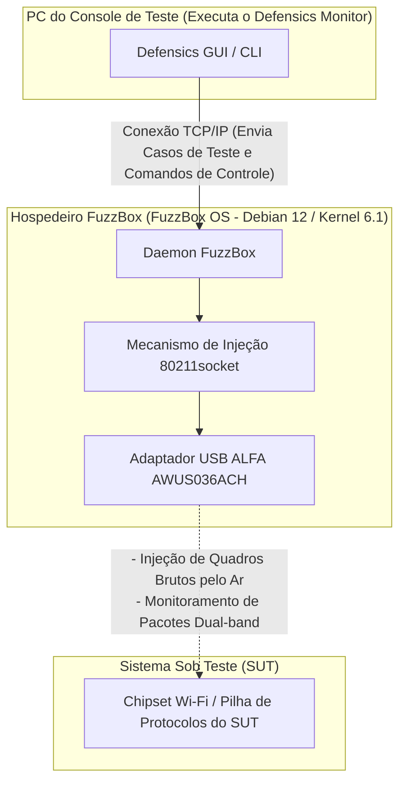

O fuzzing de protocolo WLAN — frequentemente chamado de teste negativo sem fio — é uma das etapas mais críticas na validação da segurança e robustez de dispositivos sem fio incorporados, eletrodomésticos inteligentes e pontos de acesso empresariais. No entanto, tentar transmitir quadros de gerenciamento, controle ou dados 802.11 malformados pelo ar exige controle de baixo nível da camada de controle de acesso ao meio (MAC) que os sistemas operacionais padrão e os drivers de WiFi comerciais simplesmente não permitem.

Para resolver isso, as equipes de segurança utilizam o **Black Duck FuzzBox** (anteriormente Synopsys Defensics FuzzBox), um ambiente especializado de execução de software e hardware. Para realizar os testes, o FuzzBox OS deve ser emparelhado com um adaptador sem fio USB compatível e de alto desempenho, capaz de operar em modo monitor estável e realizar injeção confiável de pacotes brutos (raw). 

Neste guia de compatibilidade, analisamos o catálogo de produtos ativo da ALFA Network na Yupitek, explicamos por que os adaptadores Wi-Fi 6/6E mais recentes falham sob o FuzzBox e fornecemos um guia de configuração passo a passo para a escolha padrão do setor: o **ALFA AWUS036ACH** (RTL8812AU).


O ALFA AWUS036ACH e a unica escolha para fuzzing de protocolos com o Black Duck FuzzBox. O driver RTL8812AU suporta injecao de pacotes brutos e modo monitor. Adaptadores Wi-Fi 6/6E nao funcionam devido a incompatibilidade de driver.



---

## 1. Requisitos do Cliente

Ao realizar o fuzzing de protocolo, a suíte de testes gera milhares de quadros sem fio malformados e personalizados (como Beacons manipulados, Association Requests ou pacotes de handshake WPA) para verificar se a pilha de protocolos do dispositivo de destino falha ou se comporta de maneira inesperada. 

As placas WiFi internas tradicionais (como a série Intel AX200) ou dongles USB de nível de consumidor são limitados por seus firmwares e drivers do sistema operacional. Eles não conseguem:
*   Injetar quadros 802.11 brutos (raw) sem estarem associados a uma rede.
*   Mudar de forma confiável para o Modo Monitor (RFMON) para capturar as respostas exatas do alvo.
*   Forçar velocidades de transmissão precisas ou fixar canais de rádio específicos sem perder pacotes.

Portanto, o sistema requer um ambiente de teste dedicado — Black Duck FuzzBox — emparelhado com um adaptador sem fio USB externo de alta potência que ofereça acesso direto à camada MAC.

---

## 2. Análise do Hardware e Software Alvo

O **FuzzBox OS** é uma distribuição Linux comercial, personalizada e desenvolvida especificamente para executar os mecanismos de injeção da Defensics. Compreender seus limites de hardware é essencial para uma implantação estável.

### 2.1 Requisitos de Hardware
*   **Sistema Hospedeiro:** O FuzzBox OS é executado em hardware dedicado x86 de 64 bits, geralmente implantado em PCs compactos como o Intel® NUC (8ª a 12ª geração) ou ASUS® NUC (14ª geração Pro).
*   **Arquitetura de CPU:** Processador x86_64 dual-core com clock de 2 GHz ou superior.
*   **Controladora USB:** Controladora Host USB 3.0 / USB 3.2.
*   **Capacidade de Alimentação USB:** Este é um ponto comum de falha. Os adaptadores sem fio ALFA de alta potência consomem uma corrente significativa (até 900mA) durante a transmissão ativa. Você deve conectar o adaptador a uma porta USB 3.0 de alta velocidade diretamente na placa-mãe do computador. Evite o uso de hubs USB sem alimentação própria, pois eles podem fazer com que o adaptador se desconecte no meio do teste.

### 2.2 Software Environment

FuzzBox OS opera as a headless Linux container platform. The software specs include:

| Componente / Utilitário | Especificações e Versão |
|---------------------|--------------------------|
| **Sistema Operacional** | FuzzBox OS (baseado no Debian 12 Bookworm, 64-bit) |
| **Kernel do Linux** | Kernel com Suporte de Longo Prazo (LTS) versão **6.1.x** |
| **Drivers Pré-carregados** | Módulos de kernel sem fio otimizados, incluindo o driver de injeção `rtl88xxau` |
| **Suporte a DKMS** | Ativado para compilação dinâmica de módulos de drivers personalizados |
| **Ferramentas GCC e Make** | GCC 12.2.0 e GNU Make 4.3 (pré-instalados para compilar drivers personalizados) |
| **Utilitários de Rede** | `iw`, `iwpan`, `wireless-tools`, `airmon-ng` e `tcpdump` |

---

## 3. Análise de Adaptadores ALFA e Localização de Drivers no GitHub

A seleção do adaptador correto a partir dos modelos ativos atuais é crucial. Vamos comparar o inventário ativo da ALFA Network na Yupitek com a matriz de compatibilidade do FuzzBox OS.

### 3.1 Avaliação Rigorosa dos Modelos ALFA Atuais
A ALFA Network fabrica adaptadores utilizando chipsets diferentes. Apenas chipsets específicos suportam o mecanismo de injeção bruta (raw) do FuzzBox.

| Modelo ALFA | Chipset | Versão USB | Geração Wi-Fi | Status de Compatibilidade com FuzzBox |
|------------|---------|-------------|-----------|------------------------------|
| **AWUS036ACH** | **Realtek RTL8812AU** | **USB 3.0** | **Wi-Fi 5** | **✅ 100% Compatível (Escolha Principal)** |
| **AWUS036ACS** | **Realtek RTL8811AU** | **USB 2.0** | **Wi-Fi 5** | **✅ Compatível (Reserva / Compacto)** |
| **AWUS036AXML** | MediaTek MT7921AUN | USB-C 3.2 | Wi-Fi 6E | ❌ Não suportado (Sem driver de injeção) |
| **AWUS036AXM** | MediaTek MT7921AUN | USB 3.2 | Wi-Fi 6E | ❌ Não suportado (Sem driver de injeção) |
| **AWUS036AX** | Realtek RTL8832BU | USB 3.2 | Wi-Fi 6 | ❌ Não suportado (Sem driver de injeção) |
| **AWUS036AXER** | Realtek RTL8832BU | USB 3.2 | Wi-Fi 6 | ❌ Não suportado (Sem driver de injeção) |
| **AWUS036ACM** | MediaTek MT7612U | USB 3.0 | Wi-Fi 5 | ❌ Não suportado (Sem driver de injeção) |
| **AWUS036EACS** | Realtek RTL8811CU | USB 2.0 | Wi-Fi 5 | ❌ Não suportado (Driver incompatível) |

### 3.2 A Escolha Principal: ALFA AWUS036ACH
O **ALFA AWUS036ACH** é a escolha padrão do setor para testes profissionais de protocolo.
*   **Chipset:** Realtek RTL8812AU.
*   **USB VID/PID:** `0bda:8812` (o registro de identificação do fabricante ALFA é `0df6:0088`).
*   **Especificações de Rádio:** Dual-band 2.4 GHz e 5 GHz (802.11ac), 2×2 MIMO.
*   **Antenas:** Duas antenas omnidirecionais externas e destacáveis de alto ganho de 5 dBi (conectores RP-SMA).
*   **Por que ele se destaca:** O chipset RTL8812AU conta com drivers robustos e aprimorados pela comunidade, os quais permitem que o mecanismo de injeção do FuzzBox ignore as pilhas de rede padrão do sistema operacional, permitindo a transmissão de quadros brutos sem perda de pacotes.

### 3.3 A Escolha de Reserva: ALFA AWUS036ACS
*   **Chipset:** Realtek RTL8811AU.
*   **USB VID/PID:** `0bda:0811` ou `0bda:8811`.
*   **Especificações de Rádio:** Dual-band, 1×1 Single-Stream, até 433 Mbps.
*   **Por que escolher este:** É compacto e econômico, compartilhando características de driver semelhantes ao RTL8812AU. No entanto, por possuir apenas uma antena, carece do alcance e da diversidade espacial exigidos para câmaras de teste maiores.

### 3.4 Fontes dos Drivers (GitHub)
O FuzzBox OS já vem pré-carregado com drivers de injeção estáveis. Caso precise compilar ou executar diagnósticos em sua estação de trabalho local de análise Linux, os repositórios mais estáveis e compatíveis com o Kernel são:
*   **Driver RTL8812AU (AWUS036ACH):** [Repositório GitHub morrownr/8812au-20210629](https://github.com/morrownr/8812au-20210629)
*   **Driver RTL8811AU (AWUS036ACS):** [Repositório GitHub morrownr/8821au](https://github.com/morrownr/8821au)

---

## 4. Análise de Compatibilidade do Driver

O núcleo da transmissão de pacotes do FuzzBox reside em seu daemon injetor proprietário `80211socket`. 

### Por que os Chipsets Wi-Fi 6/6E Mais Recentes Não Funcionam
Muitos testadores presumem que comprar um adaptador mais novo e rápido (como o Wi-Fi 6E AWUS036AXML que utiliza o chipset MT7921AUN) melhorará o desempenho. No entanto, o FuzzBox é projetado para testes de vulnerabilidade de protocolo, não para taxa de transferência de internet. 

O injetor `80211socket` interage diretamente com o driver sem fio no nível da subcamada MAC. Para isso, o driver deve suportar extensões especializadas de injeção bruta. Atualmente, o mecanismo de injeção do FuzzBox OS é otimizado para a árvore de drivers madura **Realtek `rtl88xxau`** (especificamente RTL8812AU/RTL8814AU). Os chipsets MediaTek (MT7921AUN, MT7612U) e os novos chipsets Realtek Wi-Fi 6 (RTL8832BU) não utilizam essa árvore de drivers de injeção e, portanto, são desconsiderados pelo daemon do FuzzBox.

### Estabilidade no Kernel 6.1.x
O driver RTL8812AU foi portado para versões anteriores e amplamente corrigido para o kernel Linux 6.1.x. Ele suporta fixação de canal estável, protege contra estouros de buffer sob estresse massivo de pacotes e evita pânicos no kernel (kernel panics) durante campanhas de fuzzing de desautenticação em alta velocidade.

---

## 5. Guia de Configuração

Siga estas etapas para implantar e configurar o adaptador ALFA AWUS036ACH em seu sistema Black Duck FuzzBox.

### Passo 1: Conexão Física
Conecte o ALFA AWUS036ACH diretamente a uma porta USB 3.0 (cor azul ou identificada com `SS`) no NUC do FuzzBox. Certifique-se de que as duas antenas de 5 dBi estejam firmemente rosqueadas.

### Passo 2: Verificar Detecção de Hardware
Acesse a interface de terminal do FuzzBox via SSH ou tela local e execute o seguinte comando para verificar se a interface USB reconhece o adaptador:
```bash
lsusb
```
Você deve ver uma entrada confirmando o chipset RTL8812AU:
```text
Bus 002 Device 003: ID 0bda:8812 Realtek Semiconductor Corp. RTL8812AU 802.11a/b/g/n/ac WLAN Adapter
```

### Passo 3: Configurar o Daemon Injetor
O FuzzBox mapeia seus adaptadores físicos por meio de arquivos de configuração. Abra o arquivo de configurações do injetor do FuzzBox:
```bash
sudo nano /opt/defensics/fuzzbox/injectors/80211socket.conf
```
Certifique-se de que o parâmetro driver esteja configurado para usar o módulo de injeção USB da Realtek:
```text
driver="usb:rtl88xxau;"
```
Salve o arquivo e saia do editor.

### Passo 4: Validar o Modo Monitor e Funcionamento
Verifique se o daemon do FuzzBox coloca o adaptador com sucesso em modo monitor. Desative as ferramentas padrão de gerenciamento de rede caso haja conflito e ative a interface:
```bash
sudo ip link set wlan0 down
sudo iw dev wlan0 set type monitor
sudo ip link set wlan0 up
```
Verifique o status da interface:
```bash
iwconfig wlan0
```
A saída deve confirmar `Mode:Monitor` e exibir a frequência operacional atual do adaptador.

---

## 6. Diagrama de Topologia da Aplicação

O diagrama a seguir ilustra como a estação de trabalho FuzzBox, o adaptador ALFA AWUS036ACH e o Sistema Sob Teste (SUT) interagem dentro da rede de auditoria sem fio:


### Diagrama de Fluxo do Sistema


---

## 7. Resultado de Validação

Depois de configurado, verifique se o sistema FuzzBox reconhece o adaptador sem fio e está pronto para executar os casos de teste.

Execute o utilitário interno de diagnóstico de adaptador do FuzzBox:
```bash
sudo ls -l /var/run/defensics/injectors/80211/adapters/
```
Uma detecção bem-sucedida exibirá um link simbólico para a interface de rede:
```text
lrwxrwxrwx 1 root root 23 Jun 04 13:30 phy0 -> /sys/class/net/wlan0
```

Quando você iniciar a suíte de testes de WLAN do Defensics (como a suíte de testes de Cliente WPA3 ou Ponto de Acesso) a partir do PC do Console de Teste, a saída do console exibirá a taxa de injeção e confirmará que os quadros de gerenciamento 802.11 malformados estão sendo ativamente injetados:
```text
[INFO] 13:31:02 Injector Daemon: Adapter phy0 loaded successfully.
[INFO] 13:31:04 Injecting test case #154 (Malformed Association Request) -> SUT
[INFO] 13:31:05 Capturing response: SUT responded with Status Code 0 (Success)
[INFO] 13:31:07 Injecting test case #155 (Malformed Association Request with invalid IE lengths)
```

---



## 8. Recomendações

### 8.1 Matriz de Recomendação de Hardware
Para laboratórios de testes de segurança que implantam sistemas Black Duck FuzzBox, recomendamos a seguinte pilha de hardware:

*   **Adaptador de Injeção Principal:** **ALFA Network AWUS036ACH** (RTL8812AU). Possui antenas duplas, alta potência de saída e largura de banda USB 3.0 completa. Este é o principal componente para testes de linha de base.
*   **Adaptador de Reserva / Leve:** **ALFA Network AWUS036ACS** (RTL8811AU). Perfeito para configurações portáteis rápidas, mas limitado a testes de fluxo 1×1.
*   **Otimização de Sinal (Altamente Recomendado):** Adicione as antenas painel direcionais dual-band **ALFA APA-M25** ou **APA-M25-6E**. A substituição das antenas omnidirecionais padrão por esses painéis de alto ganho foca o sinal de rádio diretamente no Sistema Sob Teste (SUT), reduzindo o ruído ambiental e melhorando as taxas de sucesso da injeção.

### 8.2 Consultas e Pedidos
A Yupitek é uma distribuidora autorizada de produtos ALFA Network, oferecendo suporte local e fornecimento em lote. Para solicitar cotações de produtos, fazer pedidos em grandes volumes ou consultar nossa equipe de suporte técnico:
*   Visite a [Página de Contato da Yupitek](/pt/contact/)
*   Or email us directly at **sales@yupitek.com**

Nossa equipe de engenharia ajudará você a adquirir as configurações exatas de hardware sem fio necessárias para dar suporte aos seus fluxos de trabalho de fuzzing de protocolo do Black Duck FuzzBox.

## Referências

1. [Synopsys Defensics — Pagina oficial do produto FuzzBox](https://www.synopsys.com/software-integrity/security-testing/fuzzing/defensics.html)
2. [morrownr/8812au-20210629 — Repositorio GitHub do driver RTL8812AU para Linux](https://github.com/morrownr/8812au-20210629)
3. [aircrack-ng — Site oficial do conjunto de ferramentas de seguranca sem fio](https://www.aircrack-ng.org/)
4. [Site oficial da ALFA Network](https://www.alfa.com.tw/)
5. [Linux Wireless — Documentacao do subsistema mac80211](https://wireless.wiki.kernel.org/en/developers/documentation/mac80211)
