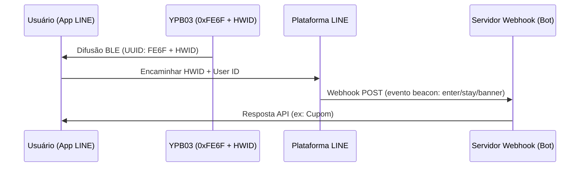

## Visão geral do produto

O **YPB03** é um beacon industrial otimizado como **LINE Beacon** que transmite pacotes padrão **LINE Simple Beacon**. Ele funciona com **4 pilhas AA** (5800mAh), garantindo durabilidade de **até 10 anos**.

Com alcance de até **240 metros**, é a escolha ideal para grandes lojas e galerias. Os clientes não necessitam instalar aplicativos extras – as notificações chegam direto na app **LINE**.

---

## Principais recursos

* **Compatibilidade oficial LINE Beacon:** Transmite o protocolo aberto LINE Simple Beacon para integrar com a API de LINE Bot.
* **10 anos de autonomia:** Usa 4 pilhas AA comuns que diminuem custos de manutenção.
* **Alcance de 240m:** Sinal potente BLE 5.0 ideal para grandes ambientes.
* **Interação sem atrito:** O cliente só precisa ativar o Bluetooth e seguir seu canal.
* **Gabinete IP65:** Resistente a jatos de água para ambientes industriais.

---

## Guia de integração do LINE Beacon para desenvolvedores

### Como funcionam os disparadores de proximidade
Quando um usuário com Bluetooth e LINE Beacon ativos entra na área do sinal:
1. O aplicativo LINE detecta o **UUID de serviço `0xFE6F`** e lê o ID de hardware (HWID).
2. A plataforma LINE envia um evento `beacon` ao seu servidor Webhook.
3. Seu bot responde em tempo real com cupons ou menus interativos.

### Passo 1: Registrar o ID de hardware (HWID)
1. Acesse o **LINE Developers Console** ou o **LINE Official Account Manager**.
2. Vá até a seção Beacon e gere o **HWID de 5 bytes (10 caracteres hexadecimais)**.

### Passo 2: Configurar o YPB03 pelo BeaconSET+
1. Abra a app **BeaconSET+** e conecte-se ao beacon (requer senha).
2. Configure uma das faixas como **Service Data** com:
   - **Service UUID:** `FE6F`
   - **Data Value:** `FE6F` + `[Seu HWID de 5 bytes]` + `7F00` (ex: `FE6F01234567897F00`).
3. Salve e desconecte. O beacon começará a transmitir o sinal LINE Beacon.

### Passo 3: Tratar o evento do webhook
Seu servidor receberá um objeto JSON com detalhes de `beacon`:
* **`hwid`**: ID de hardware do beacon.
* **`type`**: Tipo de ação (`enter` ao entrar, `stay` enviado a cada 10 segundos se continuar na área, `banner` ao clicar no banner na app).

---

## Métodos de instalação

### Método A: Fita adesiva industrial
* **Superfícies:** Vidro, acrílico, alumínio limpo.
* **Processo:** Limpar a superfície. Pressionar a fita (2 seg), aguardar 30 min e montar.

### Método B: Suporte com parafusos (Recomendado)
* **Superfícies:** Concreto, madeira, tijolo.
* **Processo:** Fixar o suporte com buchas e parafusos. Deslizar o YPB03 até travar.

---

## Guia de configuração

Os parâmetros são configurados sem fio com o **BeaconSET+**:
1. Baixe o **BeaconSET+** e ative o Bluetooth.
2. Localize o beacon e conecte-se com sua senha.
3. Ajuste o UUID, Major, Minor, potência e intervalo.

## Technical Specifications

| :--- | :--- | :--- |
| **Chip Model** | nRF52 series | Low latency and high efficiency |
| **Bluetooth Version** | BLE 5.0 | High range and throughput |
| **Waterproof Level** | IP65 | Dustproof and water-jet resistant |
| **Transmission Range** | Up to 240 meters | Maximum in open areas |
| **Protocol Support** | LINE Simple Beacon / iBeacon | Multi-slot broadcasting |
| **Service UUID** | 0xFE6F | Dedicated LINE Beacon UUID |
| **Service Data Format** | 0xFE6F + 5-Byte HWID + 0x7F00 | LINE Simple Beacon packet format |
| **Power Source** | 4 × AA batteries | 5800mAh capacity total (Included) |
| **Battery Lifetime** | Up to 10 years | Based on default broadcasting parameters |
| **Material** | ABS + Silicone | Rugged industrial casing |
| **Dimensions** | 72 × 72 × 23 mm | Wall-mountable square |
| **Net Weight** | 145 g | Including batteries |

---

## Galeria do produto


  


---


Precisa de uma cotação do produto? Por favor, [entre em contato conosco](/pt/contact/).

