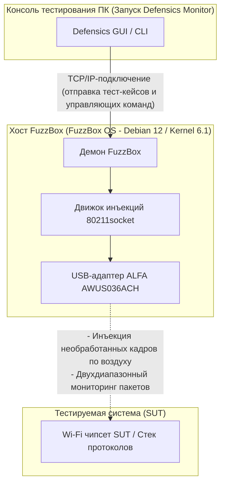

Фаззинг протоколов WLAN (часто называемый негативным беспроводным тестированием) — один из наиболее важных этапов проверки безопасности и надежности встроенных беспроводных устройств, устройств умного дома и корпоративных точек доступа. Однако попытка передавать по воздуху некорректные кадры управления, контроля или данных 802.11 требует низкоуровневого контроля уровня управления доступом к среде (MAC), который стандартные операционные системы и коммерческие драйверы Wi-Fi просто не позволяют осуществлять.

Для решения этой задачи команды безопасности используют **Black Duck FuzzBox** (ранее Synopsys Defensics FuzzBox) — специализированную программно-аппаратную среду выполнения. Для проведения тестов ОС FuzzBox должна быть сопряжена с совместимым высокопроизводительным беспроводным USB-адаптером, способным поддерживать стабильный режим мониторинга (monitor mode) и надежную инъекцию необработанных пакетов (raw packet injection).

В этом руководстве по совместимости мы анализируем текущий каталог продукции ALFA Network от Yupitek, объясняем, почему новые адаптеры Wi-Fi 6/6E не работают в FuzzBox, и предлагаем пошаговое руководство по настройке отраслевого стандарта: **ALFA AWUS036ACH** (RTL8812AU).

---

## 1. Требования заказчика

При выполнении фаззинга протоколов тестовый набор генерирует тысячи специально созданных некорректных беспроводных кадров (таких как измененные пакеты Beacon, Association Request или пакеты рукопожатия WPA), чтобы проверить, вызовет ли это сбой или непредвиденное поведение стека протоколов целевого устройства.

Традиционные встроенные карты Wi-Fi (например, серии Intel AX200) или потребительские USB-адаптеры ограничены своей прошивкой и драйверами ОС. Они не могут:
*   Отправлять необработанные кадры 802.11 без подключения к сети.
*   Надежно переходить в режим мониторинга (Monitor Mode / RFMON) для точного перехвата ответов целевого устройства.
*   Обеспечивать точную скорость передачи данных или фиксировать определенные радиоканалы без потери пакетов.

Поэтому системе требуется выделенная среда тестирования — Black Duck FuzzBox — в сочетании с мощным внешним беспроводным USB-адаптером, предоставляющим прямой доступ к уровню MAC.

---

## 2. Анализ целевого аппаратного и программного обеспечения

**FuzzBox OS** — это коммерческий, специализированный дистрибутив Linux, разработанный специально для запуска модулей инъекции Defensics. Понимание аппаратных ограничений необходимо для стабильного развертывания системы.

### 2.1 Аппаратные требования
*   **Хост-система:** ОС FuzzBox работает на выделенном 64-разрядном оборудовании x86, обычно развертываемом на компактных ПК, таких как Intel® NUC (с 8-го по 12-е поколение) или ASUS® NUC (14-е поколение Pro).
*   **Архитектура процессора:** двухъядерный процессор x86_64 с тактовой частотой 2 ГГц или выше.
*   **USB-контроллер:** хост-контроллер USB 3.0 / USB 3.2.
*   **Питание USB-порта:** Это частая причина сбоев. Мощные беспроводные адаптеры ALFA потребляют значительный ток (до 900 мА) во время активной передачи данных. Адаптер необходимо подключать напрямую к высокоскоростному порту USB 3.0 на материнской плате хоста. Избегайте использования USB-хабов без внешнего питания, так как это может привести к отключению адаптера во время тестирования.

### 2.2 Программная среда
ОС FuzzBox работает как безграфиковая (headless) платформа контейнеров Linux. Характеристики программного обеспечения включают:

| Компонент / Утилита | Спецификации и версия |
|---------------------|--------------------------|
| **Операционная система** | FuzzBox OS (на базе Debian 12 Bookworm, 64-bit) |
| **Ядро Linux** | Ядро с долгосрочной поддержкой (LTS) версии **6.1.x** |
| **Предустановленные драйверы** | Оптимизированные беспроводные модули ядра, включая драйвер инъекций `rtl88xxau` |
| **Поддержка DKMS** | Включена для динамической компиляции кастомных модулей драйверов |
| **Инструменты сборки GCC и Make** | GCC 12.2.0 и GNU Make 4.3 (предустановлены для компиляции кастомных драйверов) |
| **Сетевые утилиты** | `iw`, `iwpan`, `wireless-tools`, `airmon-ng` и `tcpdump` |

---

## 3. Анализ адаптеров ALFA и расположение драйверов на GitHub

Выбор правильного адаптера из текущих активных моделей имеет решающее значение. Давайте сравним актуальный ассортимент продукции ALFA Network от Yupitek с матрицей совместимости FuzzBox OS.

### 3.1 Строгая оценка текущих моделей ALFA
ALFA Network выпускает адаптеры на базе различных чипсетов. Только определенные чипсеты поддерживают движок инъекции необработанных пакетов FuzzBox.

| Модель ALFA | Чипсет | Версия USB | Поколение Wi-Fi | Статус совместимости с FuzzBox |
|------------|---------|-------------|-----------|------------------------------|
| **AWUS036ACH** | **Realtek RTL8812AU** | **USB 3.0** | **Wi-Fi 5** | **✅ 100% совместим (основной выбор)** |
| **AWUS036ACS** | **Realtek RTL8811AU** | **USB 2.0** | **Wi-Fi 5** | **✅ Совместим (резервный / компактный)** |
| **AWUS036AXML** | MediaTek MT7921AUN | USB-C 3.2 | Wi-Fi 6E | ❌ Не поддерживается (нет драйвера инъекций) |
| **AWUS036AXM** | MediaTek MT7921AUN | USB 3.2 | Wi-Fi 6E | ❌ Не поддерживается (нет драйвера инъекций) |
| **AWUS036AX** | Realtek RTL8832BU | USB 3.2 | Wi-Fi 6 | ❌ Не поддерживается (нет драйвера инъекций) |
| **AWUS036AXER** | Realtek RTL8832BU | USB 3.2 | Wi-Fi 6 | ❌ Не поддерживается (нет драйвера инъекций) |
| **AWUS036ACM** | MediaTek MT7612U | USB 3.0 | Wi-Fi 5 | ❌ Не поддерживается (нет драйвера инъекций) |
| **AWUS036EACS** | Realtek RTL8811CU | USB 2.0 | Wi-Fi 5 | ❌ Не поддерживается (несовместимый драйвер) |

### 3.2 Основной выбор: ALFA AWUS036ACH
**ALFA AWUS036ACH** — это отраслевой стандарт для профессионального тестирования протоколов.
*   **Чипсет:** Realtek RTL8812AU.
*   **USB VID/PID:** `0bda:8812` (идентификатор производителя ALFA регистрируется как `0df6:0088`).
*   **Характеристики радиомодуля:** двухдиапазонный 2.4 ГГц и 5 ГГц (802.11ac), 2×2 MIMO.
*   **Антенны:** две внешние съемные всенаправленные антенны с высоким коэффициентом усиления 5 dBi (разъемы RP-SMA).
*   **Почему это лучший выбор:** Чипсет RTL8812AU оснащен стабильными драйверами, доработанными сообществом, которые позволяют движку инъекций FuzzBox обходить стандартные сетевые стеки ОС, обеспечивая отправку необработанных кадров без потери пакетов.

### 3.3 Резервный выбор: ALFA AWUS036ACS
*   **Чипсет:** Realtek RTL8811AU.
*   **USB VID/PID:** `0bda:0811` или `0bda:8811`.
*   **Характеристики радиомодуля:** двухдиапазонный, 1×1 Single-Stream, до 433 Мбит/с.
*   **Почему стоит его выбрать:** Он компактный и бюджетный, обладающий схожими характеристиками драйвера с RTL8812AU. Однако из-за наличия только одной антенны ему не хватает дальности действия и пространственного разнесения, необходимых для работы в крупных испытательных камерах.

### 3.4 Исходный код драйверов (GitHub)
ОС FuzzBox поставляется с предустановленными стабильными драйверами инъекций. Если вам необходимо скомпилировать или запустить диагностику на вашей локальной аналитической рабочей станции Linux, наиболее стабильными репозиториями, совместимыми с ядром, являются:
*   **Драйвер RTL8812AU (AWUS036ACH):** [репозиторий GitHub morrownr/8812au-20210629](https://github.com/morrownr/8812au-20210629)
*   **Драйвер RTL8811AU (AWUS036ACS):** [репозиторий GitHub morrownr/8821au](https://github.com/morrownr/8821au)

---

## 4. Анализ совместимости драйверов

Основа передачи пакетов FuzzBox заключается в его проприетарном демоне инъекций `80211socket`.

### Почему новые чипсеты Wi-Fi 6/6E не работают
Многие тестировщики полагают, что покупка более нового и быстрого адаптера (например, Wi-Fi 6E AWUS036AXML на базе чипсета MT7921AUN) повысит производительность. Однако FuzzBox разработан для тестирования уязвимостей протоколов, а не для увеличения пропускной способности Интернета.

Инжектор `80211socket` взаимодействует напрямую с беспроводным драйвером на уровне подуровня MAC. Для этого драйвер должен поддерживать специализированные расширения для инъекции необработанных кадров. В настоящее время движок инъекций FuzzBox OS оптимизирован под проверенное дерево драйверов **Realtek `rtl88xxau`** (в частности, RTL8812AU/RTL8814AU). Чипсеты MediaTek (MT7921AUN, MT7612U) и новые чипсеты Realtek Wi-Fi 6 (RTL8832BU) не используют это дерево драйверов инъекции и поэтому игнорируются демоном FuzzBox.

### Стабильность при использовании ядра 6.1.x
Драйвер RTL8812AU был бэкпортирован и существенно доработан патчами для ядра Linux 6.1.x. Он поддерживает стабильную фиксацию канала (channel-locking), защищает от переполнения буфера при массивной нагрузке пакетами и предотвращает панику ядра (kernel panic) во время высокоскоростных сессий фаззинга деавторизации.

---

## 5. Руководство по настройке

Выполните следующие шаги для развертывания и настройки адаптера ALFA AWUS036ACH в вашей системе Black Duck FuzzBox.

### Шаг 1: Физическое подключение
Подключите ALFA AWUS036ACH напрямую к порту USB 3.0 (синего цвета или с маркировкой `SS`) на устройстве FuzzBox NUC. Убедитесь, что обе антенны 5 dBi надежно закреплены.

### Шаг 2: Проверка обнаружения оборудования
Подключитесь к терминалу FuzzBox через SSH или локальный дисплей и выполните следующую команду, чтобы проверить, распознает ли USB-интерфейс адаптер:
```bash
lsusb
```
Вы должны увидеть строку, подтверждающую наличие чипсета RTL8812AU:
```text
Bus 002 Device 003: ID 0bda:8812 Realtek Semiconductor Corp. RTL8812AU 802.11a/b/g/n/ac WLAN Adapter
```

### Шаг 3: Настройка демона инъекций
FuzzBox сопоставляет физические адаптеры через конфигурационные файлы. Откройте файл настроек инжектора FuzzBox:
```bash
sudo nano /opt/defensics/fuzzbox/injectors/80211socket.conf
```
Убедитесь, что параметр драйвера настроен на использование USB-модуля инъекций Realtek:
```text
driver="usb:rtl88xxau;"
```
Сохраните файл и выйдите из редактора.

### Шаг 4: Проверка режима мониторинга и работоспособности
Проверьте, успешно ли демон FuzzBox переводит адаптер в режим мониторинга. Отключите стандартные инструменты управления сетью в случае возникновения конфликтов и поднимите интерфейс:
```bash
sudo ip link set wlan0 down
sudo iw dev wlan0 set type monitor
sudo ip link set wlan0 up
```
Проверьте статус интерфейса:
```bash
iwconfig wlan0
```
Вывод команды должен подтвердить режим работы `Mode:Monitor` and отобразить текущую рабочую частоту адаптера.

---

## 6. Топология приложения

Следующая схема иллюстрирует взаимодействие рабочей станции FuzzBox, адаптера ALFA AWUS036ACH и тестируемой системы (SUT) в рамках сети беспроводного аудита:


### Диаграмма потоков системы


---

## 7. Результаты проверки

После настройки убедитесь, что система FuzzBox распознает беспроводной адаптер и готова к запуску тестов.

Запустите внутреннюю диагностическую утилиту адаптера FuzzBox:
```bash
sudo ls -l /var/run/defensics/injectors/80211/adapters/
```
При успешном обнаружении будет выведена символическая ссылка на сетевой интерфейс:
```text
lrwxrwxrwx 1 root root 23 Jun 04 13:30 phy0 -> /sys/class/net/wlan0
```

При запуске набора тестов Defensics WLAN (например, пакета тестов для клиента WPA3 или точки доступа) с ПК консоли тестирования в консоли отобразится частота инъекций, а также подтверждение активной инъекции некорректных кадров управления 802.11:
```text
[INFO] 13:31:02 Injector Daemon: Adapter phy0 loaded successfully.
[INFO] 13:31:04 Injecting test case #154 (Malformed Association Request) -> SUT
[INFO] 13:31:05 Capturing response: SUT responded with Status Code 0 (Success)
[INFO] 13:31:07 Injecting test case #155 (Malformed Association Request with invalid IE lengths)
```

---

## 8. Рекомендации

### 8.1 Матрица рекомендаций по оборудованию
Для лабораторий безопасности, развертывающих системы Black Duck FuzzBox, мы рекомендуем следующий набор оборудования:

*   **Основной адаптер инъекций:** **ALFA Network AWUS036ACH** (RTL8812AU). Оснащен двумя антеннами, высокой выходной мощностью и полной пропускной способностью USB 3.0. Это основной рабочий инструмент для базового тестирования.
*   **Резервный / облегченный адаптер:** **ALFA Network AWUS036ACS** (RTL8811AU). Идеально подходит для быстрой мобильной настройки, но ограничен тестированием в режиме потока 1×1.
*   **Оптимизация сигнала (настоятельно рекомендуется):** добавьте двухдиапазонные направленные панельные антенны **ALFA APA-M25** или **APA-M25-6E**. Замена стандартных всенаправленных антенн на эти панели с высоким коэффициентом усиления фокусирует радиосигнал непосредственно на тестируемую систему (SUT), снижая уровень окружающего шума и повышая эффективность инъекции пакетов.

### 8.2 Запросы и заказ
Yupitek является авторизованным дистрибьютором продукции ALFA Network, предоставляя локальную поддержку и оптовые поставки. Чтобы запросить коммерческое предложение, разместить оптовый заказ или проконсультироваться с нашей службой технической поддержки:
*   Посетите [страницу контактов Yupitek](/ru/contact/)
*   Или напишите нам напрямую по адресу **sales@yupitek.com**

Наша инженерная группа поможет вам подобрать точные конфигурации беспроводного оборудования, необходимые для обеспечения ваших рабочих процессов фаззинга протоколов с помощью Black Duck FuzzBox.
