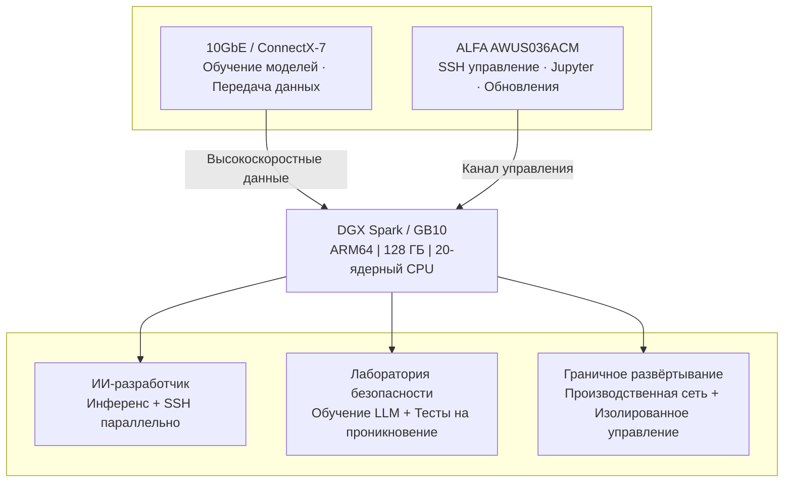

Ваш долгожданный **NVIDIA DGX Spark** (кодовое название Project DIGITS) наконец прибыл.

Распаковка, подключение питания, появляется экран OOBE (первоначальная настройка) — всё идёт гладко. Вы выбираете сеть Wi-Fi, вводите пароль, экран вращается тридцать секунд...

**«Не удалось подключиться к этой сети.»**

Попробовать снова. Перезагрузка. Сброс. Всё равно ошибка.

Вы не одиноки. На [форумах разработчиков NVIDIA](https://forums.developer.nvidia.com) **десятки тем** жалуются на одно и то же: Wi-Fi DGX Spark не работает.

Это не ошибка конфигурации. Это известный конструктивный дефект DGX Spark.

---

## Причина: Почему Wi-Fi DGX Spark такой ненадёжный?

DGX Spark — и все другие ИИ-серверы на базе **NVIDIA GB10 Grace Blackwell Superchip** — использует чип **MediaTek MT7925 Wi-Fi 7**. На бумаге — первоклассное оборудование.

Проблема в программном слое.

### Три фатальных недостатка

**① Wi-Fi supplicant OOBE слишком упрощён**

Первоначальная настройка DGX Spark использует минимальный `wpa_supplicant`, из которого удалено большинство функций корпоративной аутентификации. Это делает ассоциацию с определёнными точками доступа — особенно Ubiquiti UniFi — полностью невозможной.

NVIDIA официально задокументировала эту проблему в **примечаниях к выпуску DGX Spark (обновление апреля 2026 г.)**, и на момент написания статьи она не исправлена.

**② WPA2-Enterprise несовместим**

Если ваш офис или лаборатория используют WPA2-Enterprise (обычно в корпоративных средах), встроенный Wi-Fi DGX Spark почти наверняка не будет работать. Это нельзя исправить файлом конфигурации — это двойное ограничение на уровне драйвера и supplicant.

**③ Случайные ошибки «No Wi-Fi Adapter Found»**

Несколько пользователей на форумах NVIDIA (тема #356183) сообщают, что DGX Spark случайным образом показывает «Беспроводной адаптер не найден» во время нормальной работы, требуя полной перезагрузки. Хуже того, **система не переподключается автоматически после обрыва** — необходимо вручную выполнять команды `nmcli`.

| Проблема | Влияние |
|------|------|
| OOBE не может подключиться к корпоративным AP | UniFi / WPA2-Enterprise — полностью не работает |
| Случайный «No Wi-Fi Adapter Found» | Требуется перезагрузка, прерывает рабочий процесс |
| Нет автоматического переподключения | Удалённое управление бесполезно |
| Примечания к выпуску подтверждают проблему | Официально NVIDIA, не единичный случай |

> 💡 **Хорошая новость: Хотя эти проблемы программного обеспечения не будут полностью исправлены в ближайшее время, существует простое, стабильное и полностью совместимое аппаратное решение.**

---

## Не только DGX Spark — Все серверы GB10 AI Edge используют один и тот же чип Wi-Fi

DGX Spark привлекает всё внимание просто потому, что это собственный бренд NVIDIA, и он поступил в продажу первым. Но на самом деле **каждый AI Edge Server на базе NVIDIA GB10 Grace Blackwell Superchip** использует точно такой же чип **MediaTek MT7925 Wi-Fi 7** — тот же стек драйверов, те же ограничения `wpa_supplicant`, те же проблемы совместимости.

В настоящее время на рынке доступно шесть серверов GB10 AI Edge:

### Полное сравнение характеристик GB10 AI Edge Server

Все модели имеют общие основные характеристики:

| Компонент | Характеристика |
|----------|------|
| Superchip | **NVIDIA GB10 Grace Blackwell** |
| CPU | **20-ядерный Arm** (10× Cortex-X925 + 10× Cortex-A725) |
| GPU | **NVIDIA Blackwell GPU**, 5-е покол. Tensor Cores / 4-е покол. RT Cores |
| Производительность ИИ | **1 PFLOP FP4** (1000 TOPS AI) |
| Системная память | **128 ГБ LPDDR5x** unified, 256-бит, пропускная способность 273 ГБ/с |
| Соединение памяти | **NVLink-C2C** (5× пропускная способность PCIe 5.0) |
| NIC | **NVIDIA ConnectX-7** SmartNIC (200G × 2 QSFP) |
| Ethernet | **1× 10GbE RJ-45** |
| Чип Wi-Fi | **MediaTek MT7925** Wi-Fi 7 (2×2) |
| Видеовыход | **1× HDMI 2.1a** |
| Операционная система | **NVIDIA DGX OS** (на базе Ubuntu Linux) |
| Блок питания | **240 Вт** внешний адаптер USB-C |
| Объединение двух устройств | Поддерживается (до 405 млрд параметров) |

Различия между брендами:

| Характеристика | **ASUS ASCENT GX10** | **MSI EdgeXpert** | **NVIDIA DGX Spark** | **HP ZGX Nano G1n** | **ALTOS BrainSphere GB10 F1** | **GIGABYTE AI TOP ATOM** |
|------|----------------------|-------------------|----------------------|---------------------|------------------------------|--------------------------|
| Накопитель | 1 ТБ / 2 ТБ / 4 ТБ NVMe | 1 ТБ / 4 ТБ NVMe | 1 ТБ / 4 ТБ NVMe | 1 ТБ / 2 ТБ / 4 ТБ NVMe | 4 ТБ NVMe | 1 ТБ / 4 ТБ NVMe (макс. Gen5) |
| Модуль Wi-Fi | AW-EM637 (Wi-Fi 7) | Wi-Fi 7 | Wi-Fi 7 | MT7925 (Wi-Fi 7) | Wi-Fi 7 | Wi-Fi 7 |
| Bluetooth | BT 5.4 | BT 5.3 | BT 5.4 | BT 5.4 | BT 5.4 LE | BT 5.4 |
| USB | 4× USB 3.2 Gen 2×2 Type-C | 4× USB 3.2 Type-C | 4× USB Type-C | 4× USB Type-C | 4× USB 3.2 Gen 2×2 Type-C | 4× USB 3.2 Gen 2×2 Type-C |
| Размеры | 150×150×51 мм | 151×151×52 мм | 150×150×50,5 мм | 150×150×51 мм | 150×150×50 мм | 150×150×50,5 мм |
| Вес | 1,48 кг | 1,2 кг | 1,2 кг | 1,25 кг | < 1,5 кг | 1,2 кг |
| Встроенное ПО | — | — | — | HP ZGX Toolkit | Платформа Altos aiGeni | — |

> ⚠️ **Вывод**: Независимо от того, какой сервер GB10 AI Edge вы купили, встроенный Wi-Fi использует один и тот же чип MediaTek MT7925, и все могут столкнуться с одинаковыми проблемами подключения. Решение с USB-адаптером ALFA, описанное ниже, **работает на всех шести моделях**.

---

## Решение: Один USB Wi-Fi адаптер, десять минут

NVIDIA официально тестирует только DGX OS (на базе Ubuntu 24.04). **Все платформы GB10 используют архитектуру ARM64 (aarch64)** с ядром **версии 6.17 или новее**.

Это означает, что ваш USB Wi-Fi адаптер должен соответствовать трём требованиям:

1. ✅ **Драйвер, встроенный в ядро Linux** — без компиляции, без DKMS
2. ✅ **Полная поддержка ARM64 (aarch64)** — plug-and-play на GB10
3. ✅ **Проверенная стабильность** — широко подтверждена сообществом

Из десятков USB Wi-Fi адаптеров на рынке очень немногие удовлетворяют всем трём.

### 🥇 Единственная рекомендация: ALFA AWUS036ACM

| Элемент | Детали |
|------|------|
| Чипсет | **MediaTek MT7612U** |
| Драйвер | **Встроенный в ядро Linux mt76** (с ядра 4.19) |
| Диапазоны | Двухдиапазонный 2,4 ГГц + 5 ГГц (AC1200) |
| Антенна | 2× RP-SMA съёмные 5 дБи (с возможностью замены) |
| Интерфейс | USB 3.0 Type-A |
| Режим монитора | ✅ Полная поддержка |
| Режим AP | ✅ Поддерживается |
| Соответствие TAA | ✅ Соответствует стандартам госзакупок США |

#### Почему именно он? Шесть причин

**1. Единственное по-настоящему беспроводное решение plug-and-play**

Драйвер mt76 является частью основного ядра Linux с версии 4.19. Ядро 6.17 DGX Spark поддерживает его нативно. Подключите к порту USB, и система **автоматически загрузит драйвер** — вы ничего не устанавливаете.

**2. Единственный вариант, проверенный на ARM64**

MT7612U годами тестировался на платформах ARM — Raspberry Pi OS (aarch64), Ubuntu Server (ARM64) и других. Архитектура ARM64 GB10 полностью совместима без каких-либо патчей.

**3. Единственное решение с нулевой компиляцией, нулевой настройкой**

В отличие от Realtek RTL8812AU, требующего DKMS и перекомпиляции после каждого обновления ядра, ACM не нуждается ни в чём подобном. Обновите ядро DGX OS — ACM продолжает работать мгновенно.

**4. Единственное решение без драйверов с полным режимом монитора + инжекцией пакетов**

Если вы планируете запускать виртуальные машины Kali Linux на DGX Spark для исследований безопасности, ACM в настоящее время является единственным адаптером без драйверов, поддерживающим режим монитора, инжекцию пакетов и виртуальные интерфейсы (VIF).

**5. Единственный вариант среднего/высокого класса со сменными антеннами**

Две съёмные антенны RP-SMA. Поставляется с 5 дБи, можно заменить на антенны с высоким коэффициентом усиления 7 дБи или 9 дБи — идеально для развёртывания в серверных комнатах или на производстве со слабым сигналом Wi-Fi.

**6. Единственный вариант с соответствием TAA**

Если ваша организация имеет требования к государственным закупкам, ALFA AWUS036ACM — один из немногих внешних USB Wi-Fi адаптеров с **соответствием TAA**.

---

## Практика: От «Нет беспроводной сети» до двойной сети за 10 минут

Полный процесс использования ALFA AWUS036ACM на DGX Spark:

### Шаг 1: Подключите USB-адаптер

Вставьте AWUS036ACM в любой порт USB 3.0 Type-A на DGX Spark.

Откройте терминал и выполните:

```bash
dmesg | tail -20
```

Вы должны увидеть вывод, похожий на:

```
mt76_usb 3-1:1.0: MAC/BBP MT7612U (rev 2)
mt76_usb 3-1:1.0: firmware loaded: mt7612u.bin
ieee80211 phy1: rt2x00_set_rt: Info - RT chipset 7612, rev 0200 detected
ieee80211 phy1: rt2x00lib_probe_dev: Information - Successfully initialized device
```

**Это сигнал о том, что драйвер загрузился автоматически.** Вы ничего не устанавливали.

### Шаг 2: Подтвердите, что адаптер распознан

```bash
nmcli device status
```

Вы должны увидеть `wlan1` (или `wlx...`) в списке со статусом `disconnected`.

### Шаг 3: Подключитесь к Wi-Fi

```bash
# Сканировать доступные сети
nmcli device wifi list

# Подключиться к вашей SSID (замените «MyLabWiFi»)
sudo nmcli device wifi connect "MyLabWiFi" password "your-password"

# Проверить состояние подключения
nmcli connection show --active
```

### Шаг 4: Включите автоподключение при загрузке

Если предыдущий шаг прошёл успешно, `nmcli` автоматически сохранит профиль подключения. Он будет подключаться автоматически при каждой последующей загрузке.

Проверьте, сохранён ли профиль:

```bash
nmcli connection show
```

Видите свой SSID в списке — готово. От подключения USB до стабильного Wi-Fi соединения **проходит менее десяти минут**.

---

## Вот это настоящая сетевая архитектура ИИ-сервера

С AWUS036ACM сетевая конфигурация DGX Spark превращается в профессиональную **двухсетевую архитектуру**:



**Зачем разделять трафик?**

Обучение моделей ИИ генерирует огромный сетевой трафик — загрузка предобученных весов, синхронизация наборов данных, коммуникация распределённого обучения. Если смешивать это с SSH-управлением на одной линии:

- SSH-сессии становятся медленными или обрываются по таймауту
- Пропускная способность 10GbE тратится на трафик управления
- Если основное соединение обрывается (например, зависание загрузки модели), вы даже не можете удалённо подключиться для исправления

С разделением **ваше управляющее соединение остаётся стабильным независимо от рабочей нагрузки модели**.

---

## Три сценария, один адаптер

### Сценарий A: ИИ-разработчик
```
10GbE → Инференс моделей, передача данных
ALFA ACM → SSH, Jupyter Notebook, обновления системы
```

### Сценарий B: Лаборатория исследований безопасности
```
GB10 → Выполнение тонкой настройки LLM
Kali Linux VM → Проброс USB ALFA ACM → Тестирование на проникновение беспроводных сетей
```

### Сценарий C: Граничное развёртывание (Завод / Склад)
```
10GbE → Производственная сеть
ALFA ACM + антенны с высоким усилением → Офисный Wi-Fi управления
```

---

## Часто задаваемые вопросы

**В: MT7612U в AWUS036ACM и встроенный MT7925 в GB10 — разве это не одно и то же от MediaTek?**

О: Один производитель, совершенно разная архитектура драйверов. MT7925 использует драйвер `mt7925e`, более новый драйвер интерфейса PCIe, который всё ещё дорабатывается. MT7612U использует USB-драйвер `mt76`, который совершенствовался с ядра 4.19 и чрезвычайно стабилен.

**В: Работает ли этот адаптер вне DGX OS?**

О: Безусловно. Драйвер MT7612U является частью основного ядра Linux — Ubuntu, Debian, Raspberry Pi OS, Kali Linux, Fedora, Arch Linux — всё с ядром 4.19 или новее. Plug-and-play на всех.

---

## Резюме: Независимо от того, какой у вас GB10, выведите его в сеть за 10 минут

Купили ли вы NVIDIA DGX Spark, ASUS ASCENT GX10, MSI EdgeXpert, HP ZGX Nano, ALTOS BrainSphere GB10 F1 или GIGABYTE AI TOP ATOM — эти серверы GB10 AI Edge являются феноменальными машинами для разработки ИИ: 128 ГБ унифицированной памяти, 20-ядерный ARM CPU, сеть ConnectX-7 200GbE. Но все они используют один и тот же чип Wi-Fi MediaTek MT7925, и все могут споткнуться на одном и том же первом шаге.

Решение ALFA AWUS036ACM почти абсурдно простое: **подключил — работает.**

Но именно эта простота и есть настоящая продуктивность инженера — вы не должны отлаживать драйверы Wi-Fi. Вы должны обучать модели.

По сравнению с другими подходами преимущество очевидно:

| Подход | Время | Надёжность | Обслуживание |
|------|------|--------|---------|
| Ждать исправления драйвера Wi-Fi от NVIDIA | Неизвестно (месяцы?) | Неопределённо | Низкое |
| Купить Wi-Fi мост | 30 мин настройки | Средняя | Среднее |
| **ALFA AWUS036ACM** | **< 10 мин** | **Максимальная** | **Нулевое** |

Десять минут, один USB-адаптер, и ваш ИИ-сервер действительно в сети.

---

> 📌 **ALFA AWUS036ACM в наличии** → [Страница продукта Yupitek](/ru/products/alfa/awus036acm/)
>
> Yupitek Ltd — авторизованный дистрибьютор ALFA Network в Тайване
> Для заказов или технических вопросов: sales@yupitek.com

---

*Источники: Примечания к выпуску NVIDIA DGX Spark, Форумы разработчиков NVIDIA, morrownr/USB-WiFi GitHub, Документация ALFA Network, Документация Linux Kernel Wireless*
