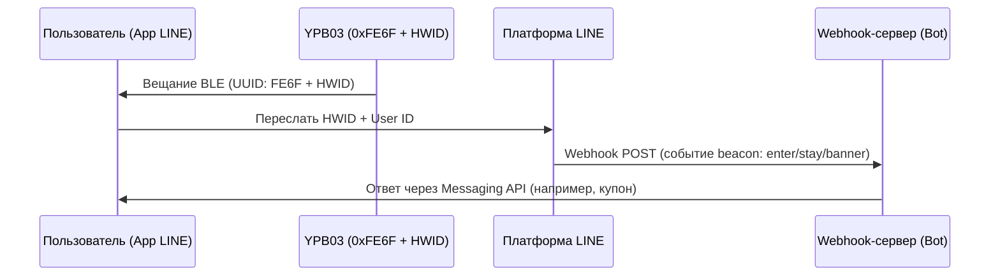

## Обзор продукта

**YPB03** — это промышленный Bluetooth® Low Energy (BLE 5.0) маяк, оптимизированный под протокол **LINE Beacon** для трансляции стандартных пакетов **LINE Simple Beacon**. Работает от **4 батареек AA** (5800 мАч), обеспечивающих работу **до 10 лет**.

С дальностью действия до **240 метров**, YPB03 идеален для крупных залов и торговых центров. Клиентам не нужно ставить отдельные приложения – уведомления приходят прямо в мессенджер **LINE**.

---

## Ключевые свойства

* **Официальная совместимость с LINE Beacon:** Транслирует открытый протокол LINE Simple Beacon для связи с LINE Bot Messaging API.
* **10 лет автономной работы:** Питание от 4 обычных пальчиковых батареек минимизирует затраты на обслуживание.
* **Дальность 240м:** Мощный BLE 5.0 сигнал для аэропортов и выставочных комплексов.
* **Взаимодействие без трения:** Пользователю достаточно включить Bluetooth и добавить ваш канал.
* **Корпус IP65:** Защита от брызг воды и пыли для использования на складах.

---

## Руководство по интеграции LINE Beacon для разработчиков

### Принцип работы триггеров приближения
Когда пользователь с включенным Bluetooth и опцией LINE Beacon входит в зону сигнала:
1. Приложение LINE обнаруживает **UUID сервиса `0xFE6F`** и считывает аппаратный ID (HWID).
2. Платформа LINE отправляет событие `beacon` на Webhook-сервер вашего бота.
3. Ваш бот реагирует в реальном времени, отправляя купоны или информацию.

### Шаг 1: Зарегистрировать аппаратный ID (HWID)
1. Войдите в **LINE Developers Console** или **LINE Official Account Manager**.
2. В разделе Beacon зарегистрируйте устройство и получите **5-байтовый (10 шестнадцатеричных символов) HWID**.

### Шаг 2: Настроить YPB03 через BeaconSET+
1. Загрузите **BeaconSET+** и подключитесь к маяку (понадобится пароль).
2. Выберите активный слот и укажите тип **Service Data** со следующими параметрами:
   - **Service UUID:** `FE6F`
   - **Data Value:** `FE6F` + `[Ваш 5-байтовый HWID]` + `7F00` (например, `FE6F01234567897F00`).
3. Сохраните параметры и отключитесь. Маяк начнет вещание LINE Beacon.

### Шаг 3: Обработка события в Webhook
Ваш сервер будет получать JSON-сообщения с данными `beacon`:
* **`hwid`**: Аппаратный ID маяка.
* **`type`**: Действие (`enter` при входе в зону, `stay` отправляется каждые 10 секунд при нахождении в зоне, `banner` при клике на баннер в приложении).

---

## Способы установки

### Метод А: Промышленный скотч
* **Поверхности:** Стекло, акрил, чистый алюминий.
* **Процесс:** Очистите поверхность. Прижмите скотч (2 сек), подождите 30 мин и закрепите маяк.

### Метод Б: Монтажный кронштейн (Рекомендуется)
* **Поверхности:** Бетон, дерево, кирпич.
* **Процесс:** Закрепите кронштейн на стене дюбелями и винтами. Вставьте YPB03 до щелчка.

---

## Руководство по настройке

Параметры настраиваются по беспроводному интерфейсу через **BeaconSET+**:
1. Скачайте **BeaconSET+** и активируйте Bluetooth.
2. Найдите маяк в поиске и подключитесь к нему.
3. Настройте UUID, Major, Minor, мощность сигнала и интервалы.

## Technical Specifications

| Параметр | Технические характеристики | Примечания |
| :--- | :--- | :--- |
| **Chip Model** | nRF52 series | Low latency and high efficiency |
| **Bluetooth Version** | BLE 5.0 | High range and throughput |
| **Waterproof Level** | IP65 | Dustproof and water-jet resistant |
| **Transmission Range** | Up to 240 meters | Maximum in open areas |
| **Protocol Support** | LINE Simple Beacon / iBeacon | Multi-slot broadcasting |
| **Service UUID** | 0xFE6F | Dedicated LINE Beacon UUID |
| **Service Data Format** | 0xFE6F + 5-Byte HWID + 0x7F00 | LINE Simple Beacon packet format |
| **Power Source** | 4 × AA batteries | 5800mAh capacity total (Included) |
| **Battery Lifetime** | Up to 10 years | Based on default broadcasting parameters |
| **Material** | ABS + Silicone | Rugged industrial casing |
| **Dimensions** | 72 × 72 × 23 mm | Wall-mountable square |
| **Net Weight** | 145 g | Including batteries |

---

## Галерея продукта


  


---


Нужно индивидуальное предложение или интеграционное решение? Свяжитесь с нашим отделом продаж напрямую по адресу: **sales@yupitek.com**

