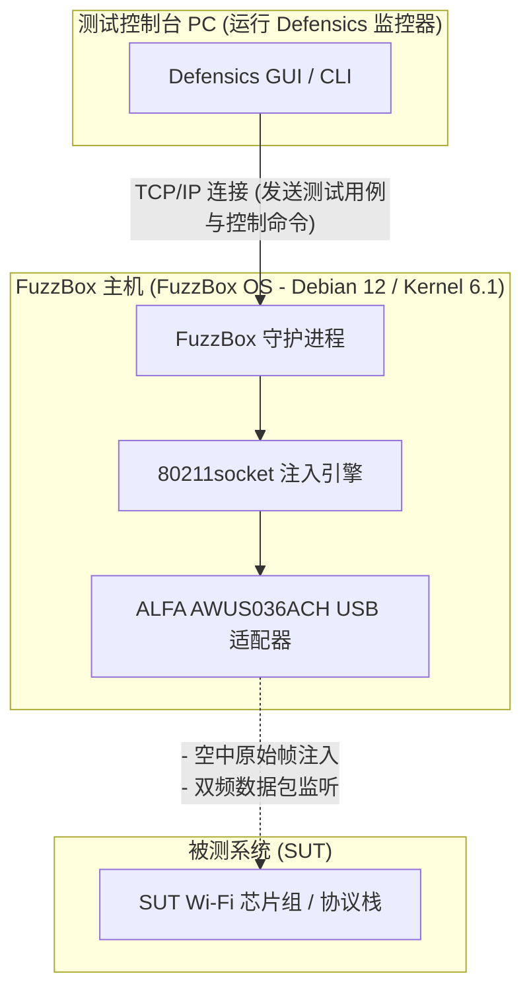

WLAN 协议模糊测试（通常被称为无线负面测试）是验证嵌入式无线设备、智能家居家电和企业级接入点（AP）安全性和鲁棒性最关键的步骤之一。然而，尝试通过无线电波发送畸形的 802.11 管理、控制或数据帧，需要对介质访问控制（MAC）层进行底层控制，而标准的操作系统和商用 WiFi 驱动程序根本不允许这样做。

为了解决这个问题，安全团队使用 **Black Duck FuzzBox**（前身为 Synopsys Defensics FuzzBox），这是一种专门的软件和硬件执行环境。为了进行测试，FuzzBox OS 必须与兼容的高性能 USB 无线适配器配对，该适配器需具备稳定的监听模式（monitor mode）和可靠的原始数据包注入（raw packet injection）能力。 

在本兼容性指南中，我们将分析 Yupitek 当前的 ALFA Network 产品目录，解释为什么较新的 Wi-Fi 6/6E 适配器在 FuzzBox 下无法使用，并为行业标准选择 —— **ALFA AWUS036ACH** (RTL8812AU) 提供逐步设置指南。

---

## 1. 客户需求

在进行协议模糊测试时，测试套件会生成数千个自定义构建的畸形无线帧（例如篡改的 Beacon、关联请求 [Association Requests] 或 WPA 握手包），以观察目标设备的协议栈是否会崩溃或出现异常行为。 

传统的内置 WiFi 网卡（如 Intel AX200 系列）或消费级 USB 网卡受到其固件和操作系统驱动的限制。它们无法：
*   在未连接（未关联）网络的情况下注入原始 802.11 帧。
*   可靠地转换到监听模式（RFMON）以捕获目标的准确响应。
*   强制执行精确的传输速率或锁定在特定的无线信道上而不丢失数据包。

因此，该系统需要一个专用的测试环境 —— Black Duck FuzzBox，并配以高功率的外置 USB 无线适配器，以提供直接的 MAC 层访问权限。

---

## 2. 目标硬件与软件分析

**FuzzBox OS** 是专为运行 Defensics 注入引擎而设计的商业定制 Linux 发行版。了解其硬件边界对于稳定部署至关重要。

### 2.1 硬件要求
*   **主机系统：** FuzzBox OS 运行在专用的 x86 64位硬件上，通常部署在紧凑型 PC（如 Intel® NUC 第 8 至 12 代或 ASUS® NUC 第 14 代 Pro）上。
*   **CPU 架构：** 主频在 2 GHz 或更高的 x86_64 双核处理器。
*   **USB 控制器：** USB 3.0 / USB 3.2 主机控制器。
*   **USB 供电能力：** 这是一个常见的故障点。高功率的 ALFA 无线适配器在活动传输期间会消耗大量电流（高达 900mA）。您必须将适配器直接连接到主机主板上的高速 USB 3.0 端口。避免使用无源（未独立供电）USB 集线器（Hub），这会导致适配器在测试中途断开连接。

### 2.2 软件环境
FuzzBox OS 作为一个无头（headless）Linux 容器平台运行。软件规格如下：

| 组件 / 工具 | 规格与版本 |
|---------------------|--------------------------|
| **操作系统** | FuzzBox OS（基于 Debian 12 Bookworm，64 位） |
| **Linux 内核** | 长期支持 (LTS) 内核版本 **6.1.x** |
| **预装驱动程序** | 优化的无线内核模块，包括 `rtl88xxau` 注入驱动程序 |
| **DKMS 支持** | 已启用，用于动态编译自定义驱动程序模块 |
| **GCC & Make 工具链** | GCC 12.2.0 和 GNU Make 4.3（预装，用于编译自定义驱动程序） |
| **网络工具** | `iw`、`iwpan`、`wireless-tools`、`airmon-ng` 和 `tcpdump` |

---

## 3. ALFA 适配器分析与 GitHub 驱动位置

从当前活跃的型号中选择正确的适配器至关重要。让我们将 Yupitek 当前活跃的 ALFA Network 库存与 FuzzBox OS 兼容性矩阵进行对比。

### 3.1 现有 ALFA 型号的硬性评估
ALFA Network 使用不同的芯片组制造适配器。只有特定的芯片组才支持 FuzzBox 的原始注入引擎。

| ALFA 型号 | 芯片组 | USB 版本 | Wi-Fi 代数 | FuzzBox 兼容状态 |
|------------|---------|-------------|-----------|------------------------------|
| **AWUS036ACH** | **Realtek RTL8812AU** | **USB 3.0** | **Wi-Fi 5** | **✅ 100% 兼容（首选）** |
| **AWUS036ACS** | **Realtek RTL8811AU** | **USB 2.0** | **Wi-Fi 5** | **✅ 兼容（备选 / 便携）** |
| **AWUS036AXML** | MediaTek MT7921AUN | USB-C 3.2 | Wi-Fi 6E | ❌ 不支持（无注入驱动程序） |
| **AWUS036AXM** | MediaTek MT7921AUN | USB 3.2 | Wi-Fi 6E | ❌ 不支持（无注入驱动程序） |
| **AWUS036AX** | Realtek RTL8832BU | USB 3.2 | Wi-Fi 6 | ❌ 不支持（无注入驱动程序） |
| **AWUS036AXER** | Realtek RTL8832BU | USB 3.2 | Wi-Fi 6 | ❌ 不支持（无注入驱动程序） |
| **AWUS036ACM** | MediaTek MT7612U | USB 3.0 | Wi-Fi 5 | ❌ 不支持（无注入驱动程序） |
| **AWUS036EACS** | Realtek RTL8811CU | USB 2.0 | Wi-Fi 5 | ❌ 不支持（驱动程序不兼容） |

### 3.2 首选：ALFA AWUS036ACH
**ALFA AWUS036ACH** 是专业协议测试的行业标准选择。
*   **芯片组：** Realtek RTL8812AU。
*   **USB VID/PID：** `0bda:8812`（ALFA 厂商标识注册为 `0df6:0088`）。
*   **射频规格：** 双频 2.4 GHz 和 5 GHz (802.11ac)，2×2 MIMO。
*   **天线：** 双外置、可拆卸 5 dBi 高增益全向天线（RP-SMA 接口）。
*   **优势所在：** RTL8812AU 芯片组具有成熟的、社区优化的驱动程序，允许 FuzzBox 注入引擎绕过标准的操作系统网络栈，从而实现零丢包的原始帧传输。

### 3.3 备选：ALFA AWUS036ACS
*   **芯片组：** Realtek RTL8811AU。
*   **USB VID/PID：** `0bda:0811` 或 `0bda:8811`。
*   **射频规格：** 双频，1×1 单流，最高 433 Mbps。
*   **选择原因：** 它体积小巧且经济实惠，与 RTL8812AU 共享相似的驱动程序特性。然而，由于它只有一根天线，它缺乏大型测试暗室所需的范围和空间分集。

### 3.4 驱动程序源码位置 (GitHub)
FuzzBox OS 预装了稳定的注入驱动程序。如果您需要在本地 Linux 分析工作站上进行编译或运行诊断，最稳定且与内核兼容的仓库是：
*   **RTL8812AU 驱动程序 (AWUS036ACH)：** [morrownr/8812au-20210629 GitHub 仓库](https://github.com/morrownr/8812au-20210629)
*   **RTL8811AU 驱动程序 (AWUS036ACS)：** [morrownr/8821au GitHub 仓库](https://github.com/morrownr/8821au)

---

## 4. 驱动程序兼容性分析

FuzzBox 数据包传输的核心在于其专有的 `80211socket` 注入器守护进程。 

### 为什么较新的 Wi-Fi 6/6E 芯片组无法工作
许多测试人员认为，购买更新、速度更快且采用 MT7921AUN 芯片组的适配器（如 Wi-Fi 6E AWUS036AXML）会提高性能。然而，FuzzBox 是专门为协议漏洞测试而设计的，而不是为了提高互联网吞吐量。 

`80211socket` 注入器在 MAC 子层直接与无线驱动程序进行交互。为此，驱动程序必须支持特殊的原始注入扩展。目前，FuzzBox OS 的注入引擎针对成熟的 **Realtek `rtl88xxau`** 驱动程序树（特别是 RTL8812AU/RTL8814AU）进行了优化。MediaTek 芯片组（MT7921AUN、MT7612U）和较新的 Realtek Wi-Fi 6 芯片组（RTL8832BU）不使用此注入驱动程序树，因此会被 FuzzBox 守护进程忽略。

### 内核 6.1.x 下的稳定性
RTL8812AU 驱动程序已被移植并针对 Linux 6.1.x 内核进行了广泛的补丁修复。它支持稳定的信道锁定，可在海量数据包压力下防止缓冲区溢出，并防止在高速取消认证（de-authentication）模糊测试期间发生内核崩溃（kernel panic）。

---

## 5. 设置指南

请按照以下步骤在您的 Black Duck FuzzBox 系统上部署和配置 ALFA AWUS036ACH 适配器。

### 步骤 1：物理连接
将 ALFA AWUS036ACH 直接连接到 FuzzBox NUC 上的 USB 3.0 端口（蓝色或标记有 `SS`）。确保双 5 dBi 天线已牢固拧紧。

### 步骤 2：验证硬件检测
通过 SSH 或本地显示器访问 FuzzBox 终端界面，并运行以下命令以检查 USB 接口是否识别了该适配器：
```bash
lsusb
```
您应该会看到一条确认 RTL8812AU 芯片组的条目：
```text
Bus 002 Device 003: ID 0bda:8812 Realtek Semiconductor Corp. RTL8812AU 802.11a/b/g/n/ac WLAN Adapter
```

### 步骤 3：配置注入器守护进程
FuzzBox 通过配置文件映射其物理适配器。打开 FuzzBox 注入器设置文件：
```bash
sudo nano /opt/defensics/fuzzbox/injectors/80211socket.conf
```
确保 driver 参数已配置为使用 Realtek USB 注入模块：
```text
driver="usb:rtl88xxau;"
```
保存文件并退出编辑器。

### 步骤 4：验证监听模式和运行状态
验证 FuzzBox 守护进程是否成功将适配器转换为监听模式。如果标准的网络管理工具发生冲突，请禁用它们，并启用该接口：
```bash
sudo ip link set wlan0 down
sudo iw dev wlan0 set type monitor
sudo ip link set wlan0 up
```
检查接口状态：
```bash
iwconfig wlan0
```
输出应确认 `Mode:Monitor`（模式：监听）并显示适配器当前的工作频率。

---

## 6. 应用拓扑结构

下图展示了 FuzzBox 工作站、ALFA AWUS036ACH 适配器以及被测系统（SUT）在无线审计网络中如何进行交互：


### 系统流程图


---

## 7. 验证结果

配置完成后，请验证 FuzzBox 系统是否能识别无线适配器并准备好运行测试用例。

运行 FuzzBox 内部的适配器诊断工具：
```bash
sudo ls -l /var/run/defensics/injectors/80211/adapters/
```
检测成功将输出指向网络接口的符号链接：
```text
lrwxrwxrwx 1 root root 23 Jun 04 13:30 phy0 -> /sys/class/net/wlan0
```

当您从测试控制台 PC 启动 Defensics WLAN 测试套件（例如 WPA3 客户端或接入点测试套件）时，控制台输出将显示注入速率，并确认正在积极注入畸形的 802.11 管理帧：
```text
[INFO] 13:31:02 Injector Daemon: Adapter phy0 loaded successfully.
[INFO] 13:31:04 Injecting test case #154 (Malformed Association Request) -> SUT
[INFO] 13:31:05 Capturing response: SUT responded with Status Code 0 (Success)
[INFO] 13:31:07 Injecting test case #155 (Malformed Association Request with invalid IE lengths)
```

---

## 8. 建议

### 8.1 硬件推荐矩阵
对于部署 Black Duck FuzzBox 系统的安全测试实验室，我们推荐以下硬件堆栈：

*   **首选注入适配器：** **ALFA Network AWUS036ACH** (RTL8812AU)。具备双天线、高输出功率和完整的 USB 3.0 带宽。这是基准测试的主要主力。
*   **备选 / 便携适配器：** **ALFA Network AWUS036ACS** (RTL8811AU)。非常适合快速便携的设置，但仅限于 1×1 流测试。
*   **信号优化（强烈推荐）：** 增配 **ALFA APA-M25** 或 **APA-M25-6E** 双频定向面板天线。用这些高增益面板天线替换原装的全向天线，可将无线电信号直接聚焦在被测系统（SUT）上，从而减少周围的环境噪声并提高注入成功率。

### 8.2 业务咨询与订购
Yupitek 是 ALFA Network 产品的授权经销商，提供本地支持和批量供应。如需索取产品报价、进行批量订购或咨询我们的技术支持团队：
*   请访问 [Yupitek 联系我们页面](/zh-cn/contact/)
*   或者直接发送电子邮件至 **sales@yupitek.com**

我们的工程团队将协助您获取支持 Black Duck FuzzBox 协议模糊测试工作流所需的精确无线硬件配置。
