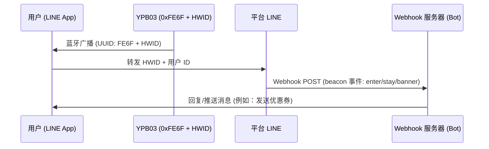

## 产品概述

**YPB03** 是一款工业级长效低功耗蓝牙 (BLE 5.0) 信标，专为 **LINE Beacon** 广播协议优化，能发射标准的 **LINE Simple Beacon** 数据包。它使用 **4 × AA (三号) 干电池** 供电（总容量达 5800mAh），在默认参数下可提供长达 **10 年** 的超长续航力。

YPB03 配备高增益天线，传输距离最远可达 **240 米**，是大型商业导购、智能零售导览和室内定位服务的首选。用户无需安装额外的 App，只要开启蓝牙，就能直接通过日常使用的 **LINE** 应用程序接收通知与互动，提供零摩擦的用户体验。

---

## 主要特点

* **官方 LINE Beacon 兼容：** 广播开放的 LINE Simple Beacon 协议，将物理位置与您的 LINE 官方账号 (LINE Bot) 完美整合。
* **10年免维护寿命：** 采用四颗标准可更换的三号电池，超大 5800mAh 电量让维护成本降至最低。
* **240米超广覆盖：** 强劲的 BLE 5.0 信号穿透力，适用于大型展馆、机场、商场与多层零售空间。
* **零安装无阻碍体验：** 用户仅需开启蓝牙并加入您的官方账号，无需额外下载第三方应用程序即可接收推送。
* **坚固耐用防护：** IP65 防水防尘等级，能抵御仓库、工厂及室内工业环境中的灰尘与水气。

---

## LINE Beacon 开发者整合指南

### Proximity Triggers 工作原理
当开启蓝牙与 LINE Beacon 功能的用户进入 YPB03 的广播范围时：
1. LINE 应用程序侦测到 **Service UUID `0xFE6F`**，并读取广播载荷中的硬件识别码 (HWID)。
2. LINE 平台接收此信号后，向您的 LINE Bot 服务器发送 `beacon` Webhook 事件。
3. 您的 Bot 服务器即时处理此事件，并向用户发送消息（如电子优惠券、迎宾消息或室内导览）。

### 步骤 1：注册您的硬件 ID (HWID)
1. 登录 **LINE Developers Console** 或 **LINE 官方账号管理后台**。
2. 进入 **Beacon** 设置页面注册您的设备，系统将产生一个独有的 **5 字节 (10 个十六进制字符) 硬件 ID (HWID)**。

### 步骤 2：使用 BeaconSET+ 设置 YPB03
YPB03 的广播参数可透过无线空中设定：
1. 下载 **BeaconSET+** 应用程序。
2. 开启蓝牙，扫描 YPB03 的 MAC 地址并连接（输入默认密码解锁）。
3. 选择一个启用的广播通道，将类型设为 **Service Data**：
   - **Service UUID:** `FE6F`
   - **Data Value:** `FE6F` + `[您的 5 字节 HWID]` + `7F00` (例如：若 HWID 为 `0123456789`，则填入 `FE6F01234567897F00`）。
4. 保存设定并中断连接，信标将开始广播 LINE Beacon 信号。

### 步骤 3：在 Webhook 中处理 Beacon 事件
当用户触发时，您的服务器会收到包含 `beacon` 的 JSON 数据。主要的事件属性包括：
* **`hwid`**：信标的 5 字节硬件识别码。
* **`type`**：触发动作类型：
  - `enter`：用户进入信标信号范围。
  - `stay`：用户持续留在范围内（每 10 秒发送一次）。
  - `banner`：用户点击了 LINE 聊天室顶部的 Beacon 横幅广告。

---

## 安装方法

### 方法 A：工业双面胶带贴装
* **适合表面：** 玻璃、压克力、干净的铝材或抛光磁砖等光滑表面。
* **步骤：** 清洁粘贴表面。贴上双面胶并施压 2 秒，静置 30 分钟后再将信标安装上去。

### 方法 B：螺丝支架固定安装（推荐）
* **适合表面：** 水泥墙、石膏板、木材或砖墙。
* **步骤：**
  1. 使用随附的膨胀胶套与螺丝将支架固定到墙面上。
  2. 将 YPB03 滑入支架插槽直至卡紧锁定。

---

## 配置指南

YPB03 的各项参数（包括 UUID、Major、Minor、广播功率和广播间隔时间）可透过 **BeaconSET+** 移动应用程序进行无线设定：
1. 从 Google Play 或 Apple App Store 下载 **BeaconSET+**。
2. 开启手机的蓝牙与定位服务。
3. 运行 App，扫描信标 of MAC 地址，点击连接并输入默认密码进行编辑。

## 技术规格

| 参数项目 | 技术规格 | 备注说明 |
| :--- | :--- | :--- |
| **芯片型号** | nRF52 系列 | 低延迟与高效率 |
| **蓝牙版本** | BLE 5.0 (低功耗蓝牙) | 长距离与高传输量 |
| **防水等级** | IP65 (防尘防泼水) | 防尘与防低压喷水 |
| **传输距离** | 最远 240 米 (开阔空间) | 开阔空间最大距离 |
| **协议支持** | LINE Simple Beacon / iBeacon | Multi-slot broadcasting |
| **服务 UUID** | 0xFE6F | Dedicated LINE Beacon UUID |
| **服务数据格式** | 0xFE6F + 5字节 HWID + 0x7F00 | LINE Simple Beacon packet format |
| **电源规格** | 4 × AA (三号) 干电池 | 总容量 5800mAh (随附) |
| **电池寿命** | 最长可达 10 年 (默认参数下) | 基于默认广播参数 |
| **外壳材质** | ABS 塑料 + 硅胶 | 坚固工业外壳 |
| **外观尺寸** | 72 × 72 × 23 mm | 壁挂方形 |
| **净重** | 145 g | 含电池 |

---

## 产品图片


  


---


需要专属报价或定制化解决方案？请直接来信联系我们的销售团队：**sales@yupitek.com**

