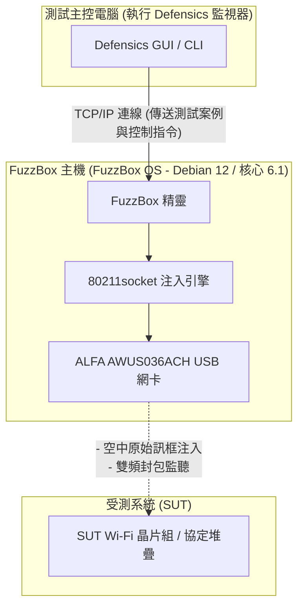

WLAN 協定模糊測試（通常稱為無線負面測試，wireless negative testing）是驗證嵌入式無線設備、智慧家居家電以及企業級基地台（Access Point, AP）安全性與強健性最關鍵的步驟之一。然而，試圖透過無線傳輸異常（malformed）的 802.11 管理、控制或資料訊框，需要對媒體存取控制（MAC）層進行底層控制，而這在標準作業系統與商用 WiFi 驅動程式中通常是被禁止的。

為了瞭解這個問題，安全團隊會使用 **Black Duck FuzzBox**（前身為 Synopsys Defensics FuzzBox），這是一個專用的軟體與硬體執行環境。為了進行測試，FuzzBox OS 必須與相容且高效能的 USB 無線網卡配對，且該網卡需支援穩定的監聽模式（monitor mode）與可靠的原始封包注入（raw packet injection）。

在此相容性指南中，我們分析了 Yupitek 現有的 ALFA Network 產品目錄，解釋了為什麼較新的 Wi-Fi 6/6E 網卡在 FuzzBox 下無法正常運作，並針對業界標準的首選：**ALFA AWUS036ACH** (RTL8812AU) 提供逐步安裝指南。

---

## 1. 客戶需求

在進行協定模糊測試時，測試套件會產生數千個自訂且異常的無線訊框（例如經修改的 Beacon、關聯請求 Association Request 或 WPA 握手封包），以測試目標設備的協定堆疊是否會崩潰或產生異常行為。

傳統的內建 WiFi 卡（如 Intel AX200 系列）或消費級 USB 網卡受到其韌體與作業系統驅動程式的限制。它們無法：
*   在未與網路關聯（associated）的情況下注入原始 802.11 訊框。
*   可靠地轉換至監聽模式（Monitor Mode, RFMON）以擷取目標設備的精確回應。
*   在不丟包（dropping packets）的情況下強制執行精確的傳輸速度或鎖定特定的無線頻道（channels）。

因此，系統需要一個專用的測試環境——Black Duck FuzzBox——並搭配可提供直接 MAC 層存取權限的高功率外接式 USB 無線網卡。

---

## 2. 目標硬體與軟體分析

**FuzzBox OS** 是一個專為執行 Defensics 注入引擎而設計的商業化、客製化 Linux 發行版。瞭解其硬體邊界對於穩定部署至關重要。

### 2.1 硬體需求
*   **主機系統（Host System）：** FuzzBox OS 運作於專用的 x86 64 位元硬體上，通常部署在迷你電腦中，例如 Intel® NUC（第 8 代至第 12 代）或 ASUS® NUC（第 14 代 Pro）。
*   **CPU 架構：** x86_64 雙核心處理器，時脈為 2 GHz 或更高。
*   **USB 控制器：** USB 3.0 / USB 3.2 主機控制器（Host Controller）。
*   **USB 供電能力：** 這是常見的故障點。高功率的 ALFA 無線網卡在主動傳輸期間會消耗大量電流（最高達 900mA）。您必須將網卡直接連接到主機主機板上的高速 USB 3.0 連接埠。請避免使用未外接電源的 USB 集線器（unpowered USB hubs），這可能會導致網卡在測試中途斷線。

### 2.2 軟體環境
FuzzBox OS 作為無週邊（headless）Linux 容器平台運作。軟體規格如下：

| 元件 / 工具程式 | 規格與版本 |
|---------------------|--------------------------|
| **作業系統** | FuzzBox OS（基於 Debian 12 Bookworm，64 位元） |
| **Linux 核心** | 長期支援（LTS）核心版本 **6.1.x** |
| **預載驅動程式** | 最佳化的無線核心模組，包含 `rtl88xxau` 注入驅動程式 |
| **DKMS 支援** | 已啟用，用於動態編譯自訂驅動程式模組 |
| **GCC & Make 工具鏈** | GCC 12.2.0 與 GNU Make 4.3（預先安裝，用於編譯自訂驅動程式） |
| **網路工具程式** | `iw`, `iwpan`, `wireless-tools`, `airmon-ng` 與 `tcpdump` |

---

## 3. ALFA 網卡分析與 GitHub 驅動程式位置

從目前的現役型號中選擇正確的網卡至關重要。讓我們將 Yupitek 的 ALFA Network 現貨庫存與 FuzzBox OS 相容性矩陣進行比較。

### 3.1 現行 ALFA 型號嚴格評估
ALFA Network 使用不同的晶片組製造網路卡。只有特定的晶片組才支援 FuzzBox 的原始注入引擎。

| ALFA 型號 | 晶片組 | USB 版本 | Wi-Fi 世代 | FuzzBox 相容性狀態 |
|------------|---------|-------------|-----------|------------------------------|
| **AWUS036ACH** | **Realtek RTL8812AU** | **USB 3.0** | **Wi-Fi 5** | **✅ 100% 相容 (主要首選)** |
| **AWUS036ACS** | **Realtek RTL8811AU** | **USB 2.0** | **Wi-Fi 5** | **✅ 相容 (備用 / 輕巧)** |
| **AWUS036AXML** | MediaTek MT7921AUN | USB-C 3.2 | Wi-Fi 6E | ❌ 不支援 (無注入驅動程式) |
| **AWUS036AXM** | MediaTek MT7921AUN | USB 3.2 | Wi-Fi 6E | ❌ 不支援 (無注入驅動程式) |
| **AWUS036AX** | Realtek RTL8832BU | USB 3.2 | Wi-Fi 6 | ❌ 不支援 (無注入驅動程式) |
| **AWUS036AXER** | Realtek RTL8832BU | USB 3.2 | Wi-Fi 6 | ❌ 不支援 (無注入驅動程式) |
| **AWUS036ACM** | MediaTek MT7612U | USB 3.0 | Wi-Fi 5 | ❌ 不支援 (無注入驅動程式) |
| **AWUS036EACS** | Realtek RTL8811CU | USB 2.0 | Wi-Fi 5 | ❌ 不支援 (驅動程式不相容) |

### 3.2 主要首選：ALFA AWUS036ACH
**ALFA AWUS036ACH** 是專業協定測試的業界標準選擇。
*   **晶片組：** Realtek RTL8812AU。
*   **USB VID/PID：** `0bda:8812`（ALFA 廠商識別碼註冊為 `0df6:0088`）。
*   **無線規格：** 雙頻 2.4 GHz 與 5 GHz (802.11ac)，2×2 MIMO。
*   **天線：** 雙外接、可拆卸式 5 dBi 高增益全向天線（RP-SMA 接頭）。
*   **優勢所在：** RTL8812AU 晶片組擁有強大且經過社群優化的驅動程式，可讓 FuzzBox 注入引擎繞過標準作業系統的網路堆疊，實現零丟包的原始訊框傳輸。

### 3.3 備用選擇：ALFA AWUS036ACS
*   **晶片組：** Realtek RTL8811AU。
*   **USB VID/PID：** `0bda:0811` 或 `0bda:8811`。
*   **無線規格：** 雙頻，1×1 單串流，最高可達 433 Mbps。
*   **選用原因：** 它體積小巧且價格實惠，並與 RTL8812AU 共享相似的驅動程式特性。然而，由於它只有一根天線，缺乏大型測試室所需的接收範圍與空間分集（spatial diversity）能力。

### 3.4 驅動程式原始碼位置 (GitHub)
FuzzBox OS 預載了穩定的注入驅動程式。如果您需要在本機 Linux 分析工作站上進行編譯或執行診斷，最穩定且與核心相容的儲存庫為：
*   **RTL8812AU 驅動程式 (AWUS036ACH)：** [morrownr/8812au-20210629 GitHub 儲存庫](https://github.com/morrownr/8812au-20210629)
*   **RTL8811AU 驅動程式 (AWUS036ACS)：** [morrownr/8821au GitHub 儲存庫](https://github.com/morrownr/8821au)

---

## 4. 驅動程式相容性分析

FuzzBox 封包傳輸的核心在於其專有的 `80211socket` 注入精靈（daemon）。

### 為什麼較新的 Wi-Fi 6/6E 晶片組無法運作
許多測試人員認為購買較新、較快的網卡（例如使用 MT7921AUN 晶片組的 Wi-Fi 6E AWUS036AXML）可以提高效能。然而，FuzzBox 是專為協定漏洞測試而設計的，而不是為了提升網速吞吐量。

`80211socket` 注入器在 MAC 子層直接與無線驅動程式進行互動。為了實現這一點，驅動程式必須支援專用的原始注入擴充功能。目前，FuzzBox OS 的注入引擎已針對成熟的 **Realtek `rtl88xxau`** 驅動程式分支（特別是 RTL8812AU/RTL8814AU）進行了最佳化。MediaTek 晶片組（MT7921AUN、MT7612U）以及較新的 Realtek Wi-Fi 6 晶片組（RTL8832BU）並不使用此注入驅動程式分支，因此會被 FuzzBox 精靈忽略。

### 核心 6.1.x 版本下的穩定性
RTL8812AU 驅動程式已被反向移植（backported）並針對 Linux 6.1.x 核心進行了廣泛的修補。它支援穩定的頻道鎖定（channel-locking）、防範在海量封包壓力下的緩衝區溢位，並防止在高強度去關聯（de-authentication）模糊測試過程中發生核心崩潰（kernel panic）。

---

## 5. 安裝指南

請按照以下步驟在您的 Black Duck FuzzBox 系統上部署與設定 ALFA AWUS036ACH 網卡。

### 步驟 1：實體連接
將 ALFA AWUS036ACH 直接連接到 FuzzBox NUC 上的 USB 3.0 連接埠（藍色或標有 `SS`）。確保雙 5 dBi 天線已牢固鎖緊。

### 步驟 2：驗證硬體偵測
透過 SSH 或本機螢幕存取 FuzzBox 終端機介面，並執行以下指令以檢查 USB 介面是否已識別該網卡：
```bash
lsusb
```
您應該會看到確認 RTL8812AU 晶片組的項目：
```text
Bus 002 Device 003: ID 0bda:8812 Realtek Semiconductor Corp. RTL8812AU 802.11a/b/g/n/ac WLAN Adapter
```

### 步驟 3：設定注入精靈
FuzzBox 透過設定檔來對應其實體網卡。開啟 FuzzBox 注入器設定檔：
```bash
sudo nano /opt/defensics/fuzzbox/injectors/80211socket.conf
```
確保驅動程式參數（driver parameter）設定為使用 Realtek USB 注入模組：
```text
driver="usb:rtl88xxau;"
```
儲存檔案並離開編輯器。

### 步驟 4：驗證監聽模式與運作
驗證 FuzzBox 精靈是否成功將網卡切換至監聽模式。如果標準網路管理工具發生衝突，請先將其停用，然後啟用該介面：
```bash
sudo ip link set wlan0 down
sudo iw dev wlan0 set type monitor
sudo ip link set wlan0 up
```
檢查介面狀態：
```bash
iwconfig wlan0
```
輸出結果應確認為 `Mode:Monitor` 並顯示網卡目前的運作頻率。

---

## 6. 應用拓撲

下圖說明了 FuzzBox 工作站、ALFA AWUS036ACH 網卡以及受測系統（System Under Test, SUT）在無線稽核網路中的互動關係：


### 系統流程圖


---

## 7. 驗證結果

設定完成後，驗證 FuzzBox 系統是否已識別該無線網卡並準備好執行測試案例。

執行 FuzzBox 內部網卡診斷工具程式：
```bash
sudo ls -l /var/run/defensics/injectors/80211/adapters/
```
偵測成功後將輸出指向網路介面的符號連結（symbolic link）：
```text
lrwxrwxrwx 1 root root 23 Jun 04 13:30 phy0 -> /sys/class/net/wlan0
```

當您從測試主控電腦啟動 Defensics WLAN 測試套件（例如 WPA3 用戶端或基地台測試套件）時，主控台輸出將顯示注入速率，並確認異常的 802.11 管理訊框正在被主動注入：
```text
[INFO] 13:31:02 Injector Daemon: Adapter phy0 loaded successfully.
[INFO] 13:31:04 Injecting test case #154 (Malformed Association Request) -> SUT
[INFO] 13:31:05 Capturing response: SUT responded with Status Code 0 (Success)
[INFO] 13:31:07 Injecting test case #155 (Malformed Association Request with invalid IE lengths)
```

---

## 8. 建議與推薦

### 8.1 硬體推薦矩陣
對於部署 Black Duck FuzzBox 系統的安全測試實驗室，我們推薦以下硬體配置：

*   **主要注入網卡：** **ALFA Network AWUS036ACH** (RTL8812AU)。具備雙天線、高輸出功率以及完整 USB 3.0 頻寬。這是進行基準測試的主要主力。
*   **備用 / 輕巧型網卡：** **ALFA Network AWUS036ACS** (RTL8811AU)。非常適合快速的便攜式設定，但限制於 1×1 串流測試。
*   **訊號最佳化 (強烈推薦)：** 搭配使用 **ALFA APA-M25** 或 **APA-M25-6E** 雙頻定向面板天線。將原廠全向天線替換為這些高增益定向天線面板，可將無線電訊號直接聚焦在受測系統 (SUT) 上，減少環境雜訊干擾並提高注入成功率。

### 8.2 諮詢與訂購
Yupitek（優必客）是 ALFA Network 產品的授權代理商，提供在地支援與批量供應。如需索取產品報價、進行大宗訂購或諮詢我們的技術支援團隊：
*   請造訪 [Yupitek 聯絡我們頁面](https://www.yupitek.com)
*   或直接寄信至 **sales@yupitek.com**

我們的工程團隊將協助您取得支援 Black Duck FuzzBox 協定模糊測試工作流程所需的精確無線硬體配置。
