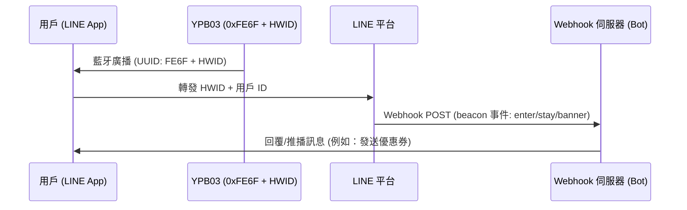

## 產品概述

**YPB03** 是一款工業級長效低功耗藍牙 (BLE 5.0) 信標，專為 **LINE Beacon** 廣播協議優化，能發射標準的 **LINE Simple Beacon** 封包。它使用 **4 × AA (三號) 乾電池** 供電（總容量達 5800mAh），在預設參數下可提供長達 **10 年** 的超長續航力。

YPB03 配備高增益天線，傳輸距離最遠可達 **240 公尺**，是大型商業導購、智慧零售導覽和室內定位服務的首選。使用者無需安裝額外的 App，只要開啟藍牙，就能直接透過日常使用的 **LINE** 應用程式接收通知與互動，提供零摩擦的用戶體驗。

---

## 主要特點

* **官方 LINE Beacon 相容：** 廣播開放的 LINE Simple Beacon 協定，將物理位置與您的 LINE 官方帳號 (LINE Bot) 完美整合。
* **10年免維護壽命：** 採用四顆標準可更換的三號電池，超大 5800mAh 電量讓維護成本降至最低。
* **240公尺超廣覆蓋：** 強勁的 BLE 5.0 訊號穿透力，適用於大型展館、機場、商場與多層零售空間。
* **零安裝無阻礙體驗：** 用戶僅需開啟藍牙並加入您的官方帳號，無需額外下載第三方應用程式即可接收推播。
* **堅固耐用防護：** IP65 防水防塵等級，能抵禦倉庫、工廠及室內工業環境中的灰塵與水氣。

---

## LINE Beacon 開發者整合指南

### Proximity Triggers 工作原理
當開啟藍牙與 LINE Beacon 功能的用戶進入 YPB03 的廣播範圍時：
1. LINE 應用程式偵測到 **Service UUID `0xFE6F`**，並讀取廣播載荷中的硬體識別碼 (HWID)。
2. LINE 平台接收此訊號後，向您的 LINE Bot 伺服器發送 `beacon` Webhook 事件。
3. 您的 Bot 伺服器即時處理此事件，並向用戶發送訊息（如電子優惠券、迎賓訊息或室內導覽）。

### 步驟 1：註冊您的硬體 ID (HWID)
1. 登入 **LINE Developers Console** 或 **LINE 官方帳號管理後台**。
2. 進入 **Beacon** 設置頁面註冊您的設備，系統將產生一個獨有的 **5 位元組 (10 個十六進位字元) 硬體 ID (HWID)**。

### 步驟 2：使用 BeaconSET+ 設定 YPB03
YPB03 的廣播參數可透過無線空中設定：
1. 下載 **BeaconSET+** 應用程式。
2. 開啟藍牙，掃描 YPB03 的 MAC 位址並連線（輸入預設密碼解鎖）。
3. 選擇一個啟用的廣播通道，將類型設為 **Service Data**：
   - **Service UUID:** `FE6F`
   - **Data Value:** `FE6F` + `[您的 5 位元組 HWID]` + `7F00` (例如：若 HWID 為 `0123456789`，則填入 `FE6F01234567897F00`）。
4. 儲存設定並中斷連線，信標將開始廣播 LINE Beacon 訊號。

### 步驟 3：在 Webhook 中處理 Beacon 事件
當用戶觸發時，您的伺服器會收到包含 `beacon` 的 JSON 資料。主要的事件屬性包括：
* **`hwid`**：信標的 5 位元組硬體識別碼。
* **`type`**：觸發動作類型：
  - `enter`：用戶進入信標訊號範圍。
  - `stay`：用戶持續留在範圍內（每 10 秒發送一次）。
  - `banner`：用戶點擊了 LINE 聊天室頂部的 Beacon 橫幅廣告。

---

## 安裝方法

### 方法 A：工業雙面膠帶貼裝
* **適合表面：** 玻璃、壓克力、乾淨的鋁材或拋光磁磚等光滑表面。
* **步驟：** 清潔黏貼表面。貼上雙面膠並施壓 2 秒，靜置 30 分鐘後再將信標安裝上去。

### 方法 B：螺絲支架固定安裝（推薦）
* **適合表面：** 水泥牆、石膏板、木材或磚牆。
* **步驟：**
  1. 使用隨附的壁虎與螺絲將支架固定到牆面上。
  2. 將 YPB03 滑入支架插槽直至卡緊鎖定。

---

## 配置指南

YPB03 的各項參數（包括 UUID、Major、Minor、廣播功率和廣播間隔時間）可透過 **BeaconSET+** 行動應用程式進行無線設定：
1. 從 Google Play 或 Apple App Store 下載 **BeaconSET+**。
2. 開啟手機的藍牙與定位服務。
3. 執行 App，掃描信標的 MAC 位址，點擊連線並輸入預設密碼進行編輯。

## 技術規格

| 參數項目 | 技術規格 | 備註說明 |
| :--- | :--- | :--- |
| **晶片型號** | nRF52 系列 | 低延遲與高效率 |
| **藍牙版本** | BLE 5.0 (低功耗藍牙) | 長距離與高傳輸量 |
| **防水等級** | IP65 (防塵防潑水) | 防塵與防低壓噴水 |
| **傳輸距離** | 最遠 240 公尺 (開闊空間) | 開闊空間最大距離 |
| **協定支援** | LINE Simple Beacon / iBeacon | Multi-slot broadcasting |
| **服務 UUID** | 0xFE6F | Dedicated LINE Beacon UUID |
| **服務數據格式** | 0xFE6F + 5位元組 HWID + 0x7F00 | LINE Simple Beacon packet format |
| **電源規格** | 4 × AA (三號) 乾電池 | 總容量 5800mAh (隨附) |
| **電池壽命** | 最長可達 10 年 (預設參數下) | 基於預設廣播參數 |
| **外殼材質** | ABS 塑膠 + 矽膠 | 堅固工業外殼 |
| **外觀尺寸** | 72 × 72 × 23 mm | 壁掛方形 |
| **淨重** | 145 g | 含電池 |

---

## 產品圖片


  


---


需要專屬報價或客製化解決方案？請直接來信聯絡我們的銷售團隊：**sales@yupitek.com**

